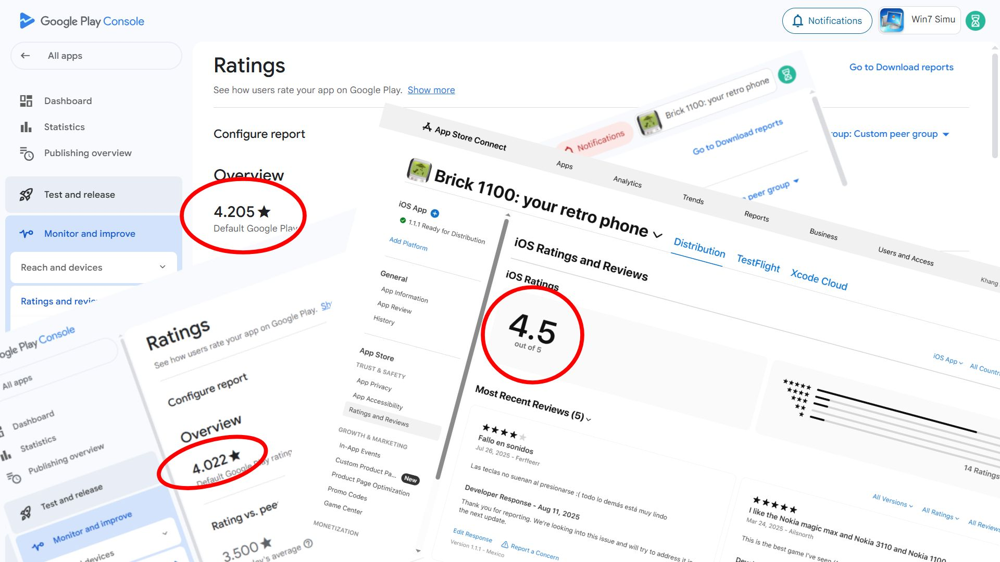

# My takes on ads

_Cover image designed on Pawel Czerwinski's original photo from [Unsplash](https://unsplash.com/photos/turned-off-signage-_9dSF0Hwitw)_

Since day one starting my side hustle, ads have been my bread and butter. They have provided me with a steady stream of income and allowed me to grow my hobby into something that pays the bills. However, I've also seen the downsides of overdoing it, and I believe it's important to strike a balance.

In this post, I want to share my experience with implementing ads in my projects, what I have learned, and what should be avoided. If you are considering ads as a monetization strategy for your business or project, I hope my insights will help you make informed decisions.

## Why ads?

Ads are a viable monetization strategy for many apps and products, especially those that are [free to use](./free-vs-paid.md), targeting a broad audience. They can help developers generate revenue without charging users directly, making it easier to attract and retain a large user base.

Although ads have been criticized for negatively impacting user experience, I believe there are still developers who can implement them thoughtfully and effectively. By prioritizing user experience and finding the right balance, it's possible to create a win-win situation for both users and developers.

## How I approach ads

Over the years, I've experimented with various [ad formats](./about-the-ads.md), platforms, vendors and strategies. From banner, display, to rewarded ads, from the more well-known networks like Google AdSense/Admob to smaller, lesser-known ones, for both mobile and web. I have learned a lot about monetizing through ads and how to effectively integrate them into my projects without compromising user experience.

Just to prove my point, here are the ratings from my apps where I have implemented ads.

As you can see, an average rating of 4.2/5 is fairly impressive (at least in my opinion), and it shows that ads and user experience can coexist harmoniously when done right.

This balance is crucial for long-term success. It's not just about making money, it's about creating a sustainable ecosystem where users feel valued and engaged. By putting myself in the users' shoes and prioritizing their experience, I've been able to maintain high user satisfaction while still generating steady revenue through ads.

As a result, ads have been a major contributor to my overall revenue, accounting for more than 60% of the total for the past few years.

<SponsorAd />

## Mistakes I try to avoid

### Overloading users with ads

This might sound obvious, but it's easy to get carried away and implement too many ads in the pursuit of higher revenue. I have seen this quite often for other apps, where the focus is solely on maximizing ad revenue without any regard for the users. This leads to a poor user experience and ultimately drives users away.

For instance, I have seen apps that greet users with a full-screen ad every time they open it, or apps that bombard users with ads for every action they take. As a user, I immediately uninstall such apps without hesitation.

For my apps, I try to limit the number of ads I show to users and ensure that they don't disrupt the overall experience.

### Ignoring user feedback

Another common mistake I have seen is ignoring user feedback regarding ads. Users are often vocal about their experiences, and it's crucial to listen to their concerns. If users find ads intrusive or irrelevant, it's essential to take that feedback seriously and make adjustments accordingly.

I tend to leave reviews for apps I try out in hopes that my feedback will be taken into account and help the developers improve their products, especially for indie developers like myself. Some are receptive and make necessary changes, but this rarely happens. Most seem to prioritize ad revenue which ultimately harms their apps in the long run.

For my apps, I also occasionally receive user complaints about ads. I always appreciate helpful and constructive feedback, and take them seriously to improve the user experience. However, there are also cases where users may not fully understand the need for ads in a free app. In such situations, I try to communicate the value of ads in supporting the app's development and maintenance.

### Relying solely on ads

While ads are indeed a viable monetization strategy. They are also very quick and easy to implement. However, I have learned that it's essential not to rely solely on ads for revenue. Diversifying income streams can help create a more stable and sustainable [business model](./visnalize-business-model.md).

In my case, I have explored additional options such as in-app purchases, subscriptions, and lifetime deals. By offering users more value and choices, I don't have to stress about overloading them with ads to maximize revenue.

## Closing thoughts

I believe I have seen far too many businesses abuse the system by prioritizing ad revenue over user experience. This short-sighted approach may yield quick profits, but it ultimately harms user retention and brand reputation.

This has led to a negative perception of ads in general, demoralizing developers like myself, who are genuinely trying their best to offer value to as many users as possible through their free apps, while still maintaining a healthy revenue stream.

I hope my sharing can help change this perception and encourage more developers to adopt a user-centric approach to ads. Please, aim for the long-term success of your business, respect your users and they will come back to you.
