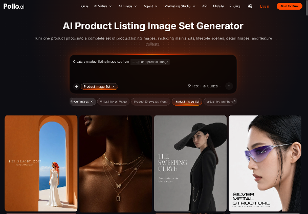
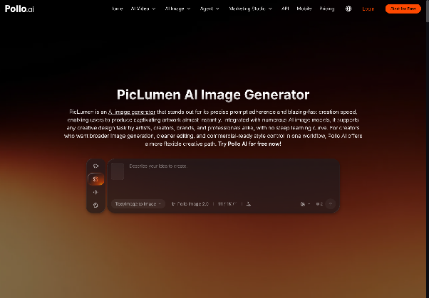

# AI Product Listing Image Set Generator: Create Visuals That Sell

_Cover image by Erfan Ro via [Unsplash](https://unsplash.com/photos/studio-setup-with-lights-camera-and-table-kqLeFAf9npk)_

If you run a small online store, you know the routine. A new product arrives, and you suddenly need a clean white-background hero shot, a few lifestyle scenes, a detail close-up, an infographic-style image for Amazon, and a vertical version for Instagram. A photographer eats the budget. Doing it yourself eats the weekend. By the time the listing goes live, a competitor has already launched three variations with sharper visuals.

AI has changed this for small-business marketers. Product imagery no longer has to be a one-off photo shoot. It can be a repeatable system: upload once, generate a full listing set, and reuse those assets across ads, social posts, and landing pages.

## Why Product Listing Images Decide Your Conversion Rate

Shoppers can't touch, hold, or try your product, so the image set becomes the product experience. That's exactly the problem Pollo AI's [AI Product Listing Image Set Generator](https://pollo.ai/ai-product-listing-image-set-generator) was built to solve. Upload one product photo and it produces a matched collection of marketplace-ready images, from a clean main shot to styled lifestyle scenes and detail-focused close-ups.

Why does a full set matter so much? Marketplaces like Amazon and Etsy, along with Shopify storefronts, reward listings that answer buyer questions visually. Shoppers want to know what the product looks like in use, how big it is, and what makes it different. A single pretty photo rarely covers all of that. You need a coherent set where lighting, angles, and style feel consistent, so the brand looks trustworthy rather than stitched together.

Consistency is the hardest part to get right by hand, and it's where AI does its best work. Every image in the set comes from the same source, so colors and proportions stay faithful to the real item. That matters when a single return can wipe out your margin.

## Adding Creative Flair with Creative Studio

Sometimes you need more than clean marketplace shots, such as a seasonal banner or a stylized campaign visual. That's where Pollo AI's Creative Studio comes in. It's an all-in-one creative toolbox that brings together one of the widest lineups of image and video models alongside practical editing tools. A standout for artistic product scenes is the [PicLumen AI Image Generator](https://pollo.ai/im/piclumen-ai), which is great for dreamy backgrounds, illustrated styles, and concept art that makes a holiday promotion feel fresh.

The real advantage isn't any single model. It's having them all in one place. You can generate a stylized background, place your product into it, upscale the result, and animate it into a short clip without leaving the workspace. For content creators and small marketing teams, that removes a lot of the tool-hopping that slows campaigns down.

## From Static Listings to Ad Videos with Marketing Studio

Images bring shoppers to the page, but short video ads are what stop the scroll. Pollo AI's Marketing Studio is built for marketers rather than film editors. The studio breaks proven, high-performing ads down into reusable scaffolds, so you never start from a blank timeline. Pick a format, drop in your product, and you can have a ready-to-run ad video in about a minute.

The key feature behind it is Pollo Asset. Everything you've uploaded, generated, or defined lives in one library with three asset types: Uploads, Elements (products, characters, scenes, styles), and Creations. A unified asset picker means the product from your Amazon listing becomes the same product element in your TikTok ad. Pollo Agent then handles the messy parts. It works out what you're trying to make, suggests creative angles, and stitches clips into a finished video.

Every studio runs on one shared credit system. You aren't juggling separate subscriptions for listing images, ad videos, and creative experiments. For a lean team, that simplicity counts almost as much as the features themselves.

## How to Build a Complete Listing Set: Step by Step

### Step 1: Start With One Clean Source Photo

Shoot your product in soft, even light against a plain background. A modern smartphone is fine. Sharpness and accurate color matter far more than expensive gear, because the AI builds everything else from this image.

### Step 2: Generate Your Listing Image Set

Upload the photo to the listing set generator and let it produce your core images: the main shot, lifestyle placements, scale references, and close-ups. Review them the way a picky buyer would, and regenerate any shot that misrepresents the product.

### Step 3: Save Winning Shots as Elements

Store your best results in Pollo Asset as product Elements. This step pays off later, because every future ad, banner, or social post can pull from the same approved visuals without new uploads.

### Step 4: Turn the Set Into an Ad Video

Open Marketing Studio, choose an ad scaffold that matches your goal, such as a product reveal, problem-solution, or unboxing, and select your saved Elements. In roughly a minute you'll have a video ready for Meta, TikTok, or YouTube Shorts.

### Step 5: Test, Compare, and Refresh

Launch two or three variations and watch click-through and conversion rates. Because regenerating costs minutes instead of reshoot fees, you can refresh creative every few weeks and avoid ad fatigue.

## Best Practices for Listing Images That Convert

1. **Lead with clarity, not creativity.** Your main image should show the product plainly and fill most of the frame. Save the artistic styling for secondary images and ads.
2. **Show the product in real life.** Lifestyle scenes help buyers picture ownership. Match the setting to your customer: a desk for office gear, a kitchen counter for cookware.
3. **Keep one visual language.** Use the same lighting mood and color palette across the whole set. Consistency signals professionalism, and professionalism builds trust.
4. **Answer objections visually.** If buyers often ask about size, add a scale shot. If they worry about quality, add a texture close-up. Every image should remove a reason not to buy.
5. **Repurpose everything.** A listing image today can become a carousel ad tomorrow and a video frame next week. Treat each generation as a reusable asset, not a single-use file.

## What's Next for AI-Powered Product Marketing

The biggest shift ahead isn't better single images. It's connected workflows. Product photos, ad videos, and campaign art are starting to flow through one system instead of five disconnected tools. Pollo AI is heading in exactly that direction, with plans to link its studios through an interactive creative agent. You'll describe a campaign goal, and the agent will coordinate listing images, video ads, and design assets for you.

For small brands, that means competing on ideas instead of production budgets. If your product pages still rely on a single photo, or your ads haven't changed in months, now is the time to experiment. Upload one product image, generate your first listing set, turn it into an ad, and see how much faster your marketing can move when your visuals work as hard as you do.
