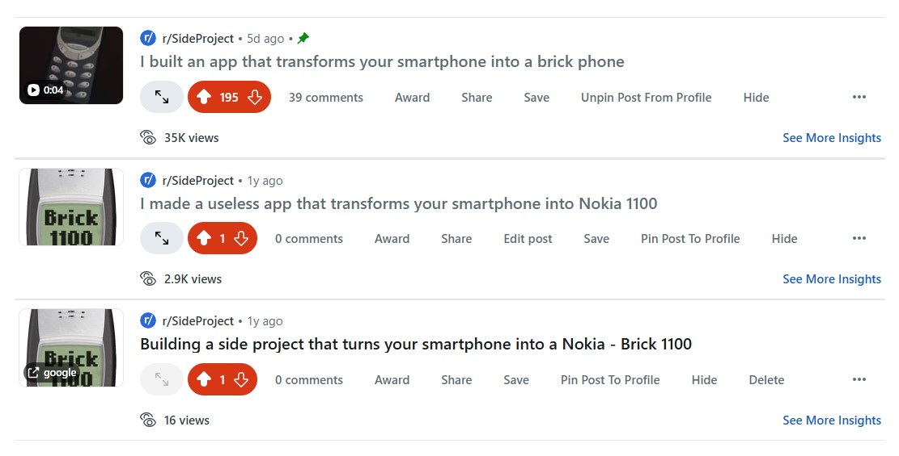
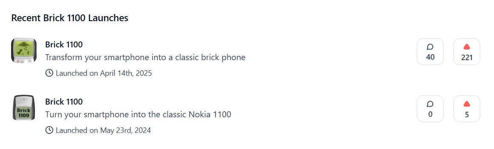
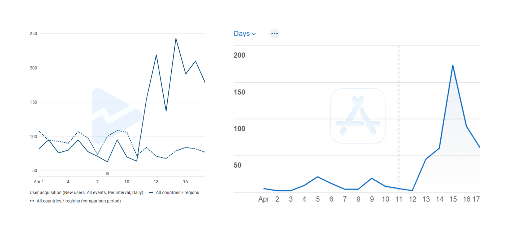
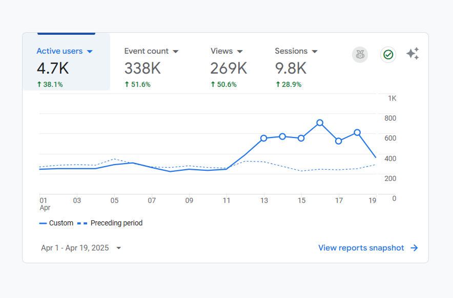
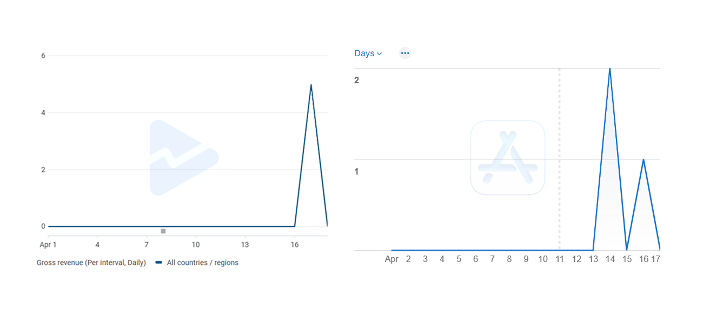
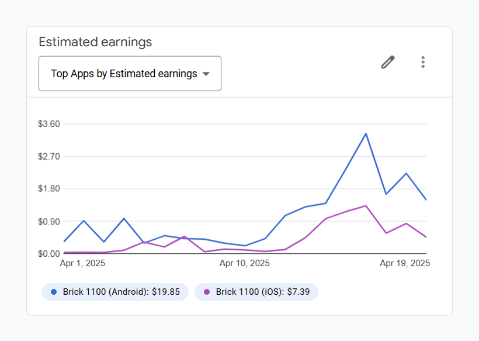

# Brick 1100's successful launch, my entire experience

Last week, I [released](/brick1100/changelog#_1-0-0-apr-11-2025) and [announced](./brick-1100-v1.md) the first stable version of Brick 1100. Following the release, earlier this week, I launched it on several platforms. With no preparation, the aim was just to list it on these platforms to gain some visibility and a little traffic. However, to my surprise, the launch was a huge success. In this post, I would like to share the results and some insights from the launch that I consider somewhat "viral", hopefully you will gain some valuable information from this.

## Launch results

In summary:

- **Hacker News**: 3 upvotes, 1 comment <Badge type="danger" text="flop" />
- **Twitter/X**: 30 views, 1 like, 1 comment <Badge type="danger" text="flop" />
- **Bluesky**: 2 likes <Badge type="danger" text="flop" />
- **Reddit**: 170+ upvotes, 31k views, 30+ comments <Badge type="tip" text="success" />
- **Product Hunt**: 200+ upvotes, 30+ comments, ranked #9 for the day <Badge type="tip" text="success" />
- **Peerlist**: 60+ upvotes, 250+ views, 6 comments, ranked #2 for the week <Badge type="tip" text="success" />

In addition to these numbers, Brick 1100 was also featured in Product Hunt's [daily newsletter](https://www.producthunt.com/newsletters/archive/39364-time-travelling-phones), which further garnered a few more upvotes post launch. On Peerlist, it was a staff-picked project for a day during the launch week, which also contributed significantly to the success of the launch over there.

And you know what the most important thing is? I got them BADGES! (well, not that important)

  
  
  

## What I did exactly

As mentioned above, I had no preparation, no expectations for this launch, I just wanted to list it on some popular platforms in hope that it would gain some visibility and traffic. There was no plan, no strategy, no connection, no audience, and no budget to leverage. In other words, I did not care much about it, just wanted to submit it and see if there is any genuine interest at all.

I submitted the project to some major platforms that I knew of: Hacker News, Reddit (r/SideProject), Product Hunt, and Peerlist. I also shared it on my Twitter/X and Bluesky accounts. In general, I was targeting the platforms that have huge impact but don't consume a lot of time and effort to submit, and don't require any kind of fees, because, well, I didn't want to expect much.

It's worth mentioning that I have been a member of these platforms for a while, despite not being very active on any of them and not having a large audience. I have some past projects that I launched on these, though it was pretty much an echo chamber, no one cared about them. Even for this project, the first time I launched it on Reddit and Product Hunt, it was a total flop, it didn't gain any traction at all. That's why I didn't have high hopes for this one either. However, the results were pretty surprising.

So how did it go viral? What was the secret sauce? To be honest, _I don't know_. Probably luck? The timing I guess? Or the catchphrase? Maybe cause I changed the logo? I don't know. But here are the things I did differently than the previous launches:

### Reddit

Better known as one of the most toxic and negative platforms on the internet, Reddit is intolerant to self-promotion. The only few exceptions are the subreddits that are specifically designed for self-promotion (though with restrictions), one of which is **r/SideProject**. But it still got a problem, I actually posted the project there before, twice, yet no one cared. It was disheartening to see myself shouting into the void. But looking back, those posts had a lot of problems, the first one was a simple link to the Google Play Store, the second one had text and a screenshot, but again, a lot of links. The title was probably the the biggest chance to get attention, but it didn't work out. This time, I took a different approach, I slightly altered the title to make it more catchy, added a 1-liner description, and a video that is just 4 seconds long. And it WORKED!

So in general, to have a successful launch on Reddit, you need:

- **A catchy title**: Maybe, maybe not, it's damn subjective.
- **No links**: I didn't include any links in the post, the description was just a 1-liner with the app name, so curious people can search for it themselves. Probably an effective way to avoid being flagged as spam or having restricted visibility.
- **Video**: If anything, the 4-second demo video was likely the most important factor. It was short and simple, but the showcased feature was interesting enough to catch people's attention.
- **Luck**: Last but not least, I think luck was also major factor. In fact, it might overrule all the other factors combined as I have no idea how the Reddit algorithm works.

By the way, you should notice a lot of "maybe", "probably", and "likely", so decide for yourself. I might be as well just making this up, but these are the things that worked for me. I don't know if they will work for you, but it's worth a try.

### Product Hunt

The most popular platform for launching products, Product Hunt is a great place to gain visibility and traffic, for free. However, it's also a very competitive platform, with a lot of projects being launched every day. So how did Brick 1100 stand out from the crowd? I have no idea myself. The first time I launched, it flopped pretty hard. 5 upvotes (including mine) and 0 reactions, despite having a coming soon page set up, and a polished launch page with the necessary information and beautiful screenshots in place. This time, I didn't do anything special or different, I just changed the logo, slightly altered the tagline, and chucked in 2 screenshots (from my website, not even from the app itself). And guess what? It blew up!

So your question might be, what makes a successful launch on Product Hunt? Here are my takes:

- **Luck**: If your project does not capture the attention of Product Hunt's editorial team and get featured on the homepage, it will be buried under the pile of other projects. So luck is now top of the list, you either need to have a very good "connection" with the editorial team, or just be lucky enough to have your project noticed by them.
- And that's it. I don't know what else to share, because that's all I feel about this launch. Like I said, I just posted it and leave it, I didn't even try. And somehow it worked, what else can I say other than luck? Launch checklist? Never seen it. Soliciting upvotes? Didn't do it. Using my network or audience? Had none.

The fact that my project was later featured in the newsletter emphasizes my point. My wild guess is, it was the editorial team's deliberate decision to feature my project on the homepage, for them to later share it in the newsletter. Amidst a forest of AI projects, Brick 1100 was like a breath of fresh air, and they took the chance to capture their audience's attention. Again, it's purely my assumption, but a plausible one it seems. So yeah, luck is the key here.

### Peerlist

Peerlist is a relatively new platform, but it's got to be one of the most supportive and fastest growing communities I've seen. A versatile social network for professionals, Peerlist also has a section for launching products. Initially, I planned to just submit the project and leave it, but I ended up finding myself engaging with the community more than I expected. Before and during the launch, I had a few sharing posts, and I was pleasantly surprised by the amount of support I received. The Peerlist staff even decided to feature my project for a day, which was a huge boost in terms of visibility. Totally unexpected, but I was grateful for it.

So if you plan to launch your project on Peerlist, here's my experience:

- **Be genuine and engaging**: The Peerlist team and their community respects authenticity and transparency. So just be yourself, and don't be afraid to share your work and ask for feedback.
- **Build in public**: having a bad experience building in public on X? I feel you. But Peerlist is different, they encourage you to share your journey, and you will receive the support. You don't need a polished launch page, just share what you are working on, showcase your most interesting features, let the community see your progress, and they will decide the rest.
- **Engage, more**: This is very important, so I have to repeat it. Unlike other platforms, Peerlist is at a stage where you can actually engage with the community and get noticed. So take advantage of it, be active, and you will be rewarded.

So far, it probably feels like I'm just advertising Peerlist, doesn't it? Well, I'm not affiliated with them nor was I paid to say this, but I genuinely think they are doing a wonderful job. I have been a member of Peerlist for a while, and I have seen the community grow and evolve. It's truly a great place to connect with like-minded people, share your work, and get feedback. So if you haven't already, I highly recommend you check it out.

## The impact

There is an apparent impact on the traffic of Brick 1100 after a successful launch on these platforms. Some of the metrics you can see below. In overall, you can see a spike in every metric after the first launch on Reddit on April 13, followed by Product Hunt and Peerlist on the next day. Then the traffic started to decline, but it was still significantly higher than before.

- **Downloads**

  

  - Google Play downloads increased by **166%** at the peak.
  - App Store downloads increased by **1033%** at the peak.

- **Active users**

  

  The number of active users on both platforms increased by **169%** at the peak. It remained at a higher level than before, with an average of **115%** increase.

- **Revenue**

  

  Despite the surge in downloads and active users, the revenue from in-app purchases did not see a significant increase. I got 4 monthly subscriptions (priced at $2 each) on both platforms, making a total of **$7**.

  

  However, the revenue from ads saw a remarkable increase as it's directly proportional to the number of active users. At the peak, the revenue increased by **900%** for Android, and **700%** for iOS, having brought in a total of **$20** on both platforms since the day of launch.

  With both sources of revenue combined, I have made a total of **$27** so far (1 week after the launch). Not a lot, but it's a good start.

## Final thoughts

Brick 1100 is my free-time/weekend side project, it's relatively [small and simple](./from-codepen-to-app.md), but seeing how it has grown and received such a positive response and support from the community is truly amazing. I somehow knew it would go viral, but I didn't know how to make it happen. I just had a really good time building it, enjoyed every moment of that process, and that's what matters the most to me.
The success of this launch has given me a lot of confidence and motivation, proving a lot of things I thought were impossible, but it might as well be what they call "survivorship bias", so I'm not sure if I can replicate this success in the future. But it never hurts to try, right?

I have learned a lot from this experience, and I hope you can take away some valuable insights from it as well. If you have any questions, don't hesitate to reach out, I try to respond to every message or comment I receive. And if you haven't already, I encourage you to check out [Brick 1100](/brick1100.md) and see for yourself what all the fuss is about. Any feedback and suggestions are always welcome and appreciated.

Thank you for reading, have a great day!

