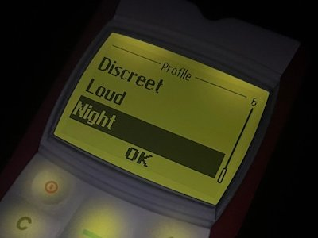

# Brick 1100 is out of beta

Hello everyone, today I'm thrilled to announce the launch of [Brick 1100 v1.0.0](/brick1100/changelog#_1-0-0-apr-11-2025), the first stable release with exciting new features, bug fixes, and improvements. With Brick 1100, we're committed to the mission: to bring you back to the good old days of using your beloved brick phones, and this release is a significant step towards that goal.

In this post, let's take a closer look at the new features and improvements that come with this version.

<SponsorAd />

## What's new?

### A more realistic experience

Some of the most notable changes in this release are the subtle yet significant enhancements to the phone interface, aiming for the most authentic experience similar to the original Nokia 1100, including:

- The feedback on each key interaction

<video playsinline autoplay loop muted controls width="200">
    <source src="./img/brick-1100-v1/realistic-keypad.mp4" type="video/mp4">
</video>

- A realistic LCD screen with a backlight effect that turns off when the phone is idle

| Phone screen before                                  | Phone screen after                                  |
| ---------------------------------------------------- | --------------------------------------------------- |
|  |  |

- A "Night" mode (profile) that dims the phone, glows the screen and keypad, and silences all sound, best used in a dark environment

### Putting user account into use

For a long time, the user account feature has been available but not utilized. With this release, you now have an option to backup your data, including your settings, saved Composer tunes, and reminders with your account on the cloud. This is especially useful if you want to switch devices or reinstall the app, as you can restore your data easily.

You can access this feature from **_Menu > Settings > Account settings > Manage data._**

### Phone "skin" (model)

A privilege of being a simulator is that it can morph into almost anything. Aside from the default Nokia 1100 skin, you can now choose a completely different skin, something like the Nokia 3310, another iconic brick phone of the early 2000s. This is one of the unique features of Brick 1100 that I believe will set it apart from other similar apps, making it stand out, more engaging, and fun to use.

You can access this feature from **_Menu > Settings > Phone settings > Model._**

### Trial option for premium features

With time and effort invested in developing Brick 1100, I believe it's only fair to offer a premium version of the app with additional features. However, I'm well aware that not everyone can afford or wants to pay without a good reason to. That's why I decided to offer a trial option where you can try out the premium features for a limited time by watching a video ad before deciding to purchase.

You can access this option from **_Menu > Subscription settings > Trial._**

### Other notable features and improvements

- **Free mode for Composer** - with this mode, you can compose tunes using your device's keyboard instead of the phone keypad. This is a great way to compose tunes quickly, especially if you want to copy/paste an existing tune from another place. How to unlock this mode is for you to find out though 😉
- **One-tap mode for Flashlight** - a new mode that allows you to quickly toggle the flashlight on/off with a single tap, automatically unlocked when you purchase the premium version.
- **New levels and enhancements for Brick Breaker and Monogram** - the games also receives some love with this release, hopefully making them more fun and captivating to play.
- And several other easter eggs, bug fixes and enhancements.

## What's next?

This release marks a significant milestone in the development of the app. While the app is now considered stable, there might be still minor issues that we will address in future updates. I'm also aware that there are features that are missing or need improvement, and I appreciate your patience and support as I work on them. And if you would like to participate in the development process, suggest new features, or report bugs, please feel free to join our [Discord server](http://visnalize.com/brick1100/chat) or leave a comment below.

Last but not least, I want to take a moment to thank everyone who has been supporting me and the project, whether it's through financial support, feedback, bug reports, or simply using the app. Your support means a lot to me and motivates me to keep improving the app and bringing you the best experience possible. Thank you for being part of this journey, and I hope you enjoy using Brick 1100 as much as I enjoyed creating it. Stay tuned for more updates and features in the future!

The download links for your convenience:

<access-links app="brick1100" />
