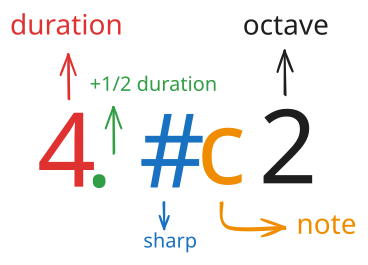
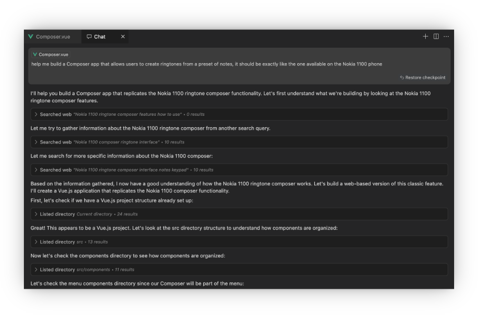
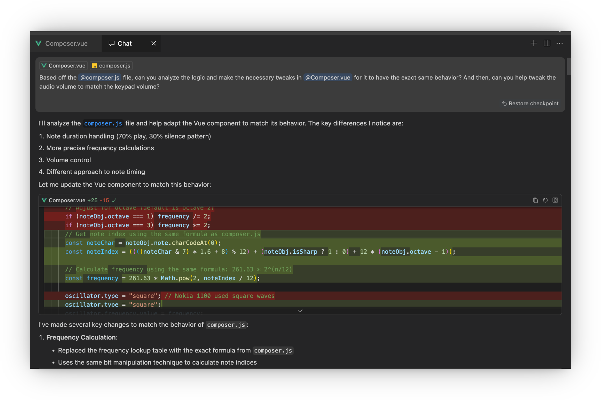

# I built a Nokia Composer with AI's assistance


I have recently released a new update to [Brick 1100](../brick1100/about.md) a few days ago, this update includes the new [Composer feature](https://brick1100.visnalize.com/#/extras/composer) allowing users to make their own ringtones in a monophonic style. It's a feature that I never thought I would be able to implement on my own, having no prior knowledge of music theory and even never having used the Nokia Composer before. However, with the help of AI, I was able to build it, in a considerably short amount of time. In this post, I would like to share the process of building the Nokia Composer and how AI has evolved remarkably to make it possible.

## What is Nokia Composer?

Composer was a built-in feature on several classic Nokia phones, allowing users to create their own monophonic ringtones. It provided a simple interface where users could manually enter musical notes, defining their pitch and duration. This feature was a popular way for users to personalize their phones in the pre-polyphonic and MP3 ringtone era, enabling them to compose famous tunes, TV theme songs, or even their own musical creations.

### How it works

The interface allow users to input notes using the phone's keypad. Each key corresponds to a different musical note, and additional options let users adjust the octave and duration of each note. Once a melody is created, it can be saved and set as the ringtone.

A typical composing process included:

1. Opening the Composer – Accessible through the phone's menu, a blank canvas would appear for users to start composing.
2. Composing the tune – Users could input notes using the phone's keypad:
    - Numeric keys `1`-`7` are used to assign musical notes
    - Keys `8` and `9` change the note's duration
    - Key `0` adds a rest
    - Key `*` shifts the note's octave
    - Key `#` makes the note sharp

3. Editing the tune – The melody could be played back, and individual notes could be modified or deleted as needed.
4. Saving and setting as ringtone – Once satisfied, users could save their custom melody and assign it as the default ring

<SponsorAd />

### Deep dive

{style="margin: 0 auto"}

<p style="text-align: center"><i>All possible combinations of a note's structure</i></p>

Nokia Composer follows a structured approach to note input, using a simplified notation system. Below is a breakdown of the key components involved in composing a melody:

- __Musical notes:__ Each numeric key, `1-7`, is assigned a specific note:
  - `1` = C (Do)
  - `2` = D (Re)
  - `3` = E (Mi)
  - `4` = F (Fa)
  - `5` = G (Sol)
  - `6` = A (La)
  - `7` = B (Ti)
- __Duration:__ Keys `8` and `9` adjust the note's length. The default duration is a quarter note (1/4 length of a whole note), which is represented by number `4`. Pressing `8` halves the duration, while `9` doubles it. The corresponding values are:
  - `1` = whole note
  - `2` = half note
  - `4` = quarter note
  - `8` = eighth note
  - `16` = sixteenth note

  Dotting a note increases its duration by half. For example, a dotted quarter note is 3/8 (1/4 + 1/8) of a whole note.
- __Octave:__ The `*` key is used to shift a note's octave, typically covering 3 octaves.
- __Rests:__ The `0` key is used to insert a rest (pause between notes). Duration keys can also apply to rests, adjusting their length accordingly.
- __Sharp notes:__ The `#` key is used to make a note sharp, raising its pitch by a semitone, not applicable to the E and B notes.
- __Tempo:__ The beats per minute (BPM) value to control the speed of the melody.

#### Example

Let's take `4c2` as an example, this represents a quarter note C in the second octave, which is also the default note for the Composer. By common convention, a quarter note equals to 1 beat, hence if we set the tempo to 120 BPM, the duration of this note would be 0.5 seconds (60 / 120 = 0.5s). In the same manner, we can interpret other note combinations:

- `8c2` = eighth note C in the second octave with a duration of 0.25s (half a beat)
- `2c2` = half note C in the second octave with a duration of 1s (2 beats)
- `4.c2` = dotted quarter note C in the second octave with a duration of 0.75s (1 and a half beats)
- `4#c2` = quarter note C# in the second octave with a duration of 0.5s
- `16.#d1` = sixteenth note D# in the first octave with a duration of 0.125s (1/4 beat)

## How I built it

I hope the above explanation gives you a good understanding of how the Nokia Composer works, because that's something I didn't know prior to building it. I had never used the Composer feature on a Nokia phone either, so I wasn't sure if I would ever get to implement it in Brick 1100. However, the project wouldn't fulfill its purpose as a Nokia 1100 simulator without this iconic feature, and become a let down for users who were expecting it. I decided to give it a shot, and with the help of AI, anything now seems possible.

### With AI's assistance

In summary, I used [Cursor](https://cursor.com) (an AI code editor) with the Claude 3.5 Sonnet model to build, the entire process took me 11 prompts, around 3 days to make the Composer fully functional and integrated with the project's codebase.

It's amazing to see how AI has evolved in such a short time. People with no background in composition can now easily [make music with AI](https://www.adobe.com/express/create/ai/music) by turning simple ideas into full soundtracks, and developers like me can build complex features without prior knowledge or experience in a certain field. I remember just months ago, AI tools like ChatGPT or GitHub Copilot are just making dumb, made-up suggestions when it comes to coding, but now they can actually provide helpful assistance. This is even more impressive with Cursor + Claude's model, which could generate for me a fully functional Composer in the very first prompt. Though to be fair, quite a few iterations were needed to refine the code, especially in handling the core logic of the Composer and integrating it with the existing codebase, but the AI's suggested code was an excellent starting point. It's not an exaggeration to say that, as a software developer, I should be worried about my job security due to the rapid growth of AI, but as an indie maker, it makes me feel like I have a superpower to build anything I want.



Without much instruction, solely from my first simple prompt, the AI agent was able to gather the necessary information of how the Nokia Composer works by searching the web, it then scanned the existing codebase to understand the structure, inspected the relevant parts for the conventions, and reused for generating the code. The result was great, the Composer was functional, but it was nowhere near perfect. There were still flaws, bugs, and inefficiencies that needed to be taken care of. It couldn't understand the way the keypad input was handled (so it improvised, but completely off the mark), the composer interface didn't fit in the overall layout, and the notes' pitch and duration were not accurate. In general, if I were to give the generated code a score, it would get a 6/10, but the most crucial and hardest part was done, so I was pretty happy with it.

<SponsorAd />

### Iterations and refinements

From reviewing the generated code, I knew where the problems lied, but I had no idea how to fix them at that point. Luckily, I found [this version](https://github.com/zserge/nokia-composer) of Composer built by [Serge Zaitsev](https://zserge.com/), which has a rather simple and clean implementation to follow. I used this as a reference source to feed the AI agent, asking it to explain the code to me and refactor it to be more readable and follow the project's coding style.



The generated code this time addressed most of the issues related the core logic of the Composer, once again, AI has been proven to be a wonderful tool for learning and adapting as it evolves. After some manual clean-up and adjustments, the Composer was finally in a good shape, the most crucial part of the Composer's logic was then encapsulated within the below function:

```js
/**
 * @param {Note[]} sequence The sequence of notes to play
 * @param {MediaStreamAudioDestinationNode} [destination] The stream destination to record audio
 */
function playSequence(sequence, destination) {
  const oscillator = this.audioContext.createOscillator();
  const gainNode = this.audioContext.createGain();

  oscillator.connect(gainNode).connect(this.audioContext.destination);
  oscillator.type = "square";
  oscillator.start();
  if (destination) gainNode.connect(destination);

  let currentTime = this.audioContext.currentTime;

  const setAudioParam = (param, value) => param.setValueAtTime(value, currentTime);
  const clamp = (value, min, max) => Math.max(min, Math.min(max, value));

  sequence.forEach(({ note, duration, octave, isSharp, hasDot }) => {
    const noteChar = note.charCodeAt(); // ASCII value of note
    const noteStep = ((noteChar & 7) * 1.6 + 8) % 12; // map note to the 12-tone scale
    const octaveOffset = 12 * clamp(octave || 1, 1, 3);
    const noteIndex = Math.floor(noteStep + (isSharp ? 1 : 0) + octaveOffset);
    const isRest = noteChar & 8;
    const adjustedVolume = this.volume / 10; // adjust volume based on keypad volume

    setAudioParam(oscillator.frequency, 261.63 * 2 ** (noteIndex / 12)); // convert to frequency (Hz)
    setAudioParam(gainNode.gain, isRest ? 0 : adjustedVolume);

    const noteDuration = (24 / this.tempoValue / clamp(duration || 4, 1, 64)) * (hasDot ? 1.5 : 1);

    currentTime += noteDuration * 7;
    setAudioParam(gainNode.gain, 0); // add a small pause between notes
    currentTime += noteDuration * 3;
  });

  return wait((currentTime - this.audioContext.currentTime) * 1000);
}
```

In simple words, the function above takes a sequence of notes and plays them back in the correct pitch, duration, and tempo. It uses the Web Audio API to generate the sound, and the function is called whenever a note is inputted or a melody composition is played. It also takes the destination stream as an optional parameter, allowing the composition to be recorded for exporting as a ringtone, an enhancement that wasn't available in the original Nokia Composer.

From this point, I just had to make some more manual tweaks to make the Composer's UI fit in the project's layout, and used a few more prompts to fix some unknown issues as they popped up when testing the feature on Android and iOS. As mentioned earlier, the total time spent on building it was around 3 days with 11 prompts, and we had a production-ready Nokia Composer in Brick 1100.

## Conclusion

Building the Nokia Composer was a challenging yet rewarding experience, and it wouldn't have been possible without the help of AI. I wouldn't know where to start to get a sufficient knowledge of music theory, let alone implement a feature like this in a short amount of time. Regardless how you perceive AI, it's undeniable that it has revolutionized the way we build software, and it's only going to get better from here. I'm excited to see what other features I can build with AI's assistance, and I hope you are too.

If you haven't tried out the Composer feature in Brick 1100 yet, I encourage you to give it a go, and let me know what you think (there's also a [Discord server](https://discord.gg/6AQDnZa4Xm) to hang out, leave feedback, or share your creations, join us if you're interested).
