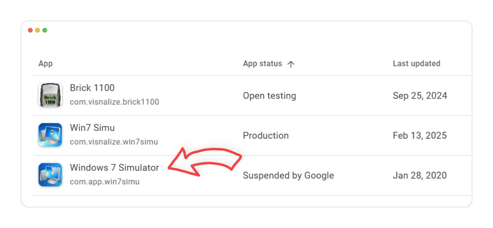
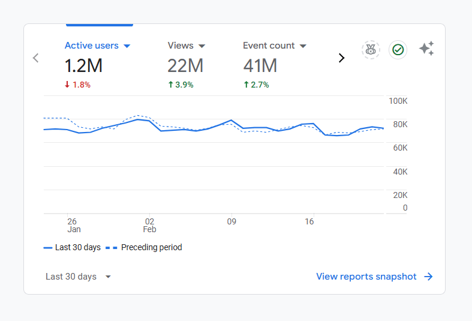

# A 5-year-old project

[Win7 Simu](../win7simu/about.md) has just turned 5 years old a couple weeks ago since its first release on February 13, 2020. Since then, it has been downloaded for __20M__ times by the time of this writing and used by many people from all around the world. An impressive number for something that I built in my free time, for fun and learning, something I had never expected to be this big.

5 years for me is a pretty long time, in fact, I haven't worked for a company for that long, especially in an ever-changing job market like my country, where 2 - 3 years is already considered a long time. The past 5 years working on Win7 Simu has granted me a lot of experiences, both positive and negative. In this second part of somewhat an impromptu series, I want to share my feelings and thoughts on the project, venting out some of the things that I have been keeping to myself for a long time.

:::tip Recommended read
If you haven't read the [first part](./building-win7-simu.md), I really recommend you read it. It will give you an insight into the beginning of the project, how it all started and the actual "building" process.
:::

## Unoriginal, a clone

An obvious thing about Win7 Simu that I have always tried to make clear of is that it is [a simulator](./simulator-vs-emulator.md#what-about-win7-simu), in other words, it's a clone of Windows 7, with flaws. Its entire goal is to mimic the look and feel of the operating system, and replicate them as closely as possible using the web techs that I know. A "useless" project that doesn't bring any value to the world, as some people might say. I'm aware of that, and I have always been. Indeed, it's absolutely unoriginal, doesn't serve much purpose other than being a "game" for people to play with.

At first, it was fun and challenging as a beginner project for me to learn and practice programming, but eventually, the impostor syndrome kicked in. I started to feel bad about myself for working on something that merely copied another product after all these years. I felt like I was wasting my time, no longer learning anything new, not making significant breakthroughs in my career while my peers were moving forward, using cutting-edge techs to work on challenging and exciting projects. This feels terrible.

___But, I still keep working on it. Why?___

<SponsorAd />

## Copyright concern

Let's address the elephant in the room, the copyright issue. I have always been worried that one day, Microsoft would come after me and ask me to take down the project, or even worse, sue me for copyright infringement. Despite the fact that Windows 7 has reached its end of life, and Microsoft no longer supports it, the copyright still stands. And there was a time the precursor of this project, which I called "Windows 7 Simulator", was removed from Google Play Store due to a copyright complaint from a legal entity representing Microsoft.

As a result, I have attempted several measures to mitigate the risk, such as changing the name to "Win7 Simu", replacing the app logo, and making it clear that the project is just a simulator and not affiliated with Microsoft in any way. However, a critical issue remains: by its nature, it's impossible to avoid using some of the copyrighted assets, such as icons, wallpapers, and sounds, which are essential to make the simulator as close to the real thing as possible. I have even tried to reach out to Microsoft several times using different channels, asking for permission to use these assets in the project, but I have never received any response from them (understandably).

To this day, the project still lives, in a gray area. Every time I open it up to fix a bug or add a feature, I'm always on the edge, wondering if I should continue working on it or drop it altogether to avoid any potential legal issues in the future. It feels depressing.

___But, I still keep working on it. Why?___

## Why I keep working on it

### People are using it

Believe it or not, every day, there are people using Win7 Simu, quite a lot actually. I have received many comments, feedback, and emails from users expressing their gratitude for the project, telling me how much they love it, how it brings back memories of the good old days when they were using Windows 7. Some of them even use it as a teaching tool for children, to show them how the operating system used to look like. In some parts of the world, especially in developing countries where people can't afford a computer, Win7 Simu is a good solution for them to experience this wonderful piece of software without much hassle, as they only need a low-end smartphone or a web browser to run it.

It's heartwarming to see that the thing I built has brought joy and value to people's lives, something that I never expected when I started this project. Seeing the positive impact that Win7 Simu has on people motivates me to keep working on it, to make it better, more accessible and enjoyable for everyone.

### It makes me money

Win7 Simu is free to use, but it's also monetized with ads and in-app purchases, and they have been generating a decent amount of [revenue](../metrics.md) for me. To be honest, money is a major factor that keeps me motivated to work on this project. I mean, who doesn't like money, right? Everybody needs money to survive, pay bills, eat, and do things they love. Although I'm glad to see that people are using Win7 Simu and enjoying it, the time and effort I put into it are not for free. There are costs for the server, domain, and other expenses to keep it running, and more importantly, I also have a family to feed, a life to live. The money I make from it helps me cover these costs, have a better life, and invest in the future.

Money shouldn't be the entire reason why anyone should work on something, but it's definitely necessary to keep things going. For me, it's not only a motivation, a reward, but also an obligation to serve the users, repay their trust and support. Let's be real, would you trust and use a free product that is rarely updated, and might be abandoned anytime as the creator no longer has the interest or resources to work on it, OR a product that you know it's sustainable, well-maintained, and has a future? I think the answer is obvious (I've also written a [dedicated post](./free-vs-paid.md) about this topic).

I guess since Win7 Simu is making money, it can be classified as a commercial project, and that makes it more vulnerable to legal issues. But to be clear, I'm not trying to make a profit out of Microsoft's work, I'm not trying to steal their intellectual property, or harm their business in any way. I've been transparent about the project, its purpose, and its limitations from the beginning. I'm not selling Windows assets through Win7 Simu, nor decoding or reverse-engineering the original software to create it. I'm just selling my time, the lines of code I wrote, and the effort I put into this project. If anyone from Microsoft is reading this, I would be grateful for your understanding and hope you know that I'm willing to cooperate if there's any concern about this project.

<SponsorAd />

### It's a therapy

As a software developer, I don't spend a lot of time with people, I don't go out much, my time are spent trying to keep up with the latest tech trends and learn new things, my senses are mostly occupied by the screen and the keyboard. The day job has consumed most of my time, energy, and mental health. Sometimes, it's overwhelming, stressful, and depressing. I have to deal with bugs, deadlines, meetings, and other things that come with the job. I have to keep up with the competition, the ever-changing tech landscape, the new tools, and frameworks that keep popping up every day. It's exhausting.

Win7 Simu is like therapy for me, I can enjoy the process of building it, without any pressure, without any expectation. I can work on it at my own pace, in my own way, experimenting with new ideas, and not worrying about the outcome. This may sound contradictory to my above statements, but the fact that Win7 Simu is a clone, a useless project, is what makes it so liberating. I don't have to think too hard about the market, the competition, the users' needs. I can just focus on building something that I enjoy, and that there are people enjoying it too.

## What's next

Looking back at the past 5 years, it appears that most of the dot points I mentioned in the [previous post](./building-win7-simu.md#what-s-next) have been achieved:

* [x] Regularly check out user reviews and feedback from several sources (Google Play reviews, emails, comments etc.) for feature prioritization.
* [x] Provide some ways for users to participate in translating the interface → <s>__Crowdin__</s> (translations are now handled by automation)
* [x] Keep users informed about the new changes for every update → [Changelog](/win7simu/changelog.md)
* [x] Implement the suggested features from the users according to the assigned priorities → [Project feature board](https://github.com/orgs/Visnalize/projects/1)
* [x] Implement some unique features that enhance the purpose of learning through the simulator → [Theme Studio](../win7simu/themestudio.md)
* [x] Integrate CI and incorporate automation tests to ensure the quality of every release → Using Github Actions
* [ ] Public the source code at some point for various benefits.

Although some of them may not be considered fully completed, and the source code I haven't decided to make public yet, I think it's still some good progress.

There is now a [long list](https://github.com/orgs/Visnalize/projects/1) of features/to-dos that can be done to improve Win7 Simu, so I'm not going to set any specific goals for it in the future. Honestly, I'm still trying to figure out what my life will look like in the next few years, let alone thinking about the future of this project. The only things I can say for sure are that I will keep working on it, as a side project (sorry to disappoint those expecting a full-time commitment), for as long as I can, and that I will do my best to make it more and more useful, not just a clone, so you can actually apply it to your daily life, assist your work, study, or entertainment. And again, please do me another favor, keep accompanying me in my journey and stay tuned for future updates of Win7 Simu or any future products that I will be able to bring forward.

_Thank you for being part of my journey. Sincerely._
