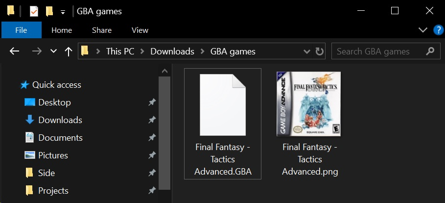
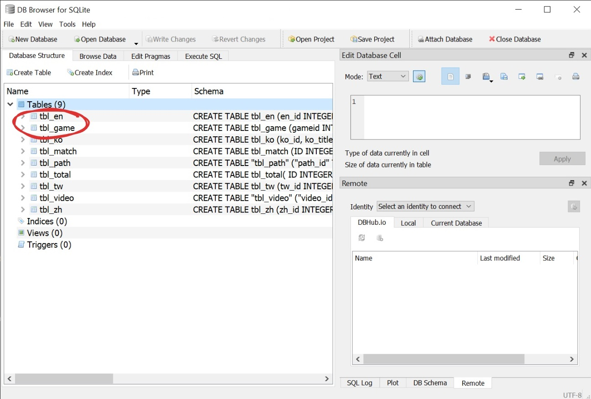
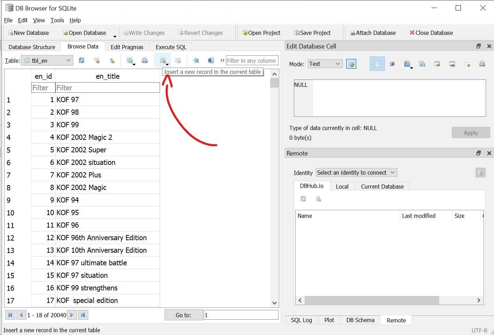
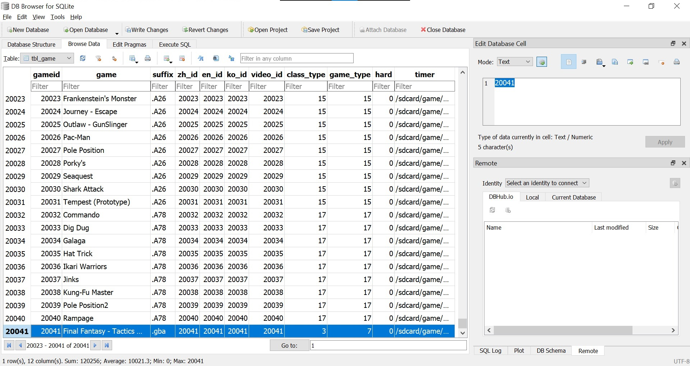

# How to add more games to Game Stick Lite 4K

Recently, I have had a chance to get my hands on a Game Stick Lite 4K, a USB stick-like device with two controllers and a bunch of pre-installed games that you can play on your TV. It is a fantastic option for those who want to play their childhood games on a big screen without owning a fancy console or a computer, as it is very affordable (typically around $20 - $40) and easy to set up. Though there are a lot of games pre-installed, some of your childhood favorites might be missing or are not available in your language. In this post, I will show you how to add more games to the Game Stick Lite 4K to enjoy more of your childhood games.

::: warning Heads up
The approach shared in this post appears to be only applicable to some versions of the Game Stick Lite 4K. The process might be varied for different versions. Please refer to the [comments](#comments) below to see if others have shared their experiences with your version of the Game Stick Lite 4K.
:::

## Prerequisites

- A Game Stick Lite 4K (apparently)
- A computer or laptop with internet connection
- A MicroSD card reader (even your smartphone can be used as a card reader)

<SponsorAd />

## Step-by-step guide

### 1. Prepare the game ROMs

- Have the game ROMs you want to play ready (you can find these easily by searching on the internet).
- Optionally, download a cover image for each game if you want to see the cover image when selecting the game to play.
  - Make sure the cover images have the same name as the game ROM files and are in the `.png` format.

### 2. Access the game stick

- Remove the MicroSD card from the game stick
- Insert the MicroSD card into your computer or laptop using a card reader.
- At the root of the SD card, you will see a `game` folder where all the games are stored. Games are grouped by the console they belong to. For instance:
  - The `fc` folder: NES games
  - The `gbc` folder: GameboyColor games
  - The `atari` folder: Atari games

### 3. Add your games

- Copy your game ROMs (and their cover images) to the respective folders. Note that the ROM format should match with what is already available in the folder.
- Install [DB4S](https://sqlitebrowser.org/) (SQLite Database Browser) on your computer or laptop.
- Back to the root of the SD card, open the `games.db` file with DB4S
  - If using a smartphone as a card reader, you might have to copy the file to your computer first.

- Here, a list of tables in the game database will be displayed, you only need to care about the tables `tbl_en` and `tbl_game` where you will modify to add your games.

:::warning Warning
Be very careful when modifying the game database. Any mistake will cause the game stick to not work properly. Always make a backup of the `games.db` file before making any changes.
:::

- Click on the "Browse Data" tab
- Select the `tbl_en` table from the dropdown
- Choose "Insert a new record" and add your game titles.
  - Make sure the game titles match the names of the ROM files you added earlier.

- Then select the `tbl_game` table from the dropdown
- Add your game data here following the existing format and structure.
  - Also make sure the game titles match the names of the ROM files you added earlier.

### 4. Save and enjoy

- Save your changes (and replace the `games.db` file on the SD card if you copied it to your computer earlier).
- Safely remove the MicroSD card from your computer or laptop
- Insert it back into the game stick.
- Turn on the game stick and enjoy your games!
