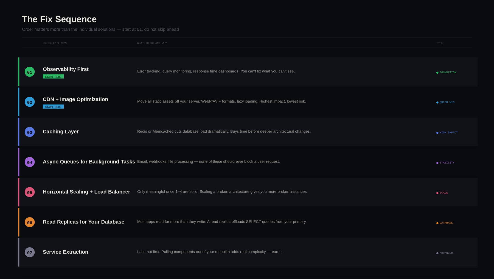

# From MVP to Millions of Users: Architecture Optimization for High-Load Web Apps

There's that one moment every founder secretly hopes for but quietly fears.

As your app starts picking up real traction and users begin sharing it, traffic climbs steadily until, almost overnight, everything slows to a crawl. Then you notice errors pile up, and the product that was working just fine yesterday is now struggling under the weight of its own success.

This situation happens so many times it's almost predictable. Most founders just don't talk about it openly. And it almost always comes down to the same root cause: **the architecture that got you to launch wasn't built to carry you past it.**

That gap between *good enough to ship* and *ready to scale* is expensive in terms of extra hours spent rewriting code by engineers and, more worryingly, momentum squandered at the wrong moment for your app and business.

So, what can founders do about it?

We'll walk through what actually breaks first when a web app faces sudden growth, and how smart teams harden their server-side and client-side architecture *before* the spike. If you're building something with real ambitions, this is the conversation worth having while you still have time to act on it.

## The Anatomy of a Viral Spike & What Actually Breaks

When an app goes viral, it rarely happens in a controlled, gradual way. It tends to come in a wave, like a tweet, a Product Hunt launch (which can drive [500 signups on Day 1 and 500% traffic spikes](https://dev.to/momen_hq/is-product-hunt-still-worth-it-heres-what-our-launch-taught-us-1552), per recent launches), or a newsletter feature. And your infrastructure either holds or it doesn't.

Here's what typically fails first, and in roughly what order:

| Layer | What breaks | Why |
| ----- | ----- | ----- |
| Database | Slow queries, connection pool exhaustion | Too many concurrent reads/writes, no caching |
| Backend server | High response times, 503 errors | Single instance, no horizontal scaling |
| Frontend | Long load times, layout shifts | Unoptimized assets, no CDN |
| Third-party APIs | Rate limit errors | No queuing or retry logic |
| Auth/session | Login failures under load | Session store not distributed |

Most early-stage products are built as monoliths, with one codebase, one server, and one database. That's not a flaw, but the problem comes when teams don't notice the cracks forming until the wall comes down.

**Why the MVP Architecture Works Against You at Scale**

A well-built MVP gets you to your first users fast. But the same decisions that speed up early development tend to create friction later.

Here are the most common patterns that become liabilities:

* **Tight coupling between modules**.  
  When your billing logic, user management, and core product features all live in the same codebase, a bug in one area can take down everything.  
* **No separation between reads and writes**.  
  A single database handling both is fine at 100 users. At 100,000, it becomes a bottleneck.  
* **Synchronous processing for everything.**  
  If a user action triggers an email, a webhook, and a database write all at once, any one of those failing can break the whole flow.  
* **No caching layer**.  
  The same data gets fetched from the database on every request, even when it hasn't changed.  
* **Frontend served from the same server as the backend**.  
  More load, less separation, slower response times.

Many indie developers hit a wall when their app goes viral. Teams focusing on [startup MVP development](https://spdload.com/mvp-development/) often advise migrating from monolithic structures to microservices before technical debt paralyzes the product.

## The Audit: Where Does Your App Stand Right Now?

Before you read another word about solutions, do this. Go through these questions honestly.

They won't replace a proper technical review, but they'll tell you where your biggest risks are and whether you have time to act before your next growth push.

**1\. What happens if your main server goes down right now?**

* The app goes down completely → High risk  
* Traffic shifts to a backup automatically → You're in reasonable shape

**2\. How long does your slowest database query take under normal load?**

* You don't know → Set up query monitoring today (PgHero or Datadog are good starting points)  
* Over 500ms on common queries → Time to look at indexing and caching  
* Under 100ms consistently → Healthy for now

**3\. Do you have a caching layer in place?**

* No caching at all → Your database is absorbing every single request  
* Some caching, not systematically applied → Partial coverage, worth auditing  
* Redis or equivalent in place with a clear strategy → Good foundation

**4\. How do you handle background tasks — emails, file processing, webhooks?**

* Synchronously, inside the main request → Any failure can break the user flow  
* Via a queue with retry logic → You're protected from cascading failures

**5\. Where are your static assets served from?**

* Same server as your application → Your app server is doing unnecessary work  
* A CDN → Good. If not set up yet, this is one of the lowest-effort, highest-impact changes you can make

**6\. When did you last look at your error logs and response time trends?**

* Rarely or never → You're flying blind. Set up basic observability before anything else  
* Weekly or more → You'll catch problems before your users do

**7\. Do you know your app's current p95 response time?**

* No → This is the single most important number to know. It tells you what the slowest 5% of your users are experiencing right now  
* Yes, and it's under 500ms → Strong position  
* Yes, and it's over 1–2 seconds → Users are already feeling it, even if they haven't complained yet

**How to read your results:**

| Answers | What it means |
| ----- | ----- |
| Mostly "no" or "don't know" | Your architecture needs attention before your next growth push |
| Mixed | You have a foundation. Prioritize the gaps by traffic impact |
| Mostly solid | Focus on observability and sequencing your next improvements |

If you answered "I don't know" more than twice, that's the most important finding. **Visibility comes before optimization. You can't fix what you can't see.**

**The Fix Sequence: Order Matters More Than the Solutions**

Here's what most scaling articles get wrong: they give you a menu of architectural improvements and let you pick.

But doing the right thing in the wrong order, say, migrating to microservices before you have basic observability, can create more chaos than the original problem.

The sequence below is ordered by impact-to-risk ratio:

| Priority | Move | Why this order |
| ----- | ----- | ----- |
| 1 | **Observability first** | You can't fix what you can't see. Set up error tracking, query monitoring, and response time dashboards before touching anything else. |
| 2 | **CDN \+ image optimization** | Highest impact, lowest risk. Moves static asset load off your server entirely. |
| 3 | **Caching layer** | Buys significant time before bigger architectural changes. Redis or Memcached can cut database load dramatically. |
| 4 | **Async queues for background tasks** | Protects against cascading failures. Email, webhooks, file processing — none of these should block a user request. |
| 5 | **Horizontal scaling \+ load balancer** | Only meaningful once 1–4 are in place. Scaling a broken architecture just gives you more broken instances. |
| 6 | **Read replicas for your database** | Most apps read far more than they write. A read replica offloads SELECT queries from your primary instance. |
| 7 | **Service extraction** | Last, not first. Pulling high-traffic components out of your monolith adds real complexity. It should be a considered decision. |

### What to ask your engineering team at each stage

You shouldn't need to implement any of this yourself. But you should be able to have the conversation. Here's how:

* **On observability:** "What does our p95 response time look like right now? Where are we seeing the most errors?"  
* **On caching:** "Are we caching anything? What data are we fetching from the database on every request that hasn't changed?"  
* **On async tasks:** "What happens to the user experience if our email provider goes down? Are any background tasks running synchronously inside a request?"  
* **On scaling:** "If we got 10x our current traffic tomorrow, what's the first thing that breaks?"

If your team can answer these confidently, you're in good shape. If there's hesitation, that's where to focus first.

**A Quick Reference: Server-Side and Client-Side Priorities**

### Server-Side

**Caching** is the fastest way to reduce database pressure. Cache expensive query results, user session data, and anything read far more often than it changes.

| Data type | Cache? | TTL suggestion |
| ----- | ----- | ----- |
| User profile info | Yes | 5–15 minutes |
| Real-time inventory or prices | No | — |
| Homepage/featured content | Yes | 1–60 minutes |
| Auth tokens | Yes | Match session length |
| User-specific feed data | Conditional | 1–5 minutes |

**Message queues** (RabbitMQ, BullMQ, AWS SQS) let you offload time-consuming tasks from the main request cycle. Instead of making the user wait while your server sends an email or processes an image, you queue the task and handle it in the background.

**Horizontal scaling** distributes traffic across multiple instances. This gives you redundancy — if one goes down, others keep running — and makes scaling as simple as adding instances.

### Client-Side

The frontend is underestimated in most scaling conversations. These are the highest-leverage moves:

| Optimization | Impact | Complexity |
| ----- | ----- | ----- |
| CDN for static assets | High | Low |
| Image optimization (WebP/AVIF, lazy loading) | High | Low–Medium |
| Code splitting | High | Medium |
| SSR or SSG for content-heavy pages | High | High |
| Deferring third-party scripts | Medium | Low |

Start with high-impact, low-complexity wins. A CDN alone, if you're not using one, can meaningfully reduce server load and improve perceived performance for users far from your origin server.

**When to Act**

The right signal isn't a specific traffic threshold, but more of a combination of leading indicators:

* Response times creeping up under **normal** load (not just peaks).  
* Database CPU regularly above 60–70%.  
* Deploy cycles getting riskier because everything is coupled.  
* Your team spending more time firefighting than building.

If you're approaching a major marketing push, a Product Hunt launch, or a press feature, and any of those boxes are checked — that's the time to act. Start with visibility, make the low-risk changes first, and treat each improvement as a foundation for the next one.
