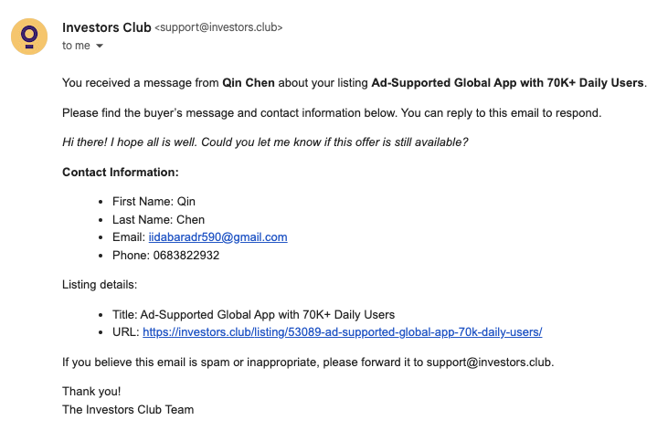
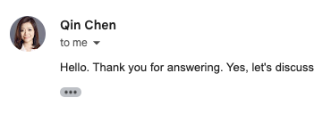
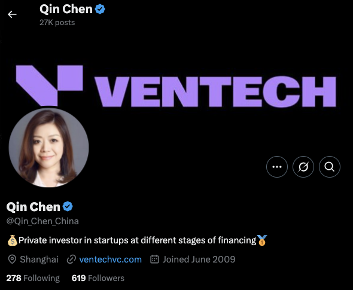
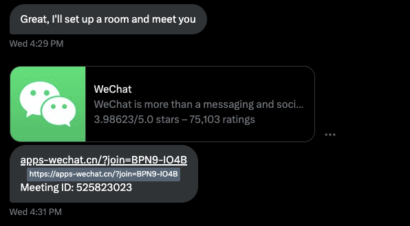
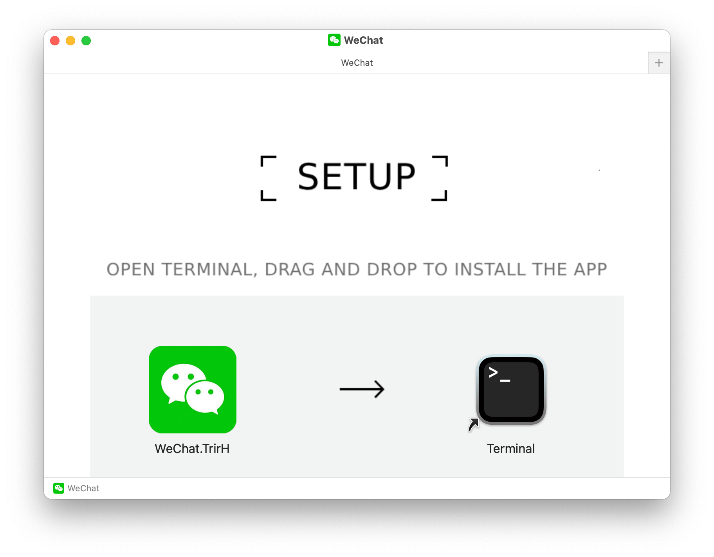
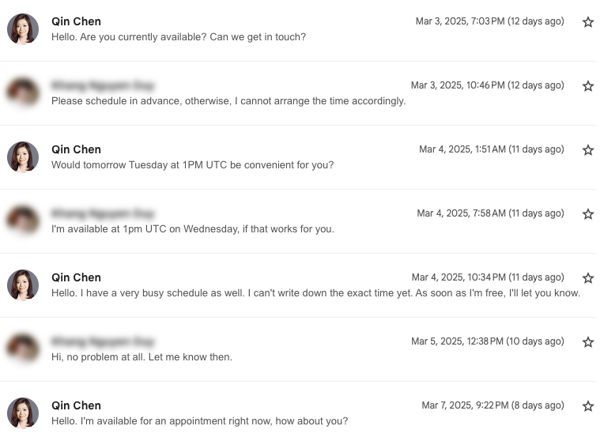
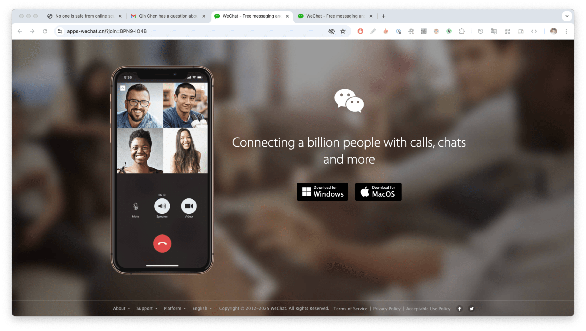
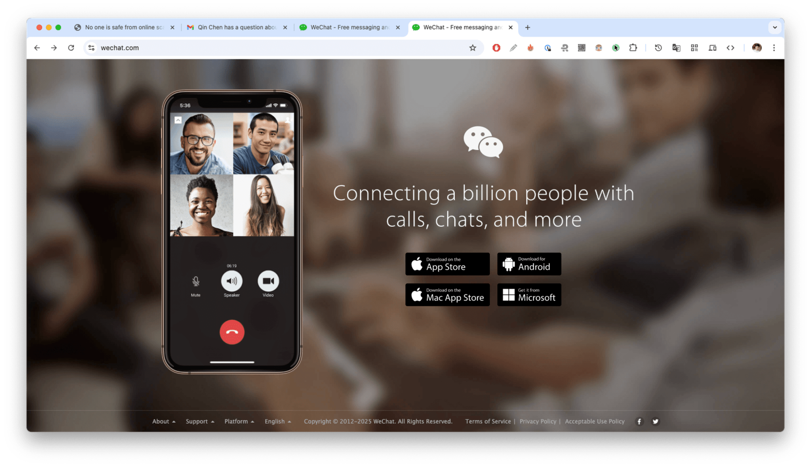

# No one is safe from online scams

_Photo by [Tima Miroshnichenko](https://www.pexels.com/photo/a-person-with-handcuffs-holding-a-sign-that-says-fraud-6266506/)_

With the rise of the internet, the transition from physical to digital has brought many benefits to our lives. However, it also comes with its own set of risks. One of the most common risks is online scams. Scammers are getting more sophisticated, it is becoming increasingly difficult to spot them, and no one is safe from becoming a victim.

I have recently been targeted by a scammer despite keeping my [online identity concealed](./concealing-online-identity.md) whenever possible. In this post, I would like to share my experience, how I managed to avoid it, and hope that it will be helpful for you to avoid similar scams.

## The story

On February 27, I received a notification from a platform where I listed [Win7 Simu](../win7simu/about.md) as part of my marketing strategy to boost its online presence. The notification was from a person who showed interest and wanted to inquire about it. I was excited to see a potential customer and didn't have any suspicions at the time, so I quickly responded to their message.

The person went by the name of "Qin Chen", had a professional-looking avatar, so their profile seemed to be legit. We had a few email exchanges, 1 - 2 emails per day, they seemed genuinely interested in Win7 Simu.

{style="margin: 0 auto"}

On March 1, they wanted to connect "by voice" to discuss further details. I proposed a few options that I was familiar with, but they said they were not able to use any of them due to the Chinese government's restrictions. Then, they suggested using WeChat, which I had never used before, but I still agreed to it. I tried to open a WeChat account, but it was not possible without a referral from an existing user. They proposed to agree on a time, and they would send an invitation link to connect on the WeChat conference platform.

Fast forward to March 12, after several attempts to find a convenient time for both to no avail, we continued the communication on X. Here, they claimed to be a "private investor" from Shanghai, China, their profile was verified with a blue checkmark, had 27K posts, 600+ followers, all of which could easily overwhelm anyone into thinking they were legit.

We exchanged a few messages, and they sent me a link to join the WeChat conference.

At this point, I started to feel something was off. The `apps-wechat.cn` domain looked suspicious, so I did a quick research, and it turned out that domain had just been registered a few days prior to our conversation. I could totally come to the conclusion that the entire thing was a scam. But still, I decided to click on the link to see through the end. Following the link, a website opened up with 2 options to install WeChat on Windows and Mac, however, clicking on either would just download a `.dmg` file, which is basically an installer for macOS.

Opening the `.dmg` file, the below installation window showed up. The WeChat app's name looked weird, and rather than dragging the app to the Applications folder, it instructed me to drag the app to the __Terminal__ to "install" it.

This is where I stopped, proceeding further would likely get my device compromised. I decided to expose the scammer, below is the entire conversation, uncensored, that took place afterwards. You can see how bold and indifferent they were to my accusations, even asking me if I would be interested in becoming part of them.

<video playsinline muted controls>
    <source src="./img/no-one-is-safe-from-online-scams/conversation-with-scammer.mp4" type="video/mp4">
</video>

<SponsorAd />

## How to avoid scams

In short, there is no foolproof way to avoid scams, but there are some common traits that you can look out for to minimize the risk of falling victim to them. Please take the following as a reference, not advice, and always use your best judgment when dealing with online strangers.

### The common traits

- __Gibberish emails__: scammers often have to iterate through many potential victims, so they tend to use generic and disposable email addresses to maximize their reach and minimize the risk of being identified.

  In this case, their email address was __`iidabaradr590@gmail.com`__, which was in no way related to their claimed identity. However, as you can see, this important factor was totally overlooked by me and it might happen to you as well.

- __Legit identity__: scammers often invest time and effort to create profiles that look professional and trustworthy to lure their victims into a false sense of credibility and gain their trust to proceed with the scam.

  In this case, a verified X account, with 27K posts, 600+ followers is a very convincing profile that could easily make a fool out of anyone. Even beyond that, the profile picture, name, description, and posts were all consistent with the identity they [impersonated](https://www.ventechvc.com/people/qin-chen), indicating the level of sophistication they put into creating the fake identity.

- __Urgency__: scammers are experts in psychological manipulation, and creating a sense of urgency is one of their most effective tactics. By doing so, they pressure their victims into making quick decisions without thinking them through, making them more susceptible to scams.

  In this case, despite their "busy" schedule, they never wanted to find a convenient time for both, always pushing to connect "now" or "as soon as possible", regardless of my availability and preparedness.

  

- __Suspicious links, attachments, and downloads__: scammers often provide links to websites, attachments, or downloads that look legitimate but are actually malicious. Without sufficient knowledge and experience, it is difficult to spot them, and they also change frequently to avoid detection.

  In this case, the domain `apps-wechat.cn` can easily be mistaken for the official WeChat website, they even went as far as cloning the official website's UI, making it look even more convincing. The download links also downloaded a `.dmg` file with an abnormal installation process that could be easily overlooked in combination with the urgency and trust they built up.

  | Fake: apps-wechat.cn | Real: wechat.com |
  | --- | --- |
  |  |  |

### What to do

- __Keep your knowledge up-to-date__: always stay informed about the latest scams, watch the news, read articles, and educate yourself about the ever-evolving tactics scammers use to avoid falling victim to them.
- __Use common sense__: if something seems too good to be true, it probably is. Always use your best judgment and think things through before making any decisions.
- __Report suspicious activities__: if you suspect someone is trying to scam you, report them to the platform you are using, and warn others about them to prevent them from falling victim to the same scam.

These tips might sound too generic and obvious, but as I mentioned earlier, there is no foolproof way to avoid scams. When you are in the heat of the moment, it is easy to overlook them. I hope my experience will help you avoid similar scams and stay safe online.
