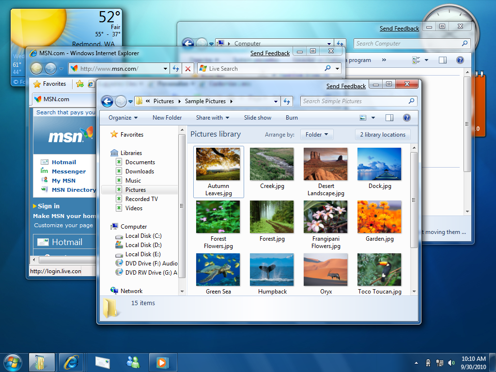
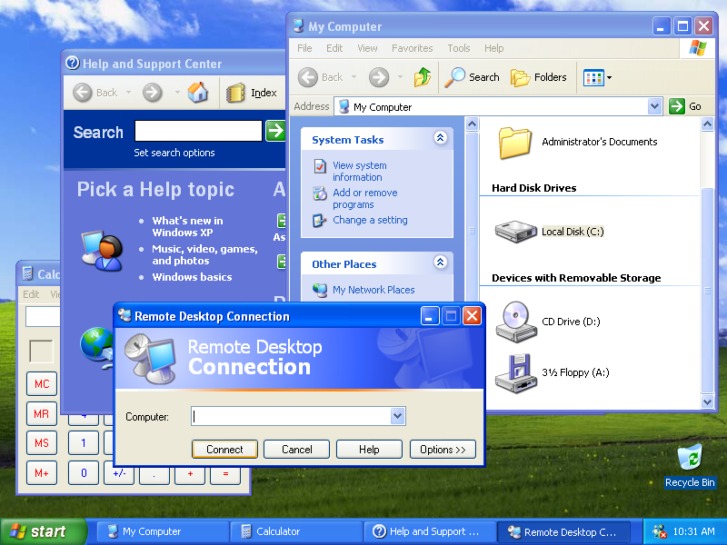
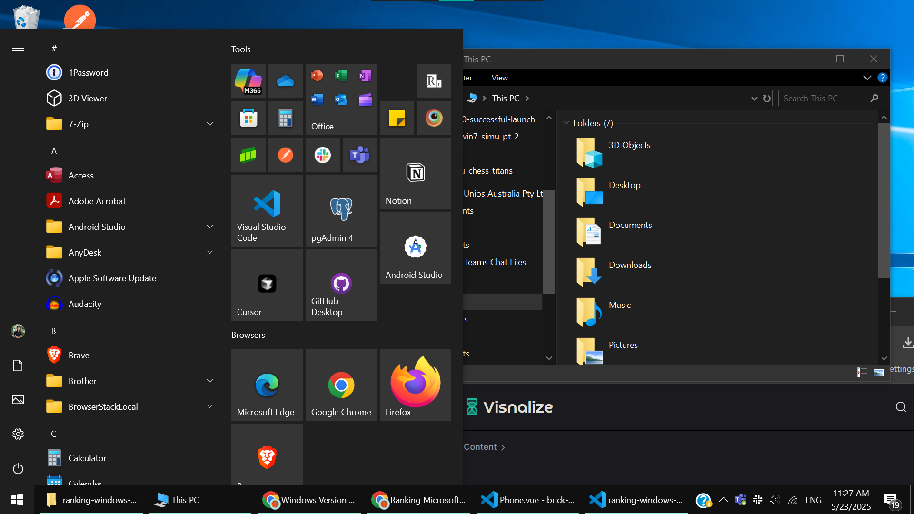
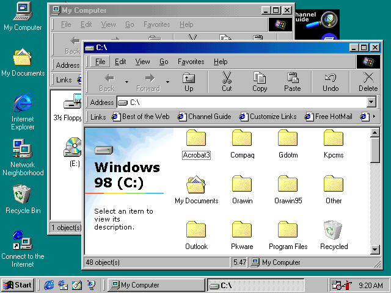
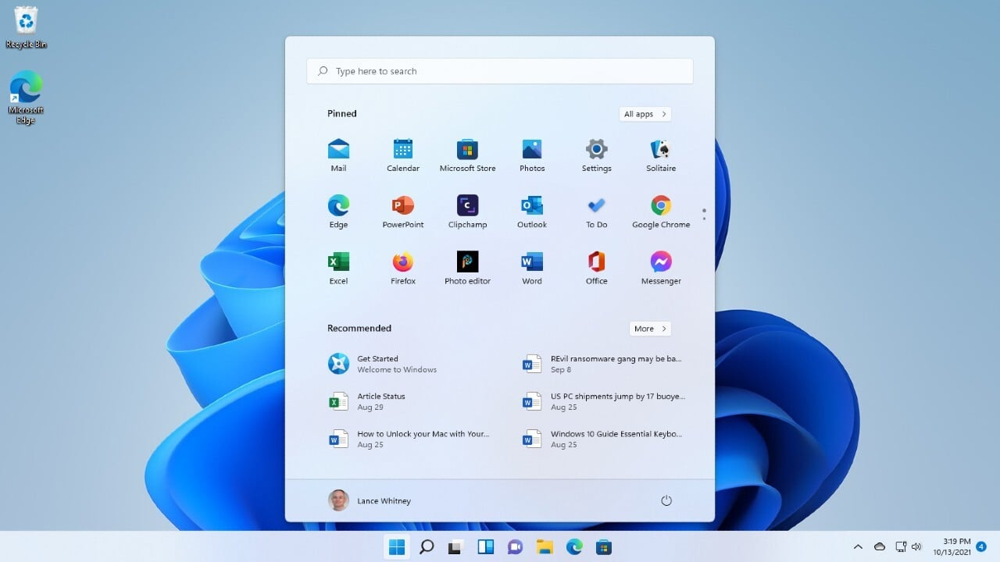

# Ranking Microsoft Windows versions - 2025 Edition

Everyone has their own preferences and opinions on which Windows version is the best, so in this fun little post, I'm going to rank the Windows versions from best to worst in my opinion (but I suppose you can already guess which one is the best, coming from the creator of [Win7 Simu](../win7simu/about.md) 😂).

_As biased as this sound, this list is actually backed by facts, statistics, and market share trends ([source](#trust-me-bro))._

<a name="trust-me-bro" />

## 🏆 Windows 7 - the GOAT, no debate

Windows 7, without a doubt, is the best Windows version to this day. It was fast, stable, and had the best user interface. The perfect balance between performance and aesthetics. It took everything people hated about Vista and... didn't do it. Whether you were gaming, working, or just customizing the hell out of your desktop, Windows 7 made you feel like your PC got you. Even after Microsoft ended support, many users clung to it for years, including enterprises, businesses, and individuals.

_If you disagree, you're against a civilization!_

## 🥈 Windows XP - that startup sound \*chefs kiss\*

Blue skies, green hills, and a startup sound etched into memory. Windows XP was ridiculously lightweight, reliable, and compatible with almost everything. It was the first Windows version to really nail the user experience. It became the backbone of businesses, schools, and homes for years. Paint, Pinball, Clippy, Windows Media Player with custom skins. Enough said. It was the golden age of Windows.

## 🥉 Windows 10 - when Microsoft finally listened

Okay, this one is not on a nostalgia trip, but Windows 10 is a solid operating system. After the mess that was 8 and the "meh" 8.1, this was the comeback we needed. It brought back the Start Menu, improved performance, and finally had users agreeing on something. It was a step in the right direction, even if it had its fair share of bugs and issues.

## 4️⃣ Windows 98 - if you know, you know

Yet another classic. Windows 98 was _the_ Windows for anyone growing up in the late 90s. It introduced several features which would become standard in future versions. The aesthetics it inherited from Windows 95 remained iconic. Remember Half-Life, Rollercoaster Tycoon, or Quake? Those games were the reason many of us fell in love with gaming and computers.

## 5️⃣ Windows 11 - trying hard to be cool

The latest version of Windows at this point in time. Windows 11 is a mixed bag. It has a sleek design, but it feels like Microsoft is trying too hard to be trendy. The new Start Menu and taskbar are... different. Some people love it, some hate it. It's fast (kinda, if you have the right hardware), but it feels like a glorified Windows 10 update. The new features are nice, but it doesn't feel like a major leap forward. It's like that friend who tries to be cool but ends up being cringy.

## Honorable mentions and conclusion

🎀 __Windows Vista__: beautiful but slow and buggy, still a solid attempt that paved the way for Windows 7.

🎀 __Windows 8.1__: a decent attempt to fix the mess of Windows 8, but just not enough.

In conclusion, Microsoft has had its ups and downs with Windows versions. Some were revolutionary, while others were just... there.

But one thing is for sure: if you want to experience the best of Windows 7 and every other Windows version mentioned above, you can always check out [Win7 Simu](../win7simu/about.md). It's the closest thing to reliving the glory days of Windows 7 without the hassle of installing it on your machine, or messing around with virtual machines and technical stuff. Just pure nostalgia and fun.
