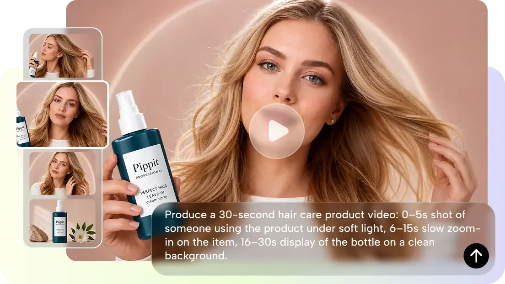
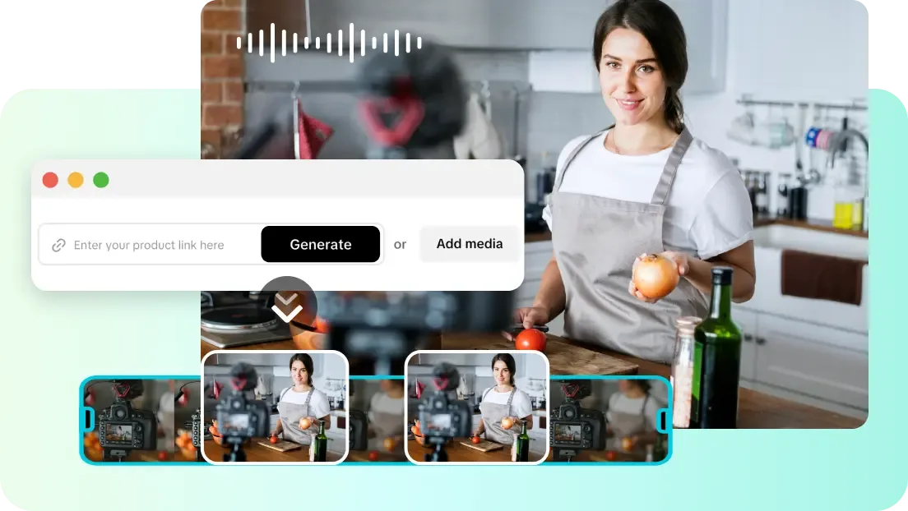
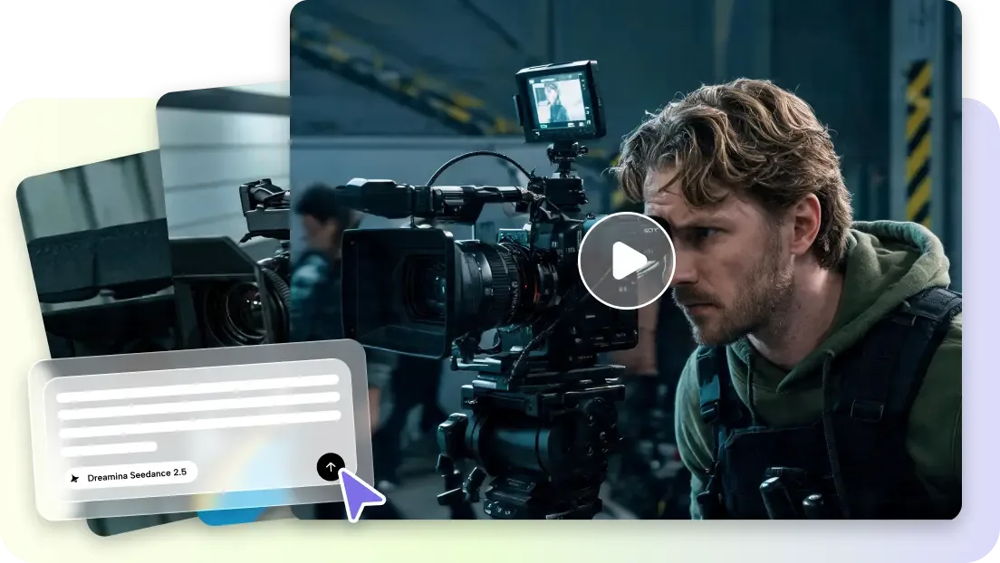

# Create Content With Full Creative Freedom Using Seedance 2.5

_Cover image from [Pippit](https://www.pippit.ai/models/seedance/2-5)_

AI-powered video creation has expanded what a single creator can produce. Visual ideas can turn into finished scenes much faster than with conventional workflows, and Seedance 2.5 supports that with flexible concepts, detailed prompts, and controlled video generation. Pippit helps creators produce, develop, and publish professional visual content, with generation tools and editing features in one place.

## What Creative Freedom Means in AI Video Production

In video making, creative freedom means working with ideas without hard restrictions. Today's [AI video generator](https://www.pippit.ai/tools/ai-video-generator) workflows let creators test new ideas quickly. Storytelling stays flexible, so the same footage can carry different stories, expressions, and compositions. Visual experimentation covers changes in style, camera movement, and scene detail. Scene customization lets you adjust subjects, backgrounds, actions, and presentation. Well-designed prompts improve the connection between the idea in your head and the visuals the model returns. Multi-format output then supports social platforms, campaigns, and presentations.

## Building Original Video Concepts Before Generation

Video concepts should be planned before generation starts. First, choose a theme that matches the message. Plan each scene so the visual progression is clear. Use style consistency to connect moments across the video. Think about motion design as well, such as the speed of movement and the direction of the camera. Prepare references for color, objects, characters, and environments. Pippit can organize those creative assets and then turn the idea into a finished video. Good preparation leads to better results and reduces unnecessary regeneration later.

## Steps to Create Content With Full Creative Freedom Using Seedance 2.5

### Step 1: Start your creative workflow

1. Sign up for Pippit using your Google, TikTok, or Facebook account.

2. Open the left vertical menu bar, select the **"More"** tab, and go to **"Video generator"**.

3. Pick **"Dreamina Seedance 2.5"** as your AI model.

4. Enter a detailed text prompt explaining your creative idea, style, scenes, and direction.

5. Adjust video length, language, subtitles, and aspect ratio to match your project.

6. Click **"+"** to upload reference images or videos from your device, phone, Dropbox, or a link. You can also select assets you have already saved.

7. Click **"Generate"** to create your content.

### Step 2: Generate creative video

1. After you click **"Generate"**, Pippit's AI video generator creates content based on your prompt and references.

2. The AI handles transitions, pacing, captions, avatars, voice, lyrics, and visual enhancements.

3. Review the generated video draft.

### Step 3: Edit and export

1. Click the **"Download"** tab in the top right corner to save the video. Use **"Regenerate"** for another result, or click **"Edit more"** below the video for customization.

2. Customize captions, add text, and adjust size, color, alignment, filters, and effects.

3. Add background music, remove backgrounds, and fine-tune visuals.

4. Click **"Export"** in the top right corner.

5. Select **"Publish"** to share directly on TikTok, Instagram, or Facebook, or click **"Download"** to save with your chosen format, resolution, frame rate, and quality.

## Combining References for Greater Creative Control

References give you more creative control during generation. Images supply product, character, object, and visual information. Video references direct movement, timing, and scene behavior. Style references keep colors, textures, and artistic approach consistent, while lighting and atmosphere references guide the mood. Compositional inspiration leads to balanced scenes with better framing. [Seedance 2.5](https://www.pippit.ai/models/seedance/2-5) accepts multimodal references, which makes creative instructions clearer. Pippit lets you mix several reference types to reach a precise visual result. Choose references that support a single creative direction rather than pulling the scene in different ways.

## Exploring Different Creative Video Styles

Different video styles help creators communicate different messages, and Pippit makes it easy to try several visual approaches. Popular styles include:

- Cinematic videos with dramatic lighting, camera movement, and depth of storytelling.

- Lifestyle videos built around natural places, products, and daily experiences.

- Fantasy videos set in imagined worlds, with fantasy characters and visual ideas.

- Minimalist videos with simple scenes and clear subjects.

## Expanding Creative Possibilities with Seedance 2.5 Features

Seedance 2.5 offers features that improve control over the generated video. Timestamp prompts mark key moments inside a scene, so creators can say when a certain action should happen. Green screen refinement means the background can be changed after generation. Multi-language prompts support localized creative planning for different audiences. Scene extension stretches a scene into a longer sequence, with improved object movement, materials, and physical interaction through realistic motion simulation. The system can create up to 30 seconds of continuous footage and allows footage extensions for connected storytelling. These features suit product videos, social content, and creative campaigns.

## Creative Prompt Writing Best Practices

Good prompts make video output better and more consistent. Describe scenes in order so the visual flow is clear. Begin with the subject, then the action, the surroundings, and the style, including lighting, mood, and color direction. Stay consistent and use the same creative approach across scenes. Use references deliberately to direct appearance and composition. Keep one creative line instead of mixing unrelated concepts. Add camera direction for better film quality, and mention camera angles, camera movement, and framing style. Regenerate to compare a range of results, then select the version that matches the original vision best.

## Enhancing Creative Projects with Pippit Editing

Pippit's editing tools improve videos after generation. Caption refinement makes text easier to read and improves communication. Filters and effects add visual personality to a project. Background replacement creates a new environment without rebuilding the scene. Audio customization brings in the right music and sound. Export flexibility lets creators produce content for a range of platforms, including images, presentations, and multi-language material. These features keep the final result professional, and the same drafts can be refined further into marketing assets.

## Conclusion

Seedance 2.5 opens up more creative possibilities through controlled scenes, realistic motion, and reference-based generation. For today's content workflows, Pippit makes it easier to refine, edit, and publish the result. Together they support campaigns, stories, product visuals, and social media posts, and give creators more visual direction over the videos they make.
