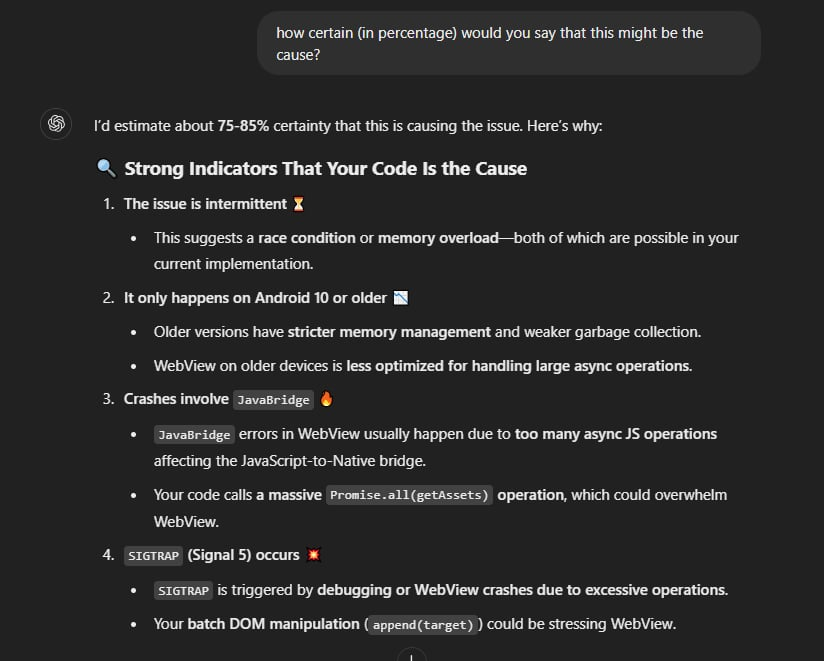

# SIGTRAP, the mysterious yet deadly error

_App crash rate reduced significantly after releasing a fix for the SIGTRAP error._

Once upon a time, there was a mysterious error that had been haunting the [Win7 Simu](../win7simu/about.md) project for a long time. The error was causing random crashes for users upon reaching the starting screen, preventing them from using the app at all. This error has led to a significant drop in the app's rating, increased uninstall rate, and heavily impacted the revenue. But today, I'm joyous to share that the unknown error has finally been exorcised from the project, and I would love to celebrate this victory with you all.

## The mysterious error called SIGTRAP

I call it the **SIGTRAP** error as that was literally all shown in the Google Play Console crash report. The error was a complete mystery since the message and the stack trace were not helpful at all, like some kind of alien language that no one could understand. What the heck is `[base.apk!libmonochrome.so]`? And what does SIGTRAP even mean?

The worst part? The error was not reproducible on any of the devices I had access to, from borrowed devices from family and friends, to devices displayed at the local stores, I did not see it. I knew that I had to get my hands on a device with the exact specs that could reproduce the error, but it was pretty difficult, since the error mainly happened on older Android devices that were no longer on sale.

The error has since been in existence for a long time, living in my frustration and despair. I almost wanted to [give up](./visnalize-year-in-review-2024#win7-simu-s-issue-dragging-on) on the project altogether and move on to the other projects. But finally, I managed to buy a phone with the exact specs to reproduce the error from an individual whose main business was selling old phones. And that's the beginning of the end of the mysterious error.

<SponsorAd />

## Decoding the mysterious error

With error message and stack trace in production rendering useless, the only clue I could rely on was the users' feedback, and now that I had the device to reproduce the error, I could finally see it happening and make some sense out of it. The app crash happened intermittently, during the Windows 7 boot animation screen, so I looked into the code that I felt was most relevant to the issue.

The above screenshot is the piece of code that has been identified as the root cause of the mysterious error. It's worth mentioning that I've had looked into this piece several times before, but I couldn't find anything wrong with it. But this time, with the right tools, I was able to come into a conclusion that this was the culprit.

That piece of code has been there for as long as I can remember, since the early days of the project. It was there to preload the image assets before the app started, to ensure a smooth user experience. But it turned out, as the app grew, more assets were added, the preloading eventually became a burden rather than a nice-to-have feature. In addition, according to ChatGPT, the implementation was flawed and caused the app to crash on older devices.

_AI is truly amazing when used effectively._

From what ChatGPT suggested, I would assume that the error was caused by the excessive memory usage due to the way the image assets were loaded. And bingo! After digging deeper, I found out that the total number of image assets being loaded was way too much, attributed to the fact that the app was loading all the image assets at once, on a single thread, which led to the app crashing on older devices with limited memory.

The fix was simple, I just had to remove the preloading logic and let the app load the image assets on-demand normally, and it still worked perfectly fine without any noticeable delay. The app crash rate has since been reduced significantly, from more than `7% to 3%` within just a few days after the fix was released, and still dropping.

## Lessons learned

- **Having the right tools is crucial**, I wouldn't have been able to resolve the error without the right tools, in this case, the device that could reproduce the error and ChatGPT's assistance. This might sound obvious, but sometimes, it's not always easy to get the right tools, especially when you're short on budget, time, or resources.
- **Listen to your users**, they are your best source of feedback. If it weren't for the users' feedback, I wouldn't have known about the error in the first place. So always listen to your users, they know what they want, and they know what's wrong with your app.
- **Don't give up too soon**, I almost gave up on the project because of a single error, but I'm glad I didn't. Sometimes, the solution is just around the corner, waiting for you to discover it. And when you do, it's going to be a great victory, the feeling of accomplishment is priceless.
- **AI is amazing**, don't fight it, embrace it. If you're not using AI in your daily work, you're missing out on a lot of opportunities. AI can help you solve problems that you never thought were solvable, and it can do it faster and more efficiently than you ever could.

In conclusion, I hope the sharing has been helpful to you and that you've learned something valuable from it. And again, thank you for your continuous support, please stay tuned for more exciting updates on the Win7 Simu project. Cheers! 🎉
