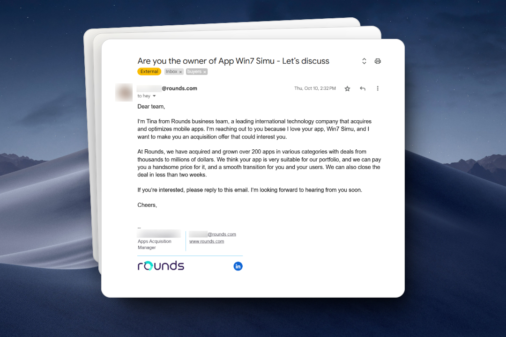
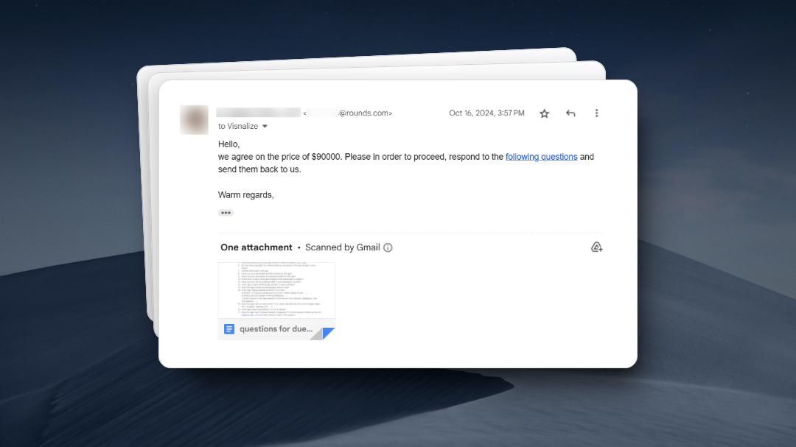
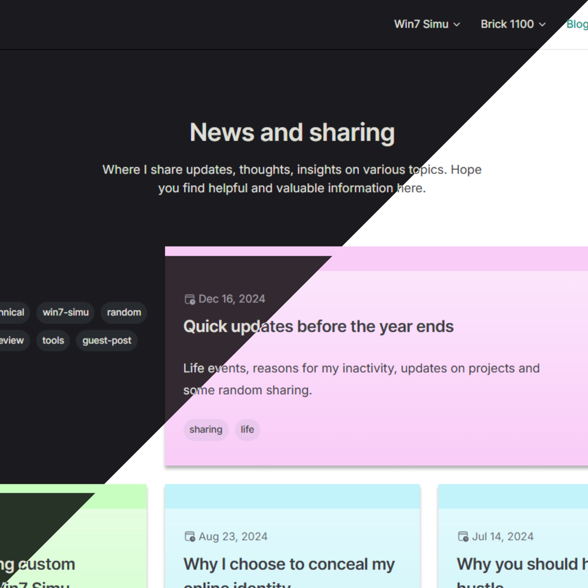
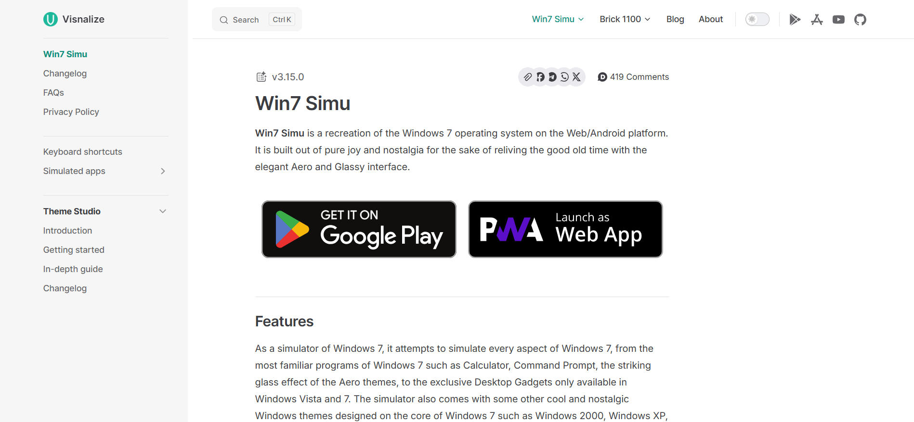
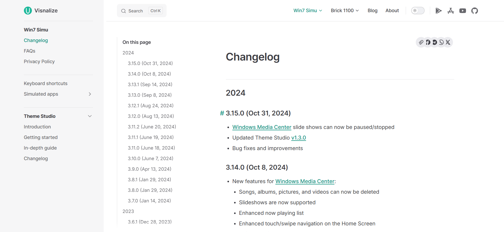
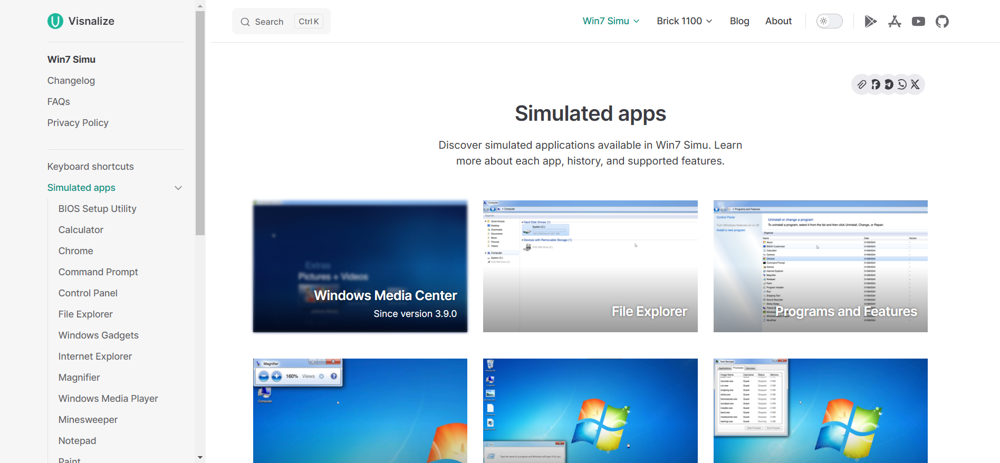
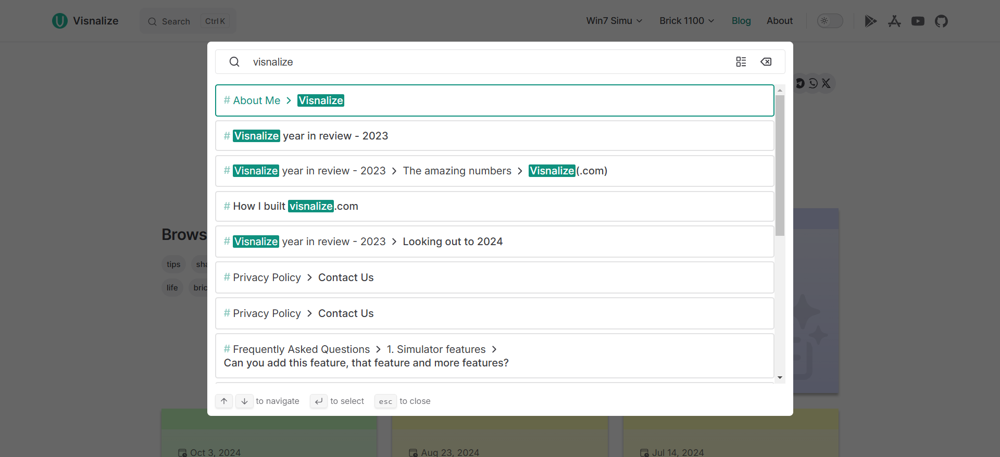
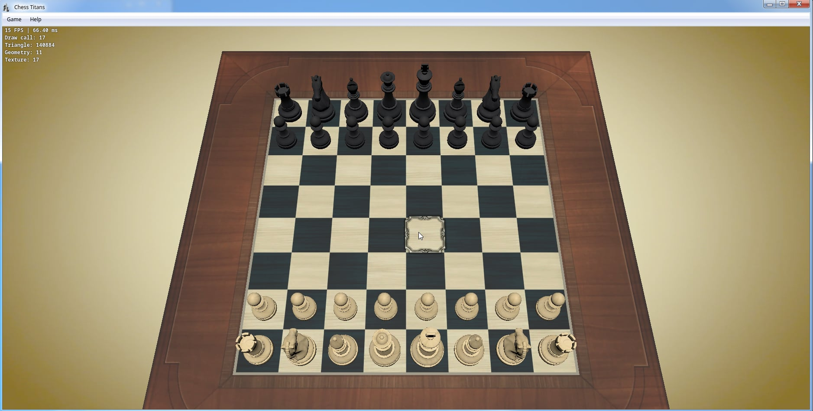

# Quick updates before the year ends

The year is coming to an end, and for the last few months I've been quite inactive on social media, my blog, and even my projects, so I thought it would be good to save some time and write a quick post to share what I've been up to, the status of my projects, and some random things I just want to write down and let out of my mind.

## Fourth acquisition offer

In October, I received yet another acquisition offer for [Win7 Simu](../win7simu/about.md). This was the fourth one since I launched the app back in 2020. The potential buyer was a big company with a lot of experience in the product acquisition and expansion business. From their writing style and the way they approached me, I could feel the professionalism and seriousness in their offer, in addition, I was interested to see how much this little side project of mine would be valued at, so I decided to give it a shot and see what they had to offer.

Since the previous post where I [disclosed the revenue](./from-side-project-to-side-hustle.md#disclosing-the-numbers) of Win7 Simu, the app has been growing steadily and at the point of the acquisition offer, it was making around $3,000/month. With all the data and information I provided, the buyer offered $80,000 for the app, I proposed a higher price of $90,000 with good reasons and they accepted it.

<SponsorAd />

Following their process, I granted limited access to some Win7 Simu's assets for their due diligence team to do certain verification, we had a few more discussions on the terms and a meeting was scheduled for the code review and assessment. The entire process spanned for nearly a month due to some issues in between on both sides, a [personal issue](#son-hospitalized-on-his-first-birthday) from my end and the work overload from theirs.

In the end, the deal was called off due to the limited time and resources they were able to invest in the project. It was a bit disappointing to see the deal fall through, but I'm glad that I had the chance to experience the acquisition process and learn a lot from it, and the mutual understanding left a good impression on me about the company and the people behind it.

## Son hospitalized on his first birthday

During the time when the acquisition offer was being discussed, my son got seriously ill and had to be hospitalized right on his first birthday. He was diagnosed with a severe case of pneumonia and had to be put on a ventilator for a couple of days. It was stressful and emotional for both me and my wife, having to see our first child in such a critical condition was heartbreaking.

I had to stay at the hospital for a whole month, working remotely while helping my wife take care of our son. Luckily, after several treatments and medications, he finally recovered and was discharged from the hospital. The whole experience was a wake-up call for me, reminding me of the importance of family and health, and how fragile life can be. I'm grateful that my son is now healthy and happy, and I'm cherishing every moment I have with him.

## Exciting news ahead

In case you're wondering, I'm still working on my projects, though at a slower pace due to the recent events (and don't worry, I don't plan to abandon them, at least not anytime soon :P). Here are some sneak peeks of what I've been up to:

<SponsorAd />

### A new website

After more than 2 years since the [previous sharing](./building-visnalize-com.md), I decided to give my home on the internet a fresh look. Yes, this website (visnalize.com) is getting a major overhaul, with a new design, more content, and exciting new features to enhance your experience while browsing the site.

It's still a work in progress, but I'm planning to launch it early next year. If you're eager to see the new site, please see the below screenshots for a sneak peek. Hope you'll like it, and don't hesitate to share your thoughts and feedback with me.

### Win7 Simu

Win7 Simu is still being actively maintained and updated in the background. There are some ongoing refactoring and optimization on the codebase to enhance the project's development speed, experience and allow early bug detection and prevention.

[Thuan](https://hohaicongthuan.github.io/) also continues to work on bringing the best features out of [Windows Media Center](../win7simu/simulated/wmc.md) to Win7 Simu while exploring some cool and innovative techs for the app. Here's a sneak peek of his brilliant work on the new Chess Titans game:

### Brick 1100

I have a long list of features and improvements planned for [Brick 1100](../brick1100/about.md), both internally and [externally](https://visnalize.com/brick1100/feedback). The only thing that matters now is to arrange the time and resources to work on them. But don't worry, I'm still committed to building Brick 1100 into something great, not just as an app, but a memo for everyone one of us to remember the good old days.

### A third project

An idea sparked in my mind when I build Win7 Simu and Brick 1100, to solve a pain point that I've been dealing with while working on these projects. I wonder if it's a common problem that many others are facing, and wish there was a simpler and more efficient solution for it. In addition, I also want to explore some new technologies, push my limits, and learn new things along the way. So I decided to start a new project, which I'm "unofficially" calling it __Cloudd__ for now.

Here's a very rough sneak peek of the project:

If you're curious about the project and eager to try it out early, follow my social media accounts or the project's [Blue Sky account](https://bsky.app/profile/cloudd.cc) for the latest updates and early access.

## Final words

I hope this post has given you a better understanding of what I've been up to lately, and the reasons behind my inactivity. Life is surely unpredictable and challenging at times, but I choose to embrace it with a positive attitude and keep moving forward. I'm grateful for all the support and encouragement I've received from my family, friends, and the community, and I'm looking forward to sharing more exciting news and updates with you in the future.

P.S. The cover image is of some traditional Vietnamese dishes that my wife made for me the other day. It's so delicious that I can't help but share it here :D

