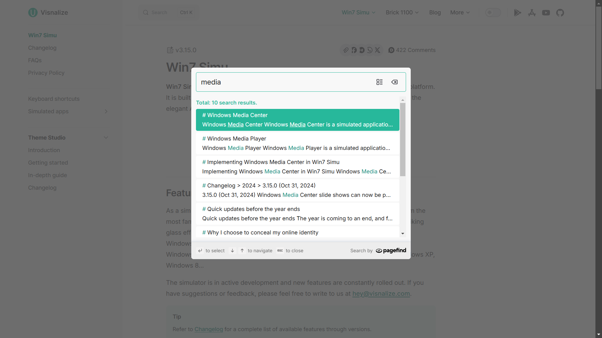
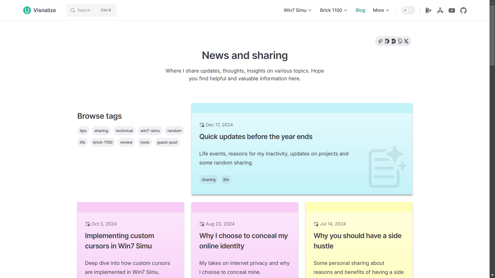
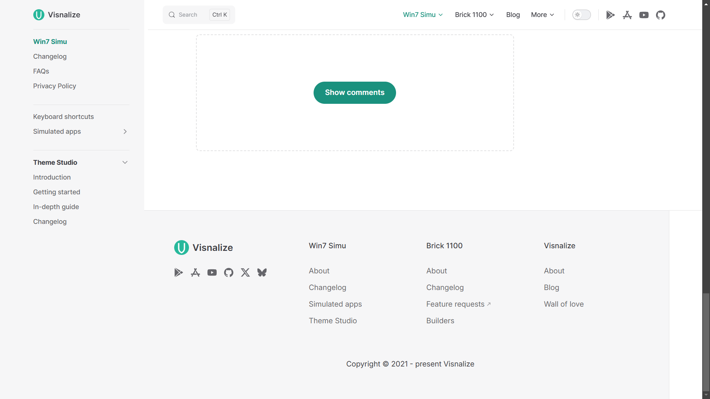
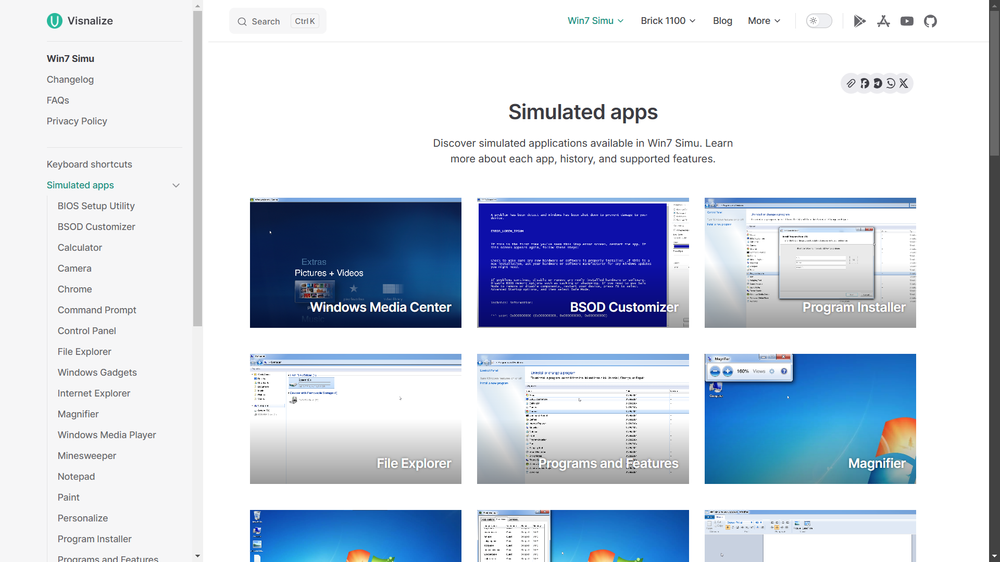

# Visnalize 2.0 - New website, same mission

Hey everyone! As teased in the [previous post](./updates-life-inactivity-projects.md#a-new-website), today I'm excited to announce the launch of the new __visnalize.com__ website. This is the second version of the website since its inception in [2022](./building-visnalize-com.md). With a fresh look, more content, and exciting new features, I hope you'll find the new website more engaging and useful. In this post, let's take a look at the changes and improvements, and as always, I'd love to hear your thoughts and feedback.

## What's new?

### A brand-new home page design

With a focus on simplicity and clarity, the new home page design aims to provide a better introduction to what Visnalize is all about, and to help you get a glimpse of the projects and content available on the site.

The new design features several sections, including a full-width hero section, dedicated sections for the projects, [Win7 Simu](../win7simu/about.md) and [Brick 1100](../brick1100/about.md), testimonials, latest news, updates, videos, and a contact form at the end. Each section is carefully crafted to provide a seamless browsing experience across different devices, with some animations and transitions to make them more engaging without overwhelming the user.

<video playsinline autoplay loop muted controls>
    <source src="./img/visnalize-new-website/visnalize-v2-landing.mp4" type="video/mp4">
</video>

<SponsorAd />

### An enhanced search experience

Finding content on the website is much easier now with the enhanced search experience, featuring a full-width search modal with instant search results. You can now search for projects, blog posts, and any other content on the site with ease.

### A refreshed blog listing design

I find myself writing more blog posts whenever I have time. It's a great way to share my thoughts, experiences, and updates with the community, so I wanted to make sure the blog listing page is visually appealing more than ever.

The design, as you can already tell, is inspired by the Windows [Sticky Notes](../win7simu/simulated/sticky.md) app.

### Refined layout, new footer

To maximize content visibility and discoverability, the new layout features a sidebar on the left side of the page, with a sticky table of contents where applicable. The footer is also redesigned to provide quick access to important links and information.

### A little touch, more content for the simulated app pages

Win7 Simu simulated app pages, including the listing page and each individual page also got a facelift with more content.

### Other notable changes

- __New social share options__: on the top of each page, you can find the social share options to easily share the content on your favorite social media platforms, or copy the link to share it elsewhere.
- __Frictionless ads experience__ while browsing the site: we all know [ads are annoying](./about-the-ads.md), but they support creators and keep things free for everyone. With the new design, I've made sure the ads are less intrusive and blend well with the content.
- __The comment section is collapsed by default__ to reduce clutter and boost performance. To view the comments, you need to click "Show comments".
- __Content images are zoomable__ to provide a better reading experience.
- Several other bug fixes and enhancements

<SponsorAd />

## FAQs

- Why the change?

    The old website was great and served its purpose well, but unfortunately, as technology evolves, we are forced to adapt to the changes. Regardless, it's always a good idea to refresh the design and improve the user experience from time to time.

- What happens to the old site?
  
    The old site will be archived and will no longer be updated. You can still access the old site at [v1.visnalize.com](https://v1.visnalize.com).

- What technologies are used to build the new site?

    The new site was built the same way as the old site, a statically generated site, with major improvements in design and developer experience, thanks to [Vitepress](https://vitepress.dev), [Vue 3](https://vuejs.org), and its entire ecosystem.

- Is the source code available?

    The new site is completely open-sourced. You can find the source code on [Github](https://github.com/Visnalize/.com/tree/v2)

- How can I report a bug or suggest a feature?

    You can report to me in any way you prefer, either through the [contact form](../about.md#contact) or directly on [Github](https://github.com/Visnalize/.com/issues).

## What's next?

Visnalize has become more or less an integral part of me. The new website is a testament to my commitment to keep creating and sharing content that is useful, engaging, and inspiring. There are many things I want to do, things will evolve and change over time, but the same mission remains: [to recreate nostalgia for entertainment](../about.md#recreating-nostalgia-for-entertainment). I will continue to bring the best of my work to the community, create the greatest memories and contribute to the world in my own way.

And as usual, I'm always open to feedback and suggestions. If you have any thoughts, ideas, or what you like or dislike about the new website, feel free to share them with me. I'd love to hear from you.
