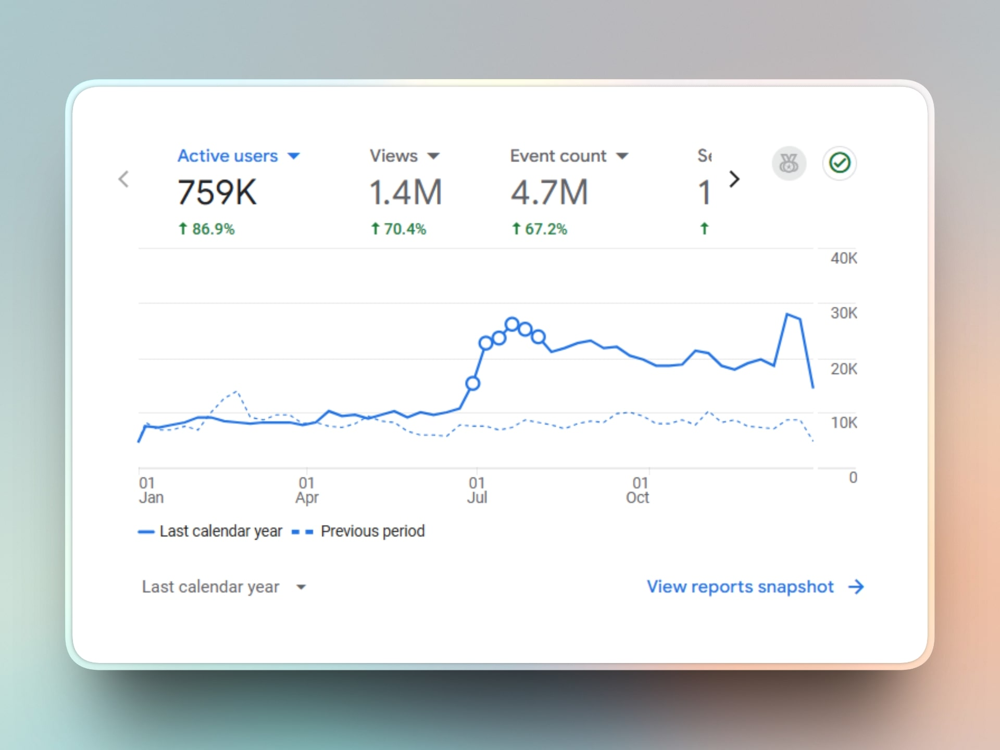
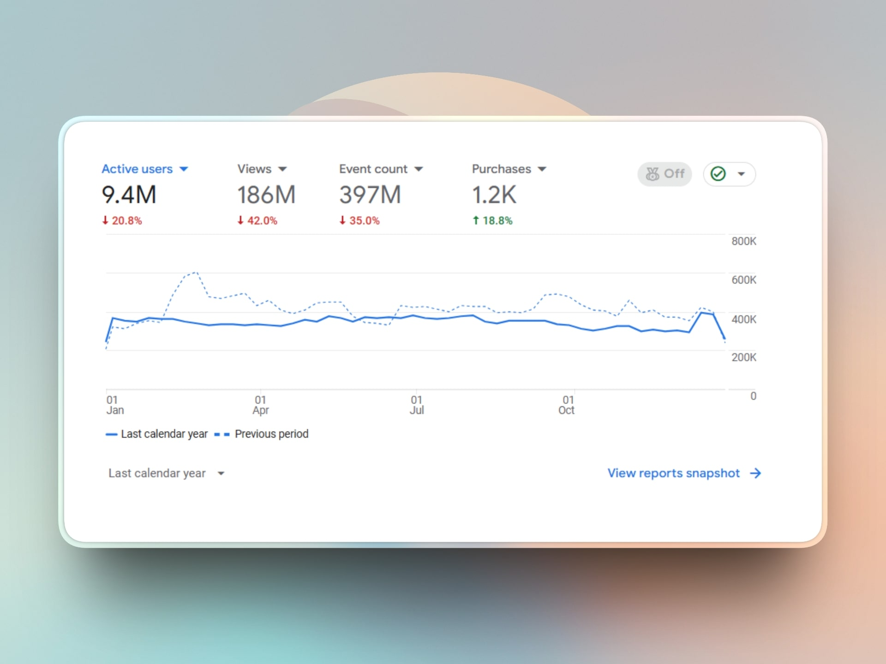
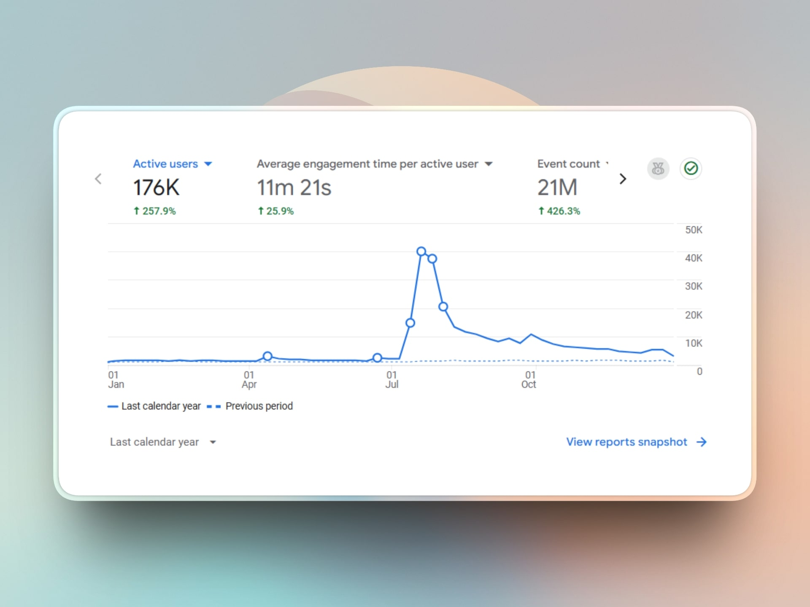
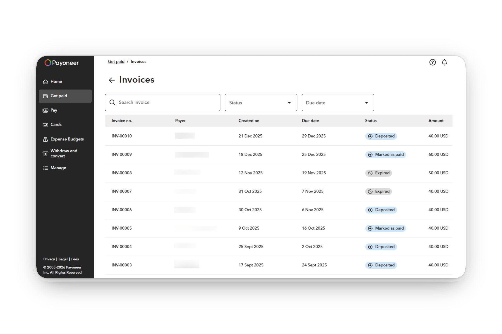

# Visnalize year in review - 2025

_Cover image by manhmocimgs via [Pixabay](https://pixabay.com/photos/river-ship-sunset-vietnam-saigon-7133579/)_

A little late this year as we've been having a crazy period toward the end of 2024, but here we are again, it's time to look back at some amazing accomplishments and growth from Visnalize in 2025.

Just like last year, we will be looking at the numbers from Visnalize.com, and the projects: [Win7 Simu](../win7simu/about.md) and [Brick 1100](../brick1100/about.md). The indicator badges will also be present to show the comparison between this and last year's numbers. Without further ado, let's dive in!

## The amazing numbers

### Visnalize(.com)

- __31__ new blog posts published <Badge type="tip" text="+23 vs last year" />
- A total of __252__ sitemap entries (content pages, blog posts, etc.) <Badge type="tip" text="+173 vs last year" />
- A total of __759K__ visitors <Badge type="tip" text="+86.9% vs last year" />
- A total of __1.4M__ page views <Badge type="tip" text="+70.4% vs last year" />
- A total of __$2,120__ in revenue from Adsense <Badge type="tip" text="+8.2% vs last year" />
- A total of __$405__ in revenue from __11__ sponsored posts <Badge type="tip" text="new" />

### Win7 Simu

__Android only__

- __23.3M__ users downloaded the app from Google Play <Badge type="tip" text="+23% vs last year" />
- __1.13M__ active devices that still have the app installed <Badge type="tip" text="+1.3% vs last year" />
- __75.6K__ users gave an average rating of __4.218/5__ <Badge type="tip" text="+2.23% vs last year" />
- __31.6K__ users left a review <Badge type="tip" text="+14.5% vs last year" />

__Both Android and Web__

- An average of __72K__ daily active users <Badge type="danger" text="-5.5% vs last year" />
- A user spent an average of __27.5 mins__ with the app <Badge type="tip" text="+3.8% vs last year" />
- __9.5M__ accounts created in the app <Badge type="tip" text="+48.4% vs last year" />
- __8__ version updates were released <Badge type="danger" text="-7 vs last year" />
- __$16.8K__ gross revenue from ads <Badge type="danger" text="-14.7% vs last year" />
- __$5.9K__ gross revenue from in-app purchases <Badge type="tip" text="+7.3% vs last year" />
- __$12K__ gross revenue from partnerships <Badge type="tip" text="155% vs last year" />

<SponsorAd />

### Brick 1100

__Both Android and iOS__

- __211K__ users downloaded the app from both App Store and Google Play <Badge type="tip" text="+318% vs last year" />
- __25K__ active devices that still have the app installed <Badge type="tip" text="+557% vs last year" />
- An average of __1,154__ daily active users <Badge type="tip" text="+361% vs last year" />
- A user spent an average of __11 mins__ with the app <Badge type="tip" text="+22.2% vs last year" />
- __222__ users gave an average rating of __4.09/5__ <Badge type="tip" text="new" />
- __4,358__ accounts created in the app <Badge type="tip" text="+137% vs last year" />
- __4__ version updates were released <Badge type="danger" text="-1 vs last year" />
- __$1,532__ gross revenue from both ads and in-app purchases <Badge type="tip" text="+580% vs last year" />
  - __$1,375__ gross revenue from ads
  - __$157__ gross revenue from in-app purchases

## Reflecting on the year

In general, we had another year of growth for Visnalize, slow but steady. Visnalize.com did exceptionally well again, with significant increases in every metric, from content production to traffic and revenue. The metrics for Win7 Simu are a bit mixed, however, the overall trend is still positive, and the project is still going strong after all these years. Brick 1100, on the other hand, has seen tremendous growth as it was finally moved out of beta and launched on several platforms.

As we reflect on the year, here is a quick recap of the highlights and lowlights in 2025.

### 👍 Things went well

#### Visnalize is now a team of 2

May 2025 marked a major milestone for Visnalize as I officially onboarded [Thuan](https://github.com/hohaicongthuan) as a part-time developer, after nearly 2 years of contributing to Win7 Simu as a contributor.

Thuan has been one of the best decisions I've made for Visnalize, he has taken a lot of the workload off my shoulders, allowing me to focus on other aspects. He has also brought in fresh ideas and perspectives, always eager to tackle new challenges, and even taken ownership of several features in both Win7 Simu and Brick 1100.

With another mind on board, I am optimistic about what we can achieve together in the coming years.

#### Win7 Simu's issue finally resolved

I mentioned in last year's review that Win7 Simu was facing a [dire issue](./visnalize-year-in-review-2024.md#win7-simus-issue-dragging-on) that was causing the app to crash, leading to a poor user experience and negative reviews. And I'm happy to report that after a month of investigation and debugging, we finally identified and rid ourselves of [the culprit](./sigtrap-the-mysterious-deadly-error.md) on February 2025.

With the issue resolved, we saw a significant reduction in crash rates, leading to improved user satisfaction and retention. The average rating on Google Play also saw a nice boost as a result.

#### Brick 1100 officially launched

After more than a year and a half in beta, Brick 1100 finally got to see the light of day with its official launch in [April 2025](./brick-1100-v1.md). The launch was considered [a success](./brick-1100-successful-launch.md), with a good number of downloads and positive feedback from users as well as the media. It was satisfying to see all the hard work, dedication, and passion finally pay off. And more importantly, the doubts and fears that I had about the project were allayed, as Brick 1100 proved to be a viable product with a promising future.

<SponsorAd />

#### A new business venture: sponsored posts

Since the early days of Visnalize.com, I've been writing blog posts and articles as a way to share knowledge, experiences, and insights with the community. Over time, I realized it could also be a potential avenue for monetization while diversifying the content on the site.

In 2025, I decided to roll out [sponsored posts](../services/sponsored-posts.md) as a new service on Visnalize.com, allowing individuals or companies to promote their products and services through blog posts on the site. The response has been surprisingly positive, with several companies taking advantage of the opportunity to reach our audience, our visitors finding more value in the content, and us generating an additional revenue stream, all while maintaining the integrity and quality of the site, a win-win situation for everyone involved.

### 👎 What didn't go well

#### Win7 Simu's growth slowed down

As mentioned earlier, while Win7 Simu had a generally positive year, the growth was slow, with some metrics even declining compared to last year. This is mainly due to the reduction in release and update activity, as we launched Brick 1100 and focused on doing a major overhaul of Win7 Simu's codebase instead of pushing out new features and enhancements.

Although the refocus took a toll on the app's growth, I believe it was a necessary step to ensure the long-term success of the project. With a more solid foundation, I'm confident we will be able to build new features and enhancements more efficiently, leading to better quality and user experience in the coming years.

#### Our marketing needs work

While we did see growth in traffic and revenue across all projects, I believe we could have done better with more marketing efforts. We relied heavily on organic growth through word-of-mouth and search engine optimization, which, while effective to some extent, limited our reach and potential audience. We also tried hiring a freelance marketer for a short period, but the results were disappointing, leading us to discontinue the collaboration. This is something we will need to address in 2026 if we want to continue growing at a healthy pace.

## Looking out to 2026

We could achieve a lot in 2025, but there is still so much more to be done and improved. We already had a long list of things planned for 2026 and beyond for all projects, but I sure hope we can find the time and resources to tackle them all. If you have any suggestions or ideas, please feel free to reach out via our [contact page](../about.md#contact) or social media.

As always, I'm grateful for all your love and support, and I hope you will continue to support us in the future. Happy new year and look forward to receiving amazing updates from Visnalize in 2026! 🎉
