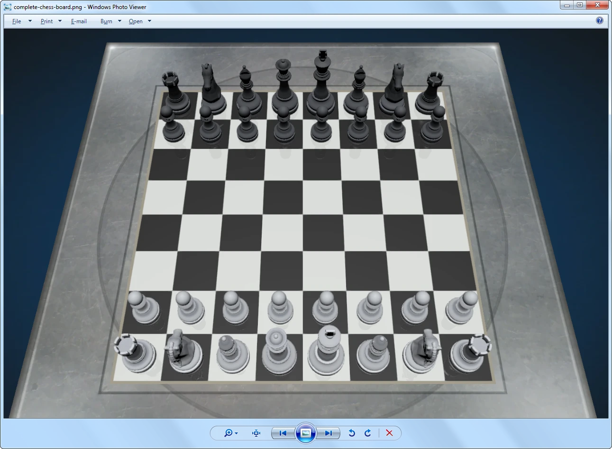
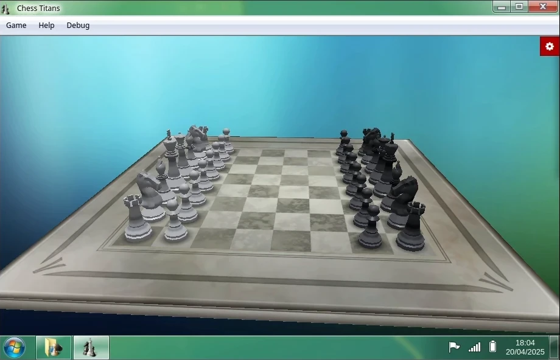
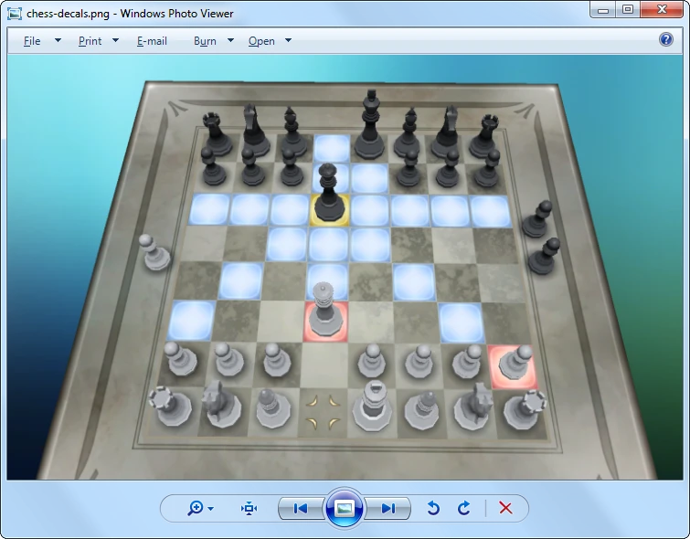
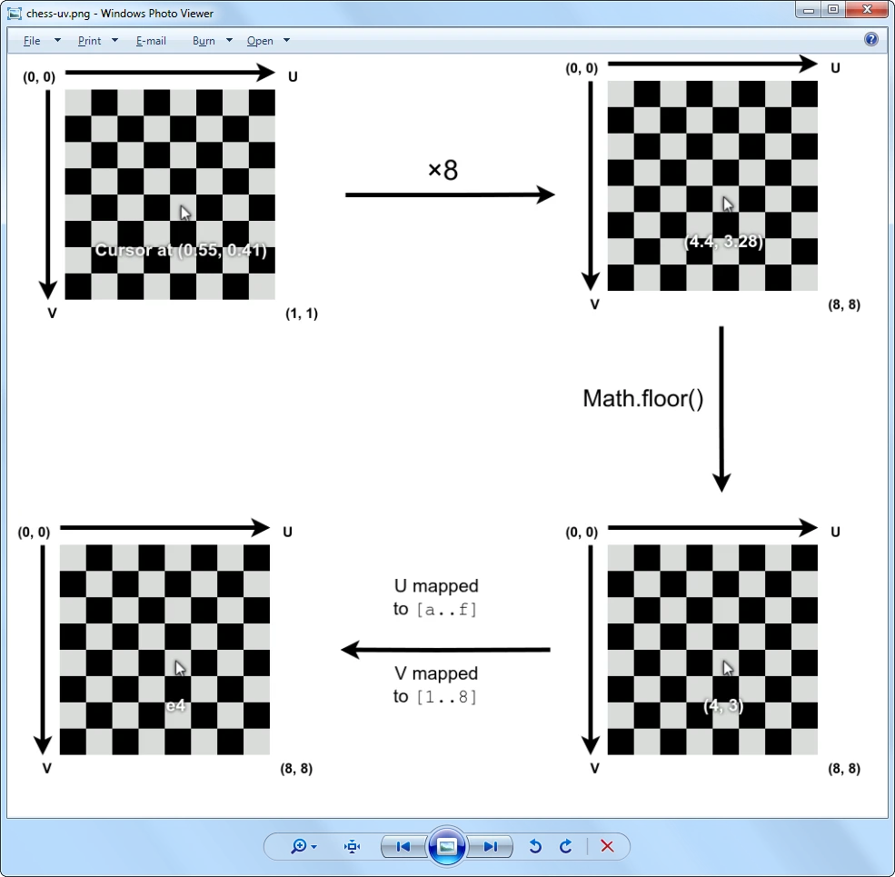
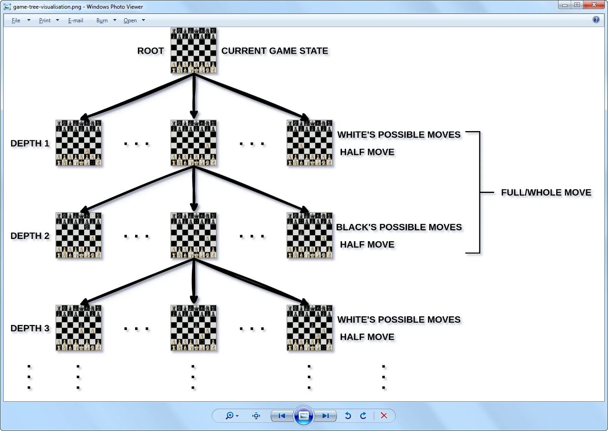

# Implementing Chess Titans in Win7 Simu


In this blog post, we're going to share how we recreated Chess Titans in Win7 Simu as well as the challenges that we encountered.

This blog post assumes the following about readers:
- Have basic knowledge about programming in JavaScript and programming in general.
- Have a basic understanding of algorithms in general, tree data structures and what a recursive function is.
- Have a basic understanding of chess, i.e. game rules, piece names, chessboard coordinates.

Chess Titans is a 3D chess video game developed by Oberon Games for Microsoft. It first appeared pre-installed in Windows Vista and then later in Windows 7. The game at the time of its release also served as a demonstration for the hardware-accelerated graphics capabilities of Windows, featuring what was considered photorealistic 3D graphics at that time.

## Resource Files

The 3D model, texture, and sound files are extracted from the `.DLL` file used by Chess Titans.

All texture and sound files are then easily converted to the appropriate formats used in Win7 Simu. However, the 3D models are in the [`.X` format](https://learn.microsoft.com/en-us/windows/win32/direct3d9/x-files--legacy-), which is an old, deprecated DirectX file format for storing 3D data developed by Microsoft.

At first, we thought about writing an entire decoder for this file format to get the 3D model data, but luckily, we didn't have to do it the hard way. There's a [plugin](https://github.com/oguna/Blender-XFileImporter) that can help us import the `.X` files straight to [Blender](https://blender.org), and from there we could convert the models to an appropriate format.

There are a lot of file formats for 3D models, like `.OBJ`, `.FBX`, to name a few, each with their own strengths and weaknesses. We ended up choosing the [`.GLTF` format](https://www.khronos.org/gltf/) for the following reason:
-  It's an open and royalty-free format.
-  It's widely supported on many 3D graphics software and is often used as an intermediary format to move 3D data around between different software.
-  It's smaller in size (when using the binary `.glb` format) compared to text-based formats like `.OBJ`.
  
There are JSON-based (with `.gltf` extension) and binary formats (with `.glb` extension) in `.GLTF`, and we chose the binary format for the obvious reason: binary files are much smaller in size compared to text-based files when storing the same data.

## The 3D Graphics

For the 3D graphics rendering, we used [*three.js*](https://threejs.org), which is a library for rendering 2D and 3D graphics. *Three.js* makes calls to the *WebGL* API under the hood, which is a low-level graphics API for the web. It abstracts away a lot of low-level 3D concepts, allowing us to quickly create and generate 3D content on the screen with a few lines of code without knowing too much about Advanced Maths and Linear Algebra stuff like projection matrices, matrix transformation, etc.

If you're unfamiliar with *three.js*, you can read about the *Fundamentals* [here](https://threejs.org/manual/#en/fundamentals). Though we will still try to explain some basic 3D concepts throughout this article, it's recommended to read the fundamentals first.

### Chessboard & pieces

The 3D models of the chessboard and pieces are loaded as ***geometry*** using the [*GLTFLoader*](https://threejs.org/docs/?q=glt#examples/en/loaders/GLTFLoader) addon bundled with *three.js*, and ***textures*** are loaded with [*TextureLoader*](https://threejs.org/docs/?q=textureloader#api/en/loaders/TextureLoader), which also comes in default with *three.js*.

> In *three.js*, ***geometry*** refers to a 3D model without any textures and materials. A 3D model is made up of ***triangles*** (also known as ***polygons***), each triangle has 3 sides and 3 ***vertices*** (singular: vertex).
> A 3D model with textures and materials is a ***mesh***.
>
>  ***Textures*** are 2D image files that are projected onto the surface of 3D models.

The textures are added to the geometries via ***materials*** and ***UV mapping***. *Three.js* provides a bunch of different materials to choose from, but upon observing the original Chess Titans graphics, we noticed that only the chess pieces interact with light, the other objects in the scene stay flat, i.e. always lit up regardless of viewing angles. For the flat lighting look, [*MeshBasicMaterial*](https://threejs.org/docs/?q=meshbasi#api/en/materials/MeshBasicMaterial) used as meshes with this material do not interact with any lights in the scene, and [*MeshStandardMaterial*](https://threejs.org/docs/?q=meshstand#api/en/materials/MeshStandardMaterial) is used for the chess pieces as it's basic and the cheapest to render.

> ***Material*** is a 3D graphics concept that defines how an object's surface should look and react to light by controlling different properties like colour, texture, roughness, metalness, etc. It uses ***shaders*** under the hood, which are small programmes run by the Graphics Processing Unit (GPU).
> A mesh can have multiple materials, and a material can have multiple textures.
>
> Besides storing the (X, Y, Z) coordinates, each vertex also has a UV coordinate which maps the vertex to a 2D ***UV map*** used to look up which part of the texture to render.
> It is called *UV* to distinguish it from the (X, Y, Z) coordinates.

A [*Perspective Camera*](https://threejs.org/docs/?q=perspe#api/en/cameras/PerspectiveCamera) is also needed for the renderer to know from which location and orientation to render. Luckily, *three.js* has a built-in camera object that we can use without knowing the low-level details about view projection and matrix transformation. There are also a [*Point Light*](https://threejs.org/docs/?q=point#api/en/lights/PointLight) and an [*Ambient Light*](https://threejs.org/docs/?q=ambien#api/en/lights/AmbientLight) added to light up the scene so that we could see the chess pieces.

To put the chess pieces in their correct locations on the chessboard, we created an object in JavaScript to map the chessboard coordinates to the 3D coordinates, which looks something like the below:

```js
export const POS_BOARD = {
  a1: [-17.5, 0.01, 17.5],
  b1: [-12.5, 0.01, 17.5],
  c1: [ -7.5, 0.01, 17.5],
  // ...
  f8: [  7.5, 0.01, -17.5],
  g8: [ 12.5, 0.01, -17.5],
  h8: [ 17.5, 0.01, -17.5],
};
```

With these mapped coordinates, we could easily create a helper function to move a chess piece to a specific square on the chessboard using the board coordinates.

In the 3D graphics rendering pipeline, each mesh with a material will result in one *draw call*. A *draw call* is a command from the CPU to the GPU to draw a mesh. In the real-time rendering application, it's recommended to keep the draw calls low, as the lower the draw calls, the less time the renderer has to spend to render a frame, and thus it can render more frames, creating smoother motion. It is also beneficial to the lower-end devices, which often have limited GPU rendering power. In a chessboard, there are many pieces that are identical, i.e. 8 white pawns, 2 black rooks, etc., so it's unnecessary to create separate meshes, which results in separate draw calls. There's an optimisation technique called instancing and *three.js* provides it in the form of [*Instanced Mesh*](https://threejs.org/docs/?q=instanced%20me#api/en/objects/InstancedMesh). Basically, *Instanced Mesh* will draw meshes with the same geometry and material in a single draw call, thus, we can draw all the same 8 white/black pawns with the cost of only one draw call. Each mesh drawn by an *Instanced Mesh* is called an *instance*, each instance can have their own transformations (location, rotation, scale). 

And with all of the above, we now have a fully 3D rendered chessboard.



<SponsorAd />

### Camera Rotation

*Three.js* also provides a built-in camera controls object called [*OrbitControls*](https://threejs.org/docs/?q=orbit#examples/en/controls/OrbitControls) that we can use to easily rotate the camera around the chessboard. However, it needs a render loop in order for the rotation to work. The render loop function looks something like the below:

```js
render() {
    // Update stuff that needs to be updated per frame
    this.controls.update();

    // Call render from the renderer
    this.renderer.render();

    // Request the next frame
    this.animationId = requestAnimationFrame(this.render);
}
```

It's basically an infinite loop to continuously render the graphics. For each time the `render()` function is called, it does some updating for things that need to be updated per frame, and then calls the render function on the renderer to actually render the frame. Finally, the function will notify the browser that it's ready for the next frame by calling the `requestAnimationFrame()` function with an argument that is the render function itself.

> 3D graphics programmes create the illusion of movement by rendering multiple images, called *frames*, continuously. The speed at which the renderer can render how many frames in a second is called *frame rate*, unit is *frames per second* (fps, f/s).
> 
> To create what most humans perceive as smooth motion, a renderer typically has to render at least 24 frames per second (film standard) or more.

The advantages of `requestAnimationFrame()` compared with using `setInterval` or `setTimeout`) are that it synchronises with the refresh rate of the screen, which makes the animation smoother and more consistent. The frames are not rendered faster or slower than the monitor can display (no wasted frames). And it can save CPU power and battery by stopping the rendering process when the tab is inactive.

With the orbit controls added, we can now rotate the camera around to inspect the chessboard.



### Decals

There are some textures appearing on the chessboard when a piece is selected. These can be created using the [*DecalGeometry*](https://threejs.org/docs/?q=decal#examples/en/geometries/DecalGeometry). A decal is projected onto the surface of a mesh so it always appears in front. However, like separate meshes, each decal is a separate draw call, so we chose to use *Instanced Mesh* to display these decals and to reduce draw calls. We also had to move them slightly up to prevent ***Z-fighting***.

> ***Z-fighting*** happens when two or more triangles overlap or are really close to each other, and the renderer doesn't know which surface to draw on top or behind which resulting in the surfaces becoming flickering.
> 
> The `Z` refers to the up/down axis in the 3D space. However, in *three.js*, the up/down axis is the `Y` axis.



### Chess piece animation

*Three.js* has a built-in [animation system](https://threejs.org/manual/#en/animation-system), but it's for individual meshes and it doesn't support *Instanced Mesh*, so we had to come up with a new animation system.

The animation system that we came up with has two components:
- An object to store animation information like animation ID, the instance ID to move, the source and destination locations, etc. Storing animation data in an object like this allows animating multiple pieces at once, like when castling, we need to move the rook and the king pieces simultaneously.

```js
this.anim = {
  animationID: {
    batchedMesh,
    instanceID,
    // ...
    from,
    to,
    animationType,
  },
  //...
}
```

- And a function that reads the info from the animation object and moves the animated chess pieces every frame.

```js
animatePiece(animID, { mesh, instID, ..., startTime, duration = 700, from, to, animType = "lerp" }) {
      // Other logic...
      const elapsedTime = Date.now() - startTime;
      const alpha = this.playAnimation ? Math.min(elapsedTime / duration, 1) : 1;
      // Other logic...

      switch (animType) {
        case "lerp":
          // Do lerp animation
          break;
        case "fadeIn":
          // Do fade in animation
          break;
        case "fadeOut":
          // Do fade out animation
          break;
      }

      if (alpha < 1) return;

      // Animation finished
      switch (animType) {
        case "lerp":
        case "fadeIn":
          // Do post-animation logic
          break;
        case "fadeOut":
          break;
      }

      delete this.anim[animID];
      if (!Object.keys(this.anim).length) this.handleAnimationFinished();
    },
```

When a chess piece is animated, its animation data is set and stored in the `this.anim` object. Whenever the game renders in the `render()` function, it checks if there's any animation data in `this.anim`. If there is, it calls the `animatePiece()` every frame to handle the animation. The `animatePiece()` then reads the animation info in `this.anim` and updates the corresponding chess piece.

To know how far in the animation, we calculate the `alpha` value as seen in the code above, which is a normalised number in the range of `0..1`. When the `alpha` reaches `1`, it means the animation has finished. The `animatePiece()` does some post-animation logic, calls the function to handle other logic when the animation has finished, and then deletes the animation info from `this.anim`.

### Post-processing effects

Besides the graphics, there are also a few post-processing effects that are present in the original Chess Titans, like reflection, smooth edges ([anti-aliasing](https://www.lenovo.com/us/en/glossary/what-is-anti-aliasing/)). Post-processing effects are techniques applied after the frames are rendered. It's roughly similar to filters in Instagram and Photoshop.

*Three.js* has a built-in [post-processing system](https://threejs.org/manual/#en/how-to-use-post-processing) and a bunch of common post-processing effects that we can use. We chose *FXAA* ([*Fast approXimate Anti-Aliasing*](https://en.wikipedia.org/wiki/Fast_approximate_anti-aliasing)) for anti-aliasing because it's the fastest while offering decent results and SSR ([*Screen-Space Reflection*](https://sugulee.wordpress.com/2021/01/16/performance-optimizations-for-screen-space-reflections-technique-part-1-linear-tracing-method/)) for reflection effect.

The render function also has to change slightly when integrating the post-processing system. We first need to create an instance of the *`EffectComposer`* with
```js
this.composer = new EffectComposer(this.renderer)
```
and then call
```js
this.composer.render()
```
to render instead of 
```js
this.renderer.render()
```

## The 2D Graphics

For the *Top down view* mode (2D view) of the game, we took a different approach. Technically, we could use *three.js* to handle the 2D rendering, but it's just manipulating `div` elements under the hood, so we ended up using the good ol' trio HTML, CSS, and JavaScript to render 2D graphics.

## The Chess Logic

### Square Selection

To figure out which square the mouse cursor is hovering over, we used [*RayCaster*](https://threejs.org/docs/?q=raycaster#api/en/core/Raycaster), which casts a ray from the mouse cursor and returns which objects intersect with the ray. We can also get the UV coordinates of the objects that intersect with the ray.

The chessboard coordinates are calculated by multiplying the U and V components by 8 (because a chessboard has 8 files and 8 ranks). The value ranges for U and V are from 0 to 1, so by multiplying by 8, we get a new range from 0 to 8. By using `Math.floor()` function, we get two new integer numbers for the U and V coordinates which are then mapped to `[a..f]` and `[1..8]`, respectively.

For example, the mouse is hovering at the UV coordinates `(0.55, 0.41)`. After multiplying by 8 we got `(0.55 * 8, 0.41 * 8) = (4.4, 3.28)`, and then applying the `Math.floor()` function, we got `(4, 3)`, which points to the square `e4` on the chessboard.



Below is the implementation of the function converting the UV coordinates to chessboard coordinates.

```js
uvToBoardCoords(u, v) {
    const files = ["a", "b", "c", "d", "e", "f", "g", "h"];
    const rank = 8 - Math.floor(v * 8);
    const file = files[Math.floor(u * 8)];
    return file + String(rank);
},
```

With the chessboard position of the mouse cursor figured out, we can now easily show the decals where the cursor is and other decals as well.

<SponsorAd />

### Game Logic

We used [*chess.js*](https://www.npmjs.com/package/chess.js/v/0.13.4) library to handle most of the game logic, i.e. game rules, move generations, etc., so that we didn't need to reinvent the wheel.

### The Chess AI

*chess.js* is great and all, but it doesn't have a chess AI implementation. Most of the chess AI libraries that we found support only a few difficulty levels, while the original Chess Titans supports up to 10 difficulty levels. So we decided to implement the chess AI from scratch.

The chess AI algorithm that we used is a really basic algorithm of chess AIs called *minimax*. It's basically a brute-force algorithm that searches for every possible move for the best moves.

In [*game theory*](https://en.wikipedia.org/wiki/Game_theory), chess is a [*zero-sum game*](https://en.wikipedia.org/wiki/Zero-sum_game), which means an advantage gained by one side implies a disadvantage to the other(s). The AI evaluates the score of the board during the game by adding all the piece scores together, where its own pieces get positive values and player pieces (opponent) get negative values. The sum of `0` means neither the AI nor the player has any advantages, a positive number indicates the advantage towards the AI, and a negative number indicates the advantage towards the player.

Each chess piece type will have its own score based on the importance of the piece type. Below are example values that we adapted from the [*Sunfish Chess Engine*](https://github.com/thomasahle/sunfish/blob/ad7baa8098be6c032919fa60f886bec557a21267/sunfish.py#L23).

```js
const pieceScore = {
  [PAWN]: 100,
  [KNIGHT]: 280,
  [BISHOP]: 320,
  [ROOK]: 479,
  [QUEEN]: 929,
  [KING]: 60000,
};
```

At any given time in the game, provided the game is not over, every possible move can be visualised in a tree data structure where each node represents a scenario when that move was made.



The algorithm searches and evaluates the score for each scenario and then returns the move that gives the highest score. [*Sebastian Lague*](https://www.youtube.com/@SebastianLague) has a really great [video](https://www.youtube.com/watch?v=l-hh51ncgDI) explaining in detail how the algorithm works, and pseudo-code examples are also provided. We highly recommend it if you want to learn more in-depth about how it works.

Another algorithm named *alpha-beta pruning* is used in addition to the search algorithm to speed up the searching without affecting the final outcome of the former algorithm. It works by pruning early unnecessary branches in the tree when an optimal score is already found (*detailed explanation is also in the video linked above, as we don't want to drag this blog post too long attempting to explain something that is already fantastically explained 😅*).

The pruning algorithm works best if we sort all the moves from best to worst before doing the search and pruning, since the sooner the algorithm finds the optimal moves, the sooner it prunes unnecessary branches. Upon our testing, the number of evaluated moves reduces from a few thousand to a maximum of a few hundred.

In the *minimax algorithm*, there's a depth level that we can specify how many moves to look into the future, we could use that as the level of difficulty for the AI. Unfortunately, as we quickly realised that it was a bad idea because according to *[Shannon number](https://en.wikipedia.org/wiki/Shannon_number)*, the number of possible moves in a chess game increases exponentially for each half move, as seen in the table below:

Number of plies (half-moves) | Number of possible positions
:-:|:-
1|20
2|400
3|8,902
4|197,281
5|4,865,609
6|119,060,324
7|3,195,901,860
8|84,998,978,956
9|2,439,530,234,167
10|69,352,859,712,417
...|...

Despite these numbers include illegal moves, the numbers are still huge. As you can see, by the 10th half-move, the number becomes so large that it's computationally infeasible to search by brute force, even with early branch pruning with the *alpha-beta pruning* algorithm. You probably wouldn't want to wait minutes or even hours for the AI to make only one move, would you? As a result, we needed to come up with a better solution.

The solution here is simply introducing new parameters controlling the AI to trade off between responsiveness and decision quality. Upon testing with different values, we found that the value depth of `3` is good enough. The other parameters to control the AI difficulty are the breadth of the search (how many possible moves in a half move to search), and should the moves be selected randomly to simulate mistakes and blunders. Below are the values that we came up with:

```js
const difficulty = {
  1: { depth: 1, breadth: 1, random: true },
  2: { depth: 1, breadth: 5, random: true },
  3: { depth: 1, breadth: 10, random: true },
  4: { depth: 2, breadth: 10, random: true },
  5: { depth: 2, breadth: 15, random: true },
  6: { depth: 2, breadth: 20, random: true },
  7: { depth: 3, breadth: 20, random: true },
  8: { depth: 3, breadth: 25, random: true },
  9: { depth: 3, breadth: 30, random: true },
  10: { depth: 3, breadth: 35, random: false },
};
```

With these values, the AI will search a lot faster while still making decent moves.

## Optimisation

### 3D model file size

The current file size of the 3D models is around `3.51 MiB`. We could compress it further using [*DRACO*](https://google.github.io/draco/). The result file size after compressing reduces to `431 KiB` + `745.5 KiB` of the DRACO decoder, we ended up at `1176.5 KiB` (~`1.15 MiB`), which is still a significant save.

Of course, compressing the file means the game has to spend extra time and resources to decompress it at startup, but with our current configurations, the decompressing time is pretty much negligible, even on low-end devices.

### *Instanced Mesh* is not as good as we thought

*Instanced Mesh* is good for reducing draw calls, but it cannot add and remove instances dynamically. We had to create all possible pieces on the board in advance, temporarily hide them under the board, and teleport them on the board when needed. All the unused pieces are still in the scene and contribute a large number of triangles towards the triangle count. As you probably can tell, the fewer triangles in a scene, the less time it takes for the computer to render a frame, thus the better the performance. For that reason, we needed a new way to reduce not only the draw calls but also the triangle count.

Fortunately, as of the current version of *three.js* we're using, there's [*Batched Mesh*](https://threejs.org/docs/?q=batch#api/en/objects/BatchedMesh), which is an extended version of *Instanced Mesh* that allows dynamic instance adding and removing. Better yet, it even allows different geometries to be rendered in one single draw call, as long as they use the same material. That's perfect for our chess game, we could render all the pieces for black and white for the cost of only 2 draw calls! *Batched Mesh* for the win!

However, there's a catch! *Batched Mesh* requires the [`WebGL_multi_draw`](https://developer.mozilla.org/en-US/docs/Web/API/WEBGL_multi_draw) extension which Firefox doesn't support. So if you're using Firefox on a low-end device and the game seems to lag a lot, this is probably why.

### Rendering on-demand & Frame rate throttling

The render loop function that we've introduced earlier is good for scenes that have objects moving around frequently but for our chess game which most of time contains only static chess pieces so rendering constantly when there's no user interaction or the chess pieces moving is a waste of computing power and battery life on mobile devices.

Therefore, we needed to refactor the render function to render only when there's user interaction and when the pieces are moving, which is often known as *rendering on-demand*. This can be implemented in different ways, and below is our approach.

```js
render() {
  // Clear requestAnimationFrame()
  if (this.animationId) {
    cancelAnimationFrame(this.animationId);
    this.animationId = null;
  }

  // Update the pieces' animations if there are any.
  for (const animID of Object.keys(this.anim)) {
    this.animatePiece(animID, this.anim[animID]);
    this.requestRender();
  }

  // Other update logic...
},
requestRender() {
  if (!this.animationId) this.animationId = requestAnimationFrame(this.render);
},
```

The other functions now have to call `requestRender()` whenever something changes and they want the screen to update. The `requestRender()` checks if there's already a render request. If not, set the new `requestAnimationFrame()` to the browser and set the `this.animationId` flag, otherwise, ignore the render request.

When it's time to render, the browser calls the `render()` function, it then clears the `this.animationId` flag, updates everything else and then renders the scene. There's the `for` loop that keeps calling `requestRender()` to update the chess pieces' animations until there's none left, and the `render()` function automatically stops itself, no more rendering continuously.

The `render()` function will still render as fast as it can. We could take a step further into optimising the game by limiting how fast it can render, also known as *frame rate throttling*.

```js
requestRender() {
  if (this.framerateTimeout) return;
  this.framerateTimeout = setTimeout(() => {
    if (!this.animationId) this.animationId = requestAnimationFrame(this.render);
    this.framerateTimeout = null;
  }, 1000 / Math.max(FPS, 0.001));
},
```

This is accomplished by simply adding a timeout after setting the `requestAnimationFrame()`. The duration of the timeout is calculated by a target *frame per second* (FPS). For instance, if you want to run the game at 30 FPS, the timeout duration is `1000 / 30 = 33.33...` miliseconds, this means the `requestRender()` function will refuse to make render request for 33.33 miliseconds if there's already a request _(the `Math.max()` is just for preventing division by zero)_. This will effectively limit how fast the render function renders and thus reducing the workload on the GPU.

## Conclusion

This was a cool and fun, and definitely challenging project to work on. We've learned a lot of new cool things, and we hope you've learned something as well.

You can check out the game right now (as of version *3.18.0*) via the [Android app](https://play.google.com/store/apps/details?id=com.visnalize.win7simu) or the [Web version](https://win7simu.visnalize.com).

If you have any questions about or corrections for this article, don't hesitate to reach out to us at the email address [hey@visnalize.com](mailto:hey@visnalize.com). If you come across a bug in the game, feel free to report it using the email above or open a new issue in [Win7 Simu's issue tracking repo](https://github.com/Visnalize/win7-simu/issues).

And if you love what we're doing as much as we love doing it, please feel free to become a financial supporter for the project via [Lemon Squeezy](https://store.visnalize.com/) or Play Store IAP. Or you could just send us your love or encouraging words via email or by leaving comments and reviews.

Thank you for reading, and stay tuned for more updates. ✌

_Published by [Thuan](https://hohaicongthuan.github.io/)_
