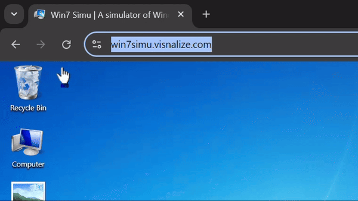
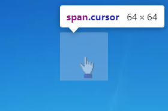

# Implementing custom cursors in Win7 Simu


_The mouse settings window captured with the simulated [Snipping Tool](../win7simu/simulated/snipping.md) in Win7 Simu_

We are back with another technical post on Win7 Simu! This time, let's dive into how the custom cursors are implemented in a web project like [Win7 Simu](../win7simu/about.md), the challenges faced, and some caveats to keep in mind. Hopefully, this post will also be useful for those working on a custom cursor implementation in their web projects. Let's get started!

## The idea

As a simulator, Win7 Simu aims to provide an experience as close to the actual Windows 7 as possible. This includes the mouse settings, which allows users to customize the cursor in the [Control Panel](../win7simu/simulated/cpanel.md). However, due to the limitations of web techs, and the fact that Win7 Simu also runs on mobile devices, the implementation of custom cursors requires some creativity and compromises to achieve a shared experience across all platforms.

At a high level, the idea to implement the custom cursor for Win7 Simu as a web project involves the following considerations:

- The availability of the cursor images: the cursor requires instant switching between different images upon user interaction with the elements on the page. This means all the cursor images need to be preloaded and ready to be used at any time.
- A dummy presentation of the custom cursor: the actual mouse cursor is hidden and the cursor images are rendered on a dummy element that follows the actual mouse cursor/touch position on the screen. This ensures the custom cursor's behavior is consistent across different platforms and avoid the unnecessity of handling the implementation deviations.
- Keeping track of the custom cursor: the cursor state needs to be tracked and updated based on the user interaction with the elements on the page. This is done from the code logic and has to be efficient to avoid any performance issues.



_How a custom cursor currently looks like in [Win7 Simu](https://win7simu.visnalize.com/)_

## The implementation

If Win7 Simu were not also developed for mobile devices, the custom cursor implementation would be as simple as 1 single line of CSS to apply a custom cursor image on the actual mouse cursor:

```css
#root {
  cursor: url('path-to-image.png'), auto;
}
```

However, on mobile touch devices, the mouse cursor is not available, hence the above CSS rule wouldn't serve any purpose. In addition, the CSS `cursor` doesn't allow animated cursor images, which is also a blocker for replicating the Windows 7 cursor behavior. Therefore, a more complex approach is necessary to implement the custom cursors.

<SponsorAd />

As per the idea mentioned above, the custom cursor implementation can be broken down into the following parts:

### 1. Preloading the cursor images

All the cursor images are preloaded and stored in memory prior to the user interaction. This is done by creating an `Image` object for each cursor image and setting the `src` attribute to the image URL. The `onload` event is then used to track the completion of the image loading process. And the preload process is invoked at boot time of Win7 Simu.

The extracted code snippets are as follows:

```js
const getAssets = [
  // other assets...
  ...this.assets.cursor,
].map(async (imageUrl) => {
  const { target } = await preload(imageUrl);
  this.$parent.$refs.preload.append(target);
});
await Promise.all(getAssets);
```

And the preload function:

```js
function preload(imageUrl) {
  return new Promise((resolve, reject) => {
    const image = new Image();
    image.onerror = reject;
    image.onload = resolve;
    image.src = imageUrl;
  });
}
```

### 2. Rendering the custom cursor



The actual mouse cursor is hidden with the CSS rule: `cursor: none !important`, and instead a dummy element is used to render the custom cursor images. This dummy element is positioned `fixed` on the screen and follows the actual mouse cursor/touch position using JS logic (more on that in the next part). The size of the dummy element is kept to a minimum (64x64 pixels) and just enough to fit in the cursor images, this ensures the simulator's performance is not heavily impacted by the custom cursor's movement and rendering.

It's also important to note that the dummy element is not supposed to be interactive and should not intefer with the user interaction on the page, hence the `pointer-events` must be set to `none` to achieve this. And the `z-index` must be set to the highest possible value to ensure the custom cursor is not overlapped by other elements on the page.

The CSS rules for the dummy element are then:

```css
.cursor {
  background-position: center;
  background-repeat: no-repeat;
  pointer-events: none;
  position: fixed;
  width: 64px;
  height: 64px;
  z-index: 9999;
}
```

### 3. Tracking the cursor state and position

The dummy element also listens to the user interaction events and updates the cursor state and position accordingly. This is done by attaching event listeners to the `mousemove`, `touchmove`, and `touchend` events on the root element of the Win7 Simu. The dummy cursor element is then positioned in response to the actual mouse cursor/touch position of the event. And the cursor state is updated based on the targeting element, which can be an editable element, a resizable element, a canvas, etc. The cursor state is then used to determine which cursor image to display on the dummy element.

The most crucial snippet of the logic to handle this is as follows:

```js
mounted() {
  this.x = this.$el.clientWidth + window.outerWidth / 2;
  this.y = this.$el.clientHeight + window.outerHeight / 2;
  this.$root.$el.addEventListener("touchend", this.moveTouch);
  this.$root.$el.addEventListener("touchmove", this.moveTouch);
  this.$root.$el.addEventListener("mousemove", this.moveMouse);
  this.$root.$on(Event.ChangeCursor, (cursorType) => {
    if ([Cursor.Default, Cursor.Working, Cursor.Busy].includes(cursorType)) {
      this.activeCursor = this.cursorImage[cursorType];
    } else {
      this.cachedCursor = this.cursorImage[cursorType];
    }
  });
},
methods: {
  moveTouch({ changedTouches, target }) {
    const [touch] = changedTouches;
    this.x = touch.clientX - this.$el.clientWidth / 2;
    this.y = touch.clientY - this.$el.clientHeight / 2;
    this.moveGeneric(target);
  },
  moveMouse(e) {
    this.x = e.clientX - this.$el.clientWidth / 2;
    this.y = e.clientY - this.$el.clientHeight / 2;
    this.moveGeneric(e.target);
  },
  moveGeneric(target) {
    // some other logic...

    const isTextInput = target.tagName === "INPUT" && (!target.type || ["text", "password", "search", "tel", "url"].includes(target.type));
    const isContentEditable = target.contentEditable === "true" || target.closest('[contenteditable="true"]');

    if (isTextInput || isContentEditable || target.tagName === "TEXTAREA") {
      this.activeCursor = this.cursorImage[Cursor.Typing];
    } else if (target.classList.contains("upper-canvas")) {
      this.activeCursor = this.cachedCursor; // paint cursor
    } else if (target.closest(".resizable") && target.classList.contains("handle")) {
      const direction = target.className.split("-")[1];
      this.activeCursor = this.cursorImage[DirectionMap[direction]];
    } else {
      this.activeCursor = this.cursorImage[Cursor.Default];
    }
  },
}
```

## The caveats

With the implementation approach above, the custom cursor behavior has somewhat replicated closely the actual Windows 7 cursor. However, due to the limitations of web techs, and how sophisticated the simulator has evolved over time, there are some challenges and caveats that are tough, if not impossible, to overcome, and are worth mentioning:

- __Custom cursors are not performant__: using a dummy element to render the cursor images is resource-intensive, the browser has to repaint the element as it updates and moves across the screen. Additionally, as the dummy element is part of the DOM, any intensive operation on the page can impact the cursor rendering and make it appear laggy to the users.
- __Custom cursors don't work in iframes__: the dummy element is bound to the HTML document where it's created, and iframe content is an external document that the dummy element doesn't have access to. Therefore, as you move the actual mouse cursor onto an iframe, the custom cursor will stop and the actual mouse cursor will be visible instead.
- __Custom cursors don't work as expected on mobile devices__: from the code above, can can tell that the custom cursor follows the touch position, this means it will only react to your finger touch and is always visible under your finger. This is not an ideal behavior and somewhat beats the purpose of having a custom cursor. This is also something a lot of users have raised and reported as a bug (despite not being a bug) on Google Play and I'm still figuring out a way to address this.
