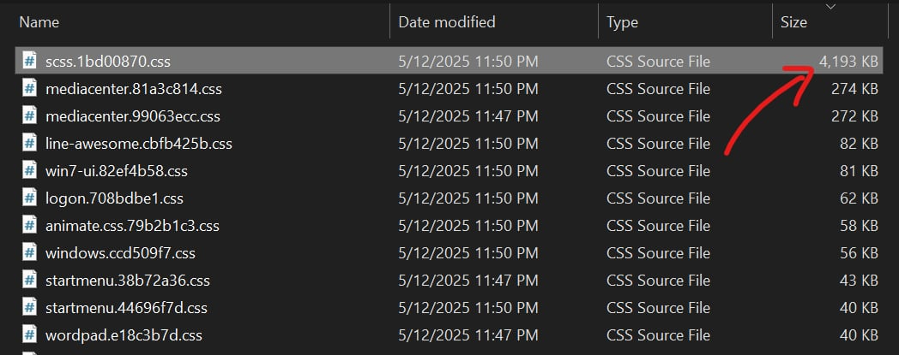
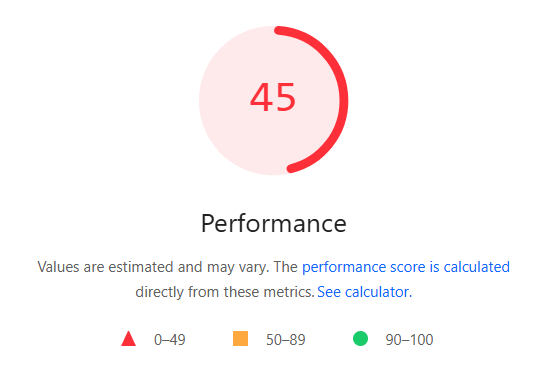

# Optimizing Win7 Simu

_The performance score before the optimization_

[Win7 Simu](../win7simu/about.md) has been my brainchild since the early days of my career, starting as a simple project to learn about [front-end development](./building-win7-simu.md#the-goal). Over the years, it has evolved a lot, in terms of popularity and complexity. With thousands of daily active users, it has become something more than just a personal project. Entrusted with the responsibility of maintaining such a large user base, I realize that optimizing the app to make it more efficient and performant is now a crucial task.

In this post, I'm sharing some of the optimizations I've done to improve Win7 Simu. If you're a technical person, you might find interesting insights and tips to apply to your own projects, if you're my user, you might love to see how I made the app better for you. In any case, I hope you find this post useful.

## The tech stack

Before diving into the main topic, it's worth mentioning the tech stack of Win7 Simu, as it plays a significant role in the optimizations I needed to do.

## The problems

- Over 4 MB for the main CSS file

- Over 1.2 MB for the entrypoint (JS + CSS required to load the app)
- Less than 50 points on the performance score

## The techniques

- Code splitting
- Tree shaking
- Lazy loading
- Compression

## The outcome

| | Before       | After
| --- | --- | ---
| App size | 44 MB      | 40 MB
| Entry size | ~1.2 MB      | ~144 kB
| Initial load performance  | | a

- <https://github.com/khang-nd/win7-simu/pull/290>
- <https://github.com/khang-nd/win7-simu/pull/291>
- <https://github.com/khang-nd/win7-simu/pull/292>
