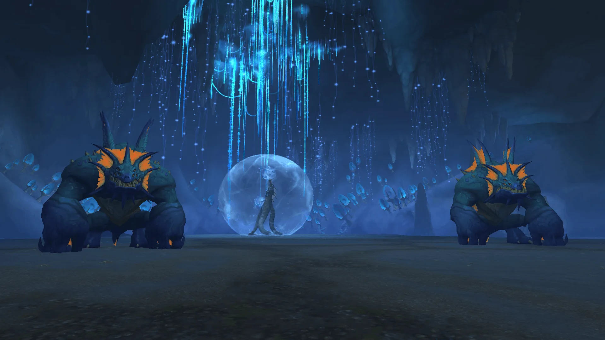

# Why WoW Raid Groups Make Common Progression Mistakes and How to Fix Them

_Cover image from [World of Warcraft](https://worldofwarcraft.blizzard.com/) by Blizzard Entertainment_

World of Warcraft raid groups rarely fail because one player lacks perfect gear. Most progression problems begin when several smaller mistakes happen together. Players arrive without proper preparation, assignments remain unclear, and the group repeats pulls without identifying what caused each wipe.

The solution is not always to replace players or spend another week farming equipment. Groups improve faster when they isolate one problem, create a simple response, and test it during the next pull. This approach works in full raids, shorter Lair encounters, and progression groups at every difficulty.

## WoW Raid Groups Start Without a Clear Plan

Many raid leaders explain every ability before the first pull. The information may be correct, but players cannot immediately process an entire encounter. Important instructions become lost among details that will not matter until later. A useful opening briefing should answer several immediate questions:

* Which abilities require the group to spread or stack?
* Which adds must die first?
* Where should tanks position the boss?
* Which casts need interrupts?
* When should the raid use Bloodlust or Heroism?
* What changes on the selected difficulty?

After a wipe, the leader can explain the next unresolved problem. This keeps each instruction connected to something the group has already experienced.

The current [Tidebound Grotto Lair](https://news.blizzard.com/en-us/article/24295085/step-into-lairs-and-face-the-foes-inside) demonstrates why concise preparation matters. It contains one boss, Nymrissa Wavecaller, but the encounter still combines add control, movement, soaking, tank positioning, and sustained raid damage.

## Players Prepare Gear but Ignore Utility

Item level shows whether a character has enough numerical power for an encounter. It does not show whether the player selected useful talents, defensive abilities, interrupts, or crowd control. Every player should check the following before entering a raid:

* talents for the encounter's damage profile;
* personal defensive and movement abilities;
* interrupts, stuns, roots, grips, and knockbacks;
* health potions, flasks, food, and weapon enhancements;
* repaired gear and enough consumables for the session.

Utility should match the encounter. A small theoretical damage increase may be less valuable than a talent that stops dangerous adds or helps the player survive.

This is particularly important against Nymrissa. Bubblefin Murlocs must be defeated before they reach the central bubble. Roots, slows, grips, and area stuns give damage dealers more time to remove them.

The Tidebound Grotto boosting service may suit prepared characters that do not have a stable raid team. The main advantage of a Tidebound Grotto carry is consistency: the group enters with established assignments and a shared understanding of the encounter.

## Damage Dealers Attack the Wrong Targets

Damage meters are useful, but they can encourage players to chase overall numbers. Someone may produce serious damage while attacking enemies that do not threaten the group. Another player may lose damage by switching to priority targets and handling mechanics correctly. Raid leaders should establish a simple target hierarchy:

1. Enemies capable of causing an immediate wipe.
2. Targets with dangerous casts or strict time limits.
3. Adds that strengthen the boss or other enemies.
4. The main boss when no higher-priority target is active.

Nymrissa is primarily a single-target encounter, but ignoring incoming murlocs can quickly end the attempt. Successful groups treat each add wave as a shared responsibility rather than a distraction for selected ranged players. Clear priorities also help players plan cooldowns. If adds appear at predictable intervals, damage dealers can save suitable abilities instead of using everything on the boss immediately.

## Raid Communication Becomes Too Complicated

Effective communication should tell players what is happening and what action follows. Too many callouts can hide the one instruction that matters.

Voice communication should generally be reserved for:

* mechanics that require immediate movement;
* changes to an existing assignment;
* missed interrupts or crowd-control effects;
* raid-wide defensive cooldowns;
* combat resurrection decisions;
* phase transitions and damage checks.

Assignments should use player names or stable groups. "Someone soak the next orb" forces the raid to make a decision during the mechanic. "Group two takes the next orb" establishes responsibility beforehand.

On Heroic Nymrissa, Frost Orbs must be soaked before they explode. However, soaking too many creates dangerous damage-over-time stacks. The [Nymrissa strategy guide](https://www.wowhead.com/guide/midnight/nymrissa-wavecaller-tidebound-grotto-lair-boss-strategy-rewards) explains the encounter cycle and difficulty-specific mechanics. Planned soaking groups prevent both missed orbs and unnecessary overlap.

A Tidebound Grotto raid carry can reduce the organizational part of progression. Players who want to improve their own performance can still study the fight and observe how an experienced group manages positioning, adds, and defensive cooldowns.

## Raid Teams Repeat Pulls Without Reviewing Them

Repeated attempts only create progress when the group changes something between them. Pulling again immediately may feel efficient, but it often reproduces the same failure. After each wipe, the group should identify:

1. The first mistake that materially changed the attempt.
2. Whether it was an individual or group problem.
3. Which assignment can prevent it.
4. What the next pull should test.

Combat logs and death reports provide better evidence than overall damage rankings. They can reveal missed interrupts, avoidable damage, incorrect targets, late defensive use, and deaths outside healer range.

The review should remain brief. Long discussions break momentum and introduce too many changes at once. If one mechanic caused most deaths, the group should fix it before debating minor damage differences.

A [WoW Tidebound Grotto boost](https://overgear.com/games/wow/raids/tidebound-grotto-general) provides access to an organized group working toward a defined completion goal. A Tidebound Grotto raid boost can cover the relevant difficulty without requiring the player to search through changing pickup groups.

## Players Use Defensive Abilities Too Late

Many players treat defensive cooldowns as emergency buttons. In raids, these abilities work better as planned responses to predictable damage. Activating a defensive at low health may not help if the dangerous attack has already landed. Players should distinguish between several defensive tools:

| Defensive Type | Best Use |
| ----- | ----- |
| Personal defensive | Predictable damage targeting the player |
| Health potion or healthstone | Recovery when immediate healing is unavailable |
| Raid-wide defensive | Heavy damage affecting most of the group |
| Immunity | Mechanics that allow immunity use |
| Movement ability | Repositioning or returning to healer range |

Healers and raid leaders should prepare a cooldown order for repeated raid-wide damage. Major abilities should not overlap unless the strategy requires several effects at once.

The goal is to reduce incoming damage before health bars become critical. This preserves healer resources and gives the group more room to recover from unexpected mistakes.

## Poor Positioning Creates Avoidable Wipes

Correct positioning involves more than standing beside a raid marker. Players must understand why the marker exists and where they should move when the arena changes. A reliable raid formation should provide:

* enough space for targeted mechanics;
* short routes toward safe areas;
* predictable positions for healers and ranged players;
* clear frontal positioning for tanks;
* room for melee players to avoid effects;
* consistent locations for dropping persistent hazards.

Nymrissa's Water Jet shows how one positioning error can affect the entire group. Tanks must direct this frontal attack away from other players. Swirling Whirlpools also require everyone to identify the safe section before the hazards converge toward the center.

Players should move as soon as the safe destination becomes clear. Waiting for an addon warning to become urgent often results in unnecessary damage or blocks another player's path.

## WoW Raid Groups Lose Focus During Progression

Concentration declines during long sessions. Players begin failing familiar mechanics, and frustration makes communication less precise. Short scheduled breaks can protect the quality of later attempts. Common signs that a group needs a reset include:

* deaths to previously consistent mechanics;
* missed assignments and ready checks;
* background conversation during pulls;
* uncoordinated talent or strategy changes;
* arguments about damage meters;
* immediate repulls without an adjustment.

Whether players join a guild group, a pickup raid, or WoW Tidebound Grotto boosting, consistent execution still requires attention. A short encounter can punish a distracted group as quickly as the final boss of a larger raid.

## How to Build Consistent WoW Raid Progression

_In-game screenshot from World of Warcraft by Blizzard Entertainment_

Successful raid groups do not eliminate every mistake. They prevent one error from spreading into several others. Clear assignments reduce hesitation, planned defensives support healers, and short reviews turn failed attempts into useful information. Apply the same progression cycle to every encounter:

* prepare the character for the actual mechanics;
* explain the most important early assignments;
* identify the first meaningful cause of each wipe;
* adjust one part of the strategy;
* repeat the pull with the new response;
* record what worked for the next session.

Tidebound Grotto provides a compact example of these principles in Midnight. Nymrissa has one repeating phase, but groups must still control adds, manage Frost Orbs, avoid whirlpools, position the boss correctly, and meet the encounter's damage requirements.

Gear makes these tasks more forgiving. Organization makes them repeatable. Raid groups progress when every pull has a purpose, and every player understands how their actions contribute to the next successful attempt.
