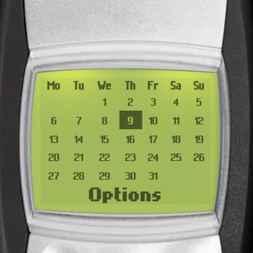
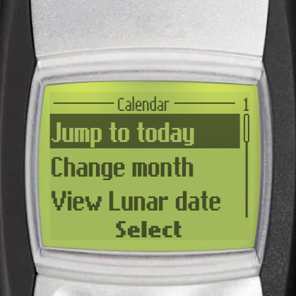
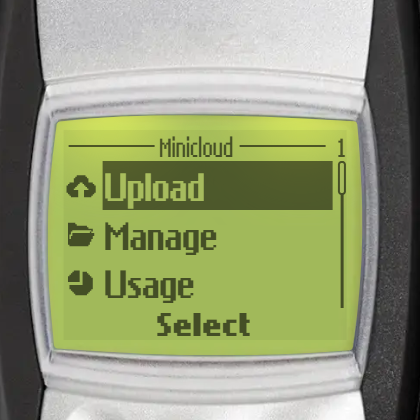
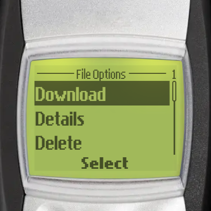

# Brick 1100 Apps

Below are the ***exclusive*** apps you can find in Brick 1100. These apps provide various utilities and unique features to enhance your experience, boost productivity, or simply add fun to your daily tasks, in a retro style.

These apps generally can be found in _Menu > Extras_, utility apps are placed in _Menu > Extras > Utilities_.

## Calendar

| Month view                                    | Features                                    |
| --------------------------------------------- | ------------------------------------------- |
|  |  |

Calendar is a simple and easy-to-use app that does one thing: view the current date. It displays the current day, month, and year in a plain and straightforward manner, making it perfect for quick reference without any distractions.

Supported features:

- Display and highlight the current date in a month view.
- Display the corresponding lunar date.
- Navigate through months and years.

## Minicloud

| Main view                                      | File options                                  |
| ---------------------------------------------- | --------------------------------------------- |
|  |  |

Minicloud is a minimal cloud storage solution for storing and transfering files between devices. It is designed to be simple and efficient, allowing you to access your files from anywhere with an internet connection.

Supported features:

- Upload files to the cloud.
- Manage files with options to download, view details, and delete.

### Usage tiers

- **Free**:
  - 200 MB of storage
  - Max 20 MB per upload.
- **Pro** (available via in-app purchase):
  - 1 GB of storage
  - Max 100 MB per upload.

## Shortcut maker

Shortcut maker is a utility app exclusive to the Android version of Brick 1100. It allows you to create shortcuts for your favorite games and apps on your home screen, making it easier to access them quickly.
