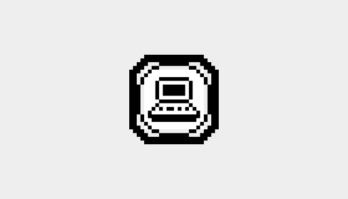

# Brick 1100 Builders

__Builders__ is a short name for an advanced program available in [Brick 1100](./about.md). It offers a set of tools and features that allow you to create your own apps and games, and seamlessly integrate them with Brick 1100. You can publish your creations and share with other Brick 1100 users, and even earn rewards for your work. The owners of these creations are referred to as _builders_.

This page will guide you through the process of building and publishing your apps and games on Brick 1100.

## Understanding how it works

### The nature of Brick 1100

> _Recommended read: [Turning my CodePen into an actual app](../blog/from-codepen-to-app.md)._

Despite being a mobile app, Brick 1100 at its core is developed using web techs (HTML, CSS, and JavaScript). Ignoring the technical details, this means you can create your own apps and games using the same techs, which subjectively have a lower entry barrier if you are new to programming, or easier and faster to work with if you are already familiar with them.

Web techs offer a powerful [iframe](https://developer.mozilla.org/en-US/docs/Web/HTML/Element/iframe) feature that allows embedding web content within web content. This is the key for how Brick 1100 works: it embeds your apps and games within its own interface, providing a seamless experience for the user.

The diagram above illustrates how your apps and games are integrated with Brick 1100 using iframe.

### Bridge 1100

Bridge 1100 is a small JavaScript utility that acts as a bridge between your apps/games and Brick 1100. It provides an API that allows your creation to exchange events and data from and to Brick 1100 such as `start`, `stop`, `keypress`, `numpress` etc. In addition, it comes with a set of predefined styles to make your creation fit seamlessly with Brick 1100's interface effortlessly.

Head over to the [Bridge 1100 GitHub repository](https://github.com/Visnalize/bridge-1100) to learn more about it.

<!-- <a-google-ad /> -->

## Step-by-step guide

As these apps/games are developed using web techs, you can use any code editor of your choice (even a [Notepad](../win7simu/simulated/notepad.md) will do the job just fine). However, [Visual Studio Code](https://code.visualstudio.com/) is recommended as it offers a wide range of features and extensions, including this [Live Server](https://marketplace.visualstudio.com/items?itemName=yandeu.five-server) extension that enhances your development experience.

Follow the steps below to get your first creation up and running on Brick 1100. Feel free to leave a comment or reach out on [Discord](https://discord.com/invite/6AQDnZa4Xm) if you need help or have any questions.

🚧 Under construction

<!-- ### 1. Setup

- Install [Visual Studio Code](https://code.visualstudio.com/).
- Install the [Live Server](https://marketplace.visualstudio.com/items?itemName=yandeu.five-server) extension in Visual Studio Code.
- Create a [GitHub](https://github.com/) account if you don't have one.
- Go to a directory repository:
  - [Brick 1100 Apps](https://github.com/Visnalize/brick-1100-apps) if you are building an app.
  - [Brick 1100 Games](https://github.com/Visnalize/brick-1100-games) if you are building a game (under construction 🚧).
- Fork the repository to your account.
- Clone the forked repository to your Visual Studio Code.

Now you are ready to start building!

### 2. Build

- Create a new folder and name it as your app's name.
- Write your app's code in the folder (you can refer to the existing apps for examples).
- Once done, commit and push your code to your forked repository.
- Create a pull request to original directory repository.

### 3. Deploy -->
