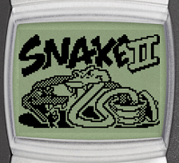
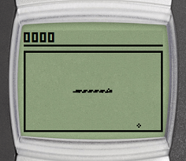
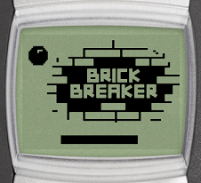
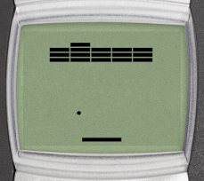
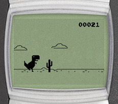
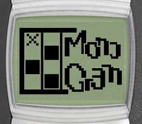
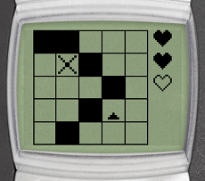

# Brick 1100 Games

## Snake

| Splash screen | Gameplay |
| --- | --- |
|  |  |

:::tip Goal
Make the snake grow longer by directing it to the food. The longer the snake gets, the more points you score.
:::

:::warning Controls

- <KeyIcon s="navi" /> / <KeyIcon s="clear" /> - pause game
- <KeyIcon s="down" /> - move clockwise
- <KeyIcon s="up" /> - move counter-clockwise
- <KeyIcon s="2" /> - move up
- <KeyIcon s="8" /> - move down
- <KeyIcon s="4" /> - move left
- <KeyIcon s="6" /> - move right
:::

## Brick Breaker

| Splash screen | Gameplay |
| --- | --- |
|  |  |

:::tip Goal
Clear the screen by breaking all the bricks with the ball to advance to the next level.
:::

:::warning Controls

- <KeyIcon s="navi" /> / <KeyIcon s="clear" /> - pause game
- <KeyIcon s="up" /> / <KeyIcon s="1" /> / <KeyIcon s="4" /> / <KeyIcon s="7" /> - move paddle left
- <KeyIcon s="down" /> / <KeyIcon s="3" /> / <KeyIcon s="6" /> / <KeyIcon s="9" /> - move paddle right
:::

## Chrome Dino

| Splash screen | Gameplay |
| --- | --- |
|  |  |

:::tip Goal
Control the T-Rex to overcome obstacles. The longer you survive, the higher your score.
:::

:::warning Controls

- <KeyIcon s="clear" /> - pause game
- <KeyIcon s="up" /> / <KeyIcon s="2" /> - jump
- <KeyIcon s="down" /> / <KeyIcon s="8" /> - duck
:::

## Monogram

| Splash screen | Gameplay |
| --- | --- |
|  |  |

:::tip Goal
Leave blank or fill the grid cells until a pixel image appears to advance to the next level.
:::

:::warning Controls

- <KeyIcon s="clear" /> - pause game
- <KeyIcon s="2" /> - move the cursor up
- <KeyIcon s="8" /> - move the cursor down
- <KeyIcon s="4" /> - move the cursor left
- <KeyIcon s="6" /> - move the cursor right
- <KeyIcon s="up" /> - move the cursor to the previous cell
- <KeyIcon s="down" /> - move the cursor to the next cell
- <KeyIcon s="navi" /> / <KeyIcon s="5" /> - toggle cell fill
- <KeyIcon s="aste" /> - toggle cell hints (shows the number of filled cells in the row/column)
- <KeyIcon s="0" /> - reset the grid
:::
