# Brick 1100 Games

Below is a list of classic games you can play on Brick 1100, with each game having its own gameplay and controls using the T9 keypad.

## Snake

| Splash screen | Gameplay |
| --- | --- |
| 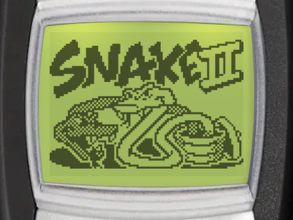 | 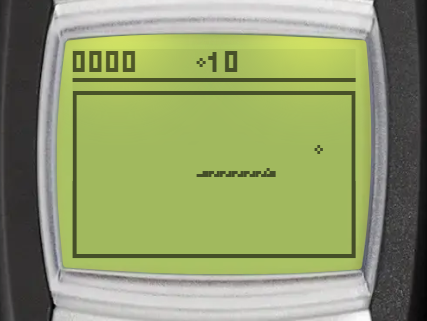 |

:::tip Goal
Make the snake grow longer by directing it to the food. The longer the snake gets, the more points you score.
:::

:::warning Controls

- <KeyIcon s="navi" /> / <KeyIcon s="clear" /> - pause game
- <KeyIcon s="down" /> - move clockwise
- <KeyIcon s="up" /> - move counter-clockwise
- <KeyIcon s="2" /> - move up
- <KeyIcon s="8" /> - move down
- <KeyIcon s="4" /> - move left
- <KeyIcon s="6" /> - move right
:::

## Space Impact +

| Splash screen | Gameplay |
| --- | --- |
| 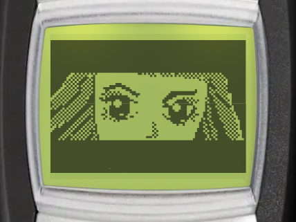 | 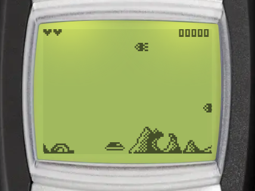 |

:::tip Goal
Destroy enemy ships and avoid their attacks to progress through levels, achieve a high score and unlock achievements.
:::

:::warning Controls (Default)

- <KeyIcon s="navi" /> / <KeyIcon s="clear" /> - pause game
- <KeyIcon s="8" /> - move up / jump
- <KeyIcon s="0" /> - move down
- <KeyIcon s="aste" /> - move left
- <KeyIcon s="hash" /> - move right
- <KeyIcon s="3" /> - fire main weapon
- <KeyIcon s="6" /> - fire bonus weapon
:::

:::warning Controls (Alternate)

- <KeyIcon s="navi" /> / <KeyIcon s="clear" /> - pause game
- <KeyIcon s="2" /> - move up / jump
- <KeyIcon s="8" /> - move down
- <KeyIcon s="4" /> - move left
- <KeyIcon s="6" /> - move right
- <KeyIcon s="5" /> - fire main weapon
- <KeyIcon s="3" /> - fire bonus weapon
:::

<SponsorAd />

## Brick Breaker

| Splash screen | Gameplay |
| --- | --- |
| 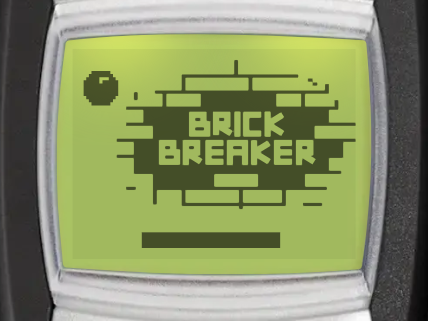 | 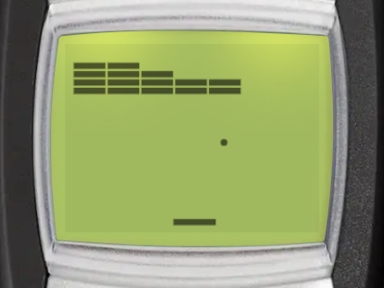 |

:::tip Goal
Clear the screen by breaking all the bricks with the ball to advance to the next level.
:::

:::warning Controls

- <KeyIcon s="navi" /> / <KeyIcon s="clear" /> - pause game
- <KeyIcon s="up" /> / <KeyIcon s="1" /> / <KeyIcon s="4" /> / <KeyIcon s="7" /> - move paddle left
- <KeyIcon s="down" /> / <KeyIcon s="3" /> / <KeyIcon s="6" /> / <KeyIcon s="9" /> - move paddle right
:::

## Chrome Dino

| Splash screen | Gameplay |
| --- | --- |
| 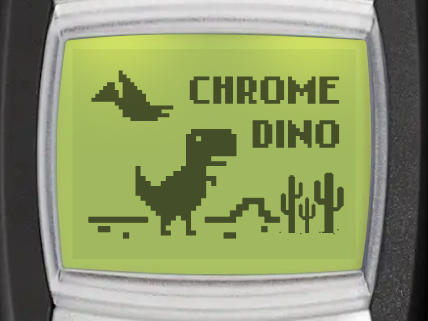 | 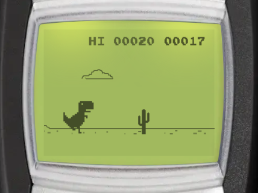 |

:::tip Goal
Control the T-Rex to overcome obstacles. The longer you survive, the higher your score.
:::

:::warning Controls

- <KeyIcon s="clear" /> - pause game
- <KeyIcon s="up" /> / <KeyIcon s="2" /> - jump
- <KeyIcon s="down" /> / <KeyIcon s="8" /> - duck
:::

## Monogram

| Splash screen | Gameplay |
| --- | --- |
| 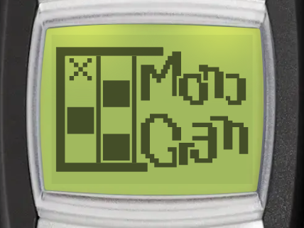 | 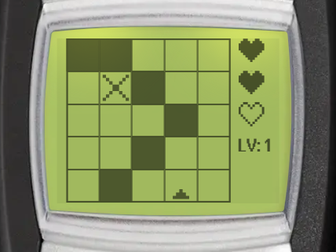 |

:::tip Goal
Leave blank or fill the grid cells until a pixel image appears to advance to the next level.
:::

:::warning Controls

- <KeyIcon s="clear" /> - pause game
- <KeyIcon s="2" /> - move the cursor up
- <KeyIcon s="8" /> - move the cursor down
- <KeyIcon s="4" /> - move the cursor left
- <KeyIcon s="6" /> - move the cursor right
- <KeyIcon s="up" /> - move the cursor to the previous cell
- <KeyIcon s="down" /> - move the cursor to the next cell
- <KeyIcon s="navi" /> / <KeyIcon s="5" /> - toggle cell fill
- <KeyIcon s="aste" /> - toggle cell hints (shows the number of filled cells in the row/column)
- <KeyIcon s="0" /> - reset the grid
:::

## Rapid Roll

| Splash screen | Gameplay |
| --- | --- |
| 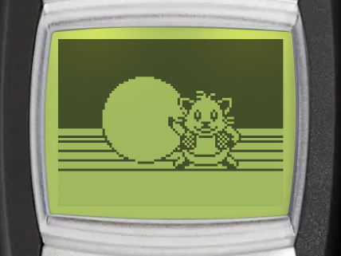 | 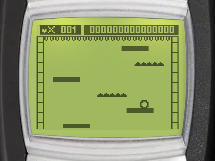 |

:::tip Goal
Move the ball to avoid spikes and land safely on platforms. The longer you survive, the higher your score.
:::

:::warning Controls

- <KeyIcon s="navi" /> / <KeyIcon s="clear" /> - pause game
- <KeyIcon s="4" /> - move left
- <KeyIcon s="6" /> - move right
:::

## Tappy Duck

| Splash screen | Gameplay |
| --- | --- |
| 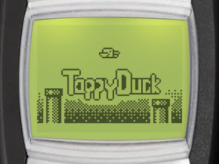 | 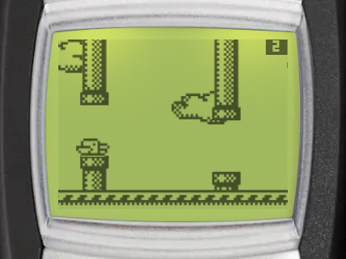 |

:::tip Goal
Fly the duck through the gaps between pipes. The longer you survive, the higher your score.
:::

:::warning Controls

- <KeyIcon s="clear" /> - pause game
- __Any key__ - flap wings / fly up
:::

## Wordee

| Splash screen | Gameplay |
| --- | --- |
| 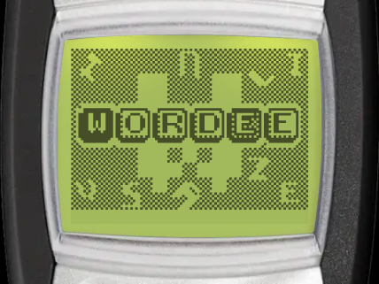 | 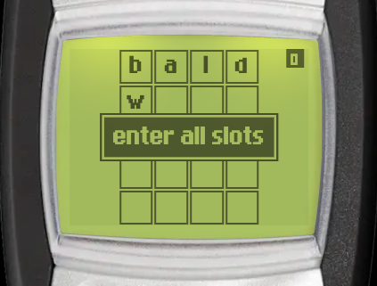 |

:::tip Goal
Guess a hidden 4-letter word within 5 tries. Filled letters are in the correct position, checkered letters are in the word but wrong position.
:::

:::warning Controls

- <KeyIcon s="4" /> / <KeyIcon s="6" /> - change active slot
- <KeyIcon s="2" /> / <KeyIcon s="8" /> - scroll through letters for the active slot
- <KeyIcon s="navi" /> / <KeyIcon s="5" /> - submit guess
:::
