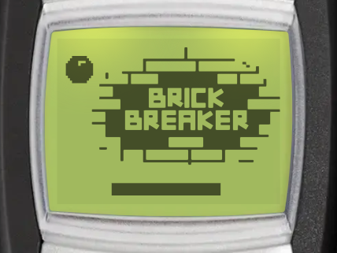
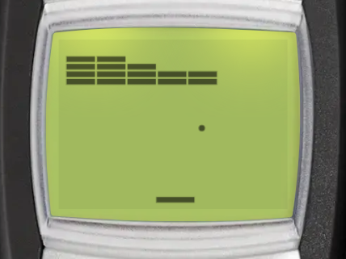

# Brick Breaker

| Splash screen | Gameplay |
| --- | --- |
|  |  |

Brick Breaker is the classic paddle and ball game. Bounce the ball off your paddle to break all the bricks on the screen. You can find it in _Menu > Games > Brick Breaker_.

:::tip Goal
Break all the bricks on the screen with the ball as it bounces off the paddle to advance to the next level. Unbreakable bricks can stay.
:::

## Controls

:::warning Controls

- <KeyIcon s="up" /> / <KeyIcon s="1" /> / <KeyIcon s="4" /> / <KeyIcon s="7" /> - move paddle left
- <KeyIcon s="down" /> / <KeyIcon s="3" /> / <KeyIcon s="6" /> / <KeyIcon s="9" /> - move paddle right
- __Any other key__ - launch the ball at the start of a level, or after you lose a life
- <KeyIcon s="navi" /> / <KeyIcon s="clear" /> - pause game
:::

## How to play

### Lives

You have 3 lives, shown as dots at the top right of the screen. You lose a life when the ball falls off the bottom of the screen. The ball then goes back onto the paddle and waits for you to launch it again. When you lose all your lives, the game is over.

### Scoring

- Each brick scores 10 points, multiplied by a combo. The combo counts the bricks you break before the ball returns to the paddle: the first brick scores 10, the second 20, the third 30, and so on.
- Clearing a level gives a bonus of 50 points times the level number.

:::tip Tip
Break several bricks before the ball returns to the paddle for more points.
:::

The ball gets a little faster every few paddle hits. Hit the ball with the edge of the paddle to send it out at a sharper angle.

### Brick types

| Brick | Looks like | Behaviour |
| --- | --- | --- |
| Normal | Solid | Breaks in 1 hit. |
| Two-hit | Hollow outline | The first hit turns it into a normal brick. |
| Power-up | Solid, with a hole in the middle | Breaks in 1 hit and drops a power-up. |
| Unbreakable | Checker pattern | Never breaks. You do not need to break it to clear the level. |

### Power-ups

A power-up falls from its brick. Catch it with the paddle to use it. Losing a life ends all active power-ups.

| Power-up | Icon | Effect |
| --- | --- | --- |
| Wide | Double arrow | Makes the paddle wider for 15 seconds. |
| Slow | Wave | Slows down the ball for 10 seconds. |
| Multi | Two balls | Adds 2 more balls. You only lose a life when the last ball falls. |

## Game modes

The game menu has these entries: _Continue_, _Daily challenge_, _New game_, _Endless_, _High scores_ and _Instructions_. _Continue_ only shows when you have a paused game.

### New game

Play the campaign of **50 levels**, in order. Levels get harder as you go: the ball gets faster, the bricks get smaller, and new brick types appear (power-up bricks from level 2, two-hit bricks from level 5 and unbreakable bricks from level 11). Your score and lives carry over from one level to the next.

### Daily challenge

One new level each day, the same for every player. You have one try each day: clear the level to win. See [Daily challenges](../games.md#daily-challenges) for streaks and statistics.

### Endless <Notation icon="premium" /> {#endless}

Play new levels without end. Each level is made for your game, and each one is faster than the one before.

## Continue after game over

When you lose your last life, you can continue from where you lost with 1 life, once per game. The bricks stay as they were. It is free for subscribers, other players watch a video ad. Continue is only available on Android and iOS.

## High scores

The Brick Breaker leaderboard ranks players by the highest campaign level reached. Select _High scores_ in the game menu to open it (Android and iOS only). Playing the daily challenge also counts towards the shared [streak achievements](../games.md#daily-challenges).
