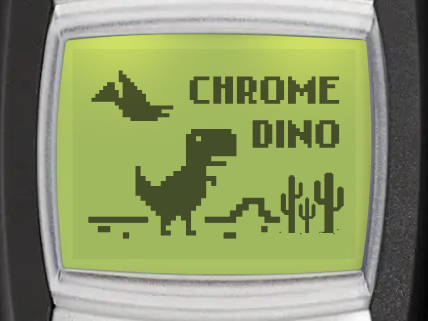
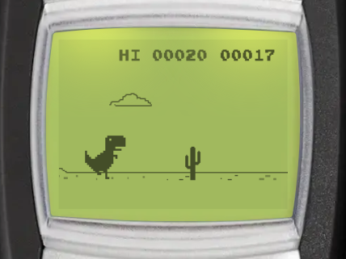

# Chrome Dino

| Splash screen | Gameplay |
| --- | --- |
|  |  |

Chrome Dino is the endless runner from the Chrome browser, on your Brick 1100 screen. Jump over cacti and duck under pterodactyls for as long as you can. You can find it in _Menu > Games > Chrome Dino_.

:::tip Goal
Control the T-Rex to overcome obstacles. The longer the distance you run, the higher your score.
:::

## Controls

:::warning Controls

- <KeyIcon s="up" /> / <KeyIcon s="1" /> / <KeyIcon s="2" /> / <KeyIcon s="3" /> - jump (the first jump starts the run)
- <KeyIcon s="down" /> / <KeyIcon s="7" /> / <KeyIcon s="8" /> / <KeyIcon s="9" /> - duck
- <KeyIcon s="navi" /> / <KeyIcon s="clear" /> - pause game
:::

## How to play

- Hold the jump key for a higher jump, or release it early for a short hop.
- Press the duck key in the air to drop down faster.
- Your score is the distance you run. The score flashes every 100 points.
- The game gets faster the longer you run.
- Cacti come in small and large sizes, in groups of up to 3. Pterodactyls appear at different heights once the game is fast enough.
- Every 700 points, the screen turns dark for a while (night mode).

## Game menu

The game menu has these entries: _Continue_, _New game_, _Skins_, _High scores_ and _Instructions_. _Continue_ only shows when you have a paused game.

## Skins

A skin changes the T-Rex and the cacti into characters from the other Brick 1100 games. Pterodactyls, clouds and the ground stay the same.

| Skin | How to unlock |
| --- | --- |
| Classic | Available from the start |
| Ship | Reach 500 points |
| Black Cat | Reach 1000 points |
| Ghost | Subscription <Notation icon="premium" /> |
| Alien | Subscription <Notation icon="premium" /> |

To change the skin, select _Skins_ in the game menu, then choose a skin and press <KeyIcon s="navi" />. Your choice is saved. Once you reach the score for a skin, it stays unlocked.

## Continue after game over

When you crash, you can keep running from where you crashed, once per game. It is free for subscribers, other players watch a video ad. Continue is only available on Android and iOS.

## High scores and achievements

The Chrome Dino leaderboard ranks players by their best score. Select _High scores_ in the game menu to open it (Android and iOS only).

You can also unlock achievements by beating a best score of 100, 500, 1000 and 2000 points.
