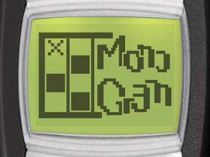
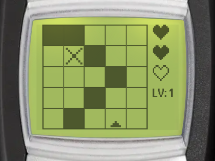

# Monogram

| Splash screen | Gameplay |
| --- | --- |
|  |  |

Monogram is a picture logic puzzle (also known as a nonogram). Fill the right cells of the grid, following the number clues, until a pixel picture appears. You can find it in _Menu > Games > Monogram_.

:::tip Goal
Fill the grid cells to reveal a picture. The numbers beside the grid are the clues for the cursor's row and column: the runs of filled cells in that line, in order.
:::

## Controls

:::warning Controls

- <KeyIcon s="2" /> / <KeyIcon s="4" /> / <KeyIcon s="6" /> / <KeyIcon s="8" /> - move the cursor up, left, right or down (the cursor wraps around the edges)
- <KeyIcon s="up" /> / <KeyIcon s="down" /> - move the cursor to the previous or next cell
- <KeyIcon s="navi" /> / <KeyIcon s="5" /> - fill a cell, or make a filled cell blank again
- <KeyIcon s="hash" /> - mark a cell as empty, or remove the mark
- <KeyIcon s="0" /> - start the picture over (press twice to confirm)
- <KeyIcon s="clear" /> - pause game
:::

## How to play

### Reading the clues

The clues for the row and the column under the cursor show beside the grid. Each clue lists the runs of filled cells in that line, in order. For example, `3 1` means a run of 3 filled cells, then at least one blank cell, then 1 filled cell. A line with no filled cells shows `0`.

### Lives

You have 3 lives (hearts) for each picture. Filling a cell that should stay blank costs a life, and the cell shows an X. When you lose all 3 lives, the game is over.

A picture is solved by its clues, so any board that fits every clue counts as solved. A fill is only wrong when no correct board has that cell filled.

### Marking empty cells

Press <KeyIcon s="hash" /> on a cell that you know is empty to mark it with a small dash. A marked cell cannot be filled by mistake. When you finish a row or a column, its remaining blank cells are marked for you.

### Starting over

Press <KeyIcon s="0" />, then <KeyIcon s="0" /> again to clear the board and start the picture over. Any other key cancels. Lives you already lost stay lost.

### First picture tips

On your very first picture, short tips explain the clues, the controls, the automatic marks and the lives, as you play. Press any key to close a tip.

## Game modes

The game menu has these entries: _Continue_, _Daily puzzle_, _New game_, _Levels_, _Booster (ad)_, _High scores_ and _Instructions_. _Continue_ only shows when you have a paused game.

### New game

Play the campaign of **100 pictures**, from level 1. The pictures get harder as you go:

| Levels | Grid size |
| --- | --- |
| 1 - 15 | 5 x 5 |
| 16 - 35 | 8 x 8 |
| 36 - 70 | 10 x 10 |
| 71 - 100 | 12 x 12 |

When you solve a picture, it shows with its name for a few seconds, then the next level starts. The game keeps the highest level you reached.

### Daily puzzle

One picture each day, the same for every player. It is taken from the 8 x 8 to 12 x 12 pictures of the campaign, and drawn the other way round (mirrored from left to right). You have one try each day. See [Daily challenges](../games.md#daily-challenges) for streaks and statistics.

### Levels <Notation icon="premium" /> {#levels}

Replay any level you already reached. Select _Levels_, then choose a level from the list.

### Booster (ad)

Watch a video ad to start a new game from the highest level you reached, instead of level 1. You can use the booster once a day.

## Continue after game over

When you lose all your lives, you can keep solving the same picture with 1 life, once per game. It is free for subscribers, other players watch a video ad. Continue is only available on Android and iOS. This also works in the daily puzzle.

## High scores

The Monogram leaderboard ranks players by the highest level reached. Select _High scores_ in the game menu to open it (Android and iOS only). Playing the daily puzzle also counts towards the shared [streak achievements](../games.md#daily-challenges).
