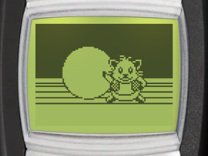
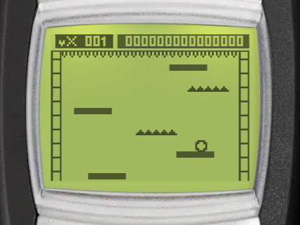

# Rapid Roll

| Splash screen | Gameplay |
| --- | --- |
|  |  |

Rapid Roll is the classic falling ball game. Roll the ball from platform to platform as the screen scrolls up, and stay away from the spikes. You can find it in _Menu > Games > Rapid Roll_.

:::tip Goal
Move the ball to land safely on platforms and avoid the spikes. Do not let the ball reach the top or fall off the bottom of the screen. The longer you survive, the higher your score.
:::

## Controls

:::warning Controls

- <KeyIcon s="4" /> - move left
- <KeyIcon s="6" /> - move right
- <KeyIcon s="navi" /> / <KeyIcon s="clear" /> - pause game
:::

Hold a key to keep moving.

## How to play

### Lives

You start with 1 ball and 2 extra hearts. The ball pops when it:

- reaches the top of the screen,
- falls off the bottom of the screen, or
- lands on a spike platform.

Each pop costs a heart. When the ball pops with no hearts left, the game is over. Collect hearts on the platforms to gain extra lives.

### Scoring

You score points while the ball is falling. The game gets faster as your score grows.

### Items

Items appear on some platforms. Roll over an item to collect it. The icon of an active item blinks when it is about to end.

| Item | Effect |
| --- | --- |
| Heart | Gives an extra life. |
| Shield | Saves the ball from one pop. It lasts until it is used. |
| Hourglass | Slows the screen down for 6 seconds. |
| Star | Doubles your points for 10 seconds. |

### Stages and platforms

Every 1000 points starts a new stage, and each stage adds a new platform type:

| Platform | From | Behaviour |
| --- | --- | --- |
| Normal | Stage 1 | A safe place to land. |
| Spikes | Stage 1 | Pops the ball when it lands on it. |
| Crumbling | Stage 2 | Breaks shortly after the ball lands on it. |
| Moving | Stage 3 | Slides from side to side, and carries the ball with it. |
| Bouncy | Stage 4 | Throws the ball up, through the platforms above. |

## Game modes

The game menu has these entries: _Continue_, _New game_, _Level_, _High scores_ and _Instructions_. _Continue_ only shows when you have a paused game.

Select _Level_ to choose the starting speed: _Easy_ (default), _Medium_ or _Hard_. Your choice is saved.

## Continue after game over

When the ball pops with no hearts left, you can keep rolling with 1 heart and your score kept, once per game. It is free for subscribers, other players watch a video ad. Continue is only available on Android and iOS.

## High scores

The Rapid Roll leaderboard ranks players by their best score, for all levels. Select _High scores_ in the game menu to open it (Android and iOS only).
