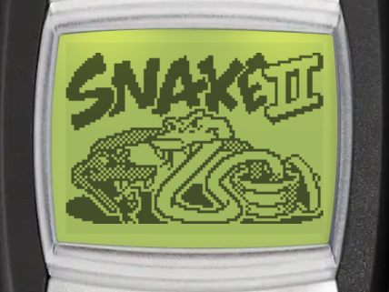
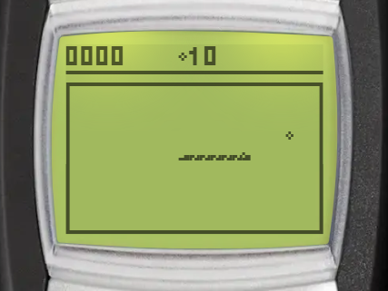

# Snake II

| Splash screen | Gameplay |
| --- | --- |
|  |  |

Snake II is the classic Nokia snake game. Guide the snake to the food to make it grow, and do not crash into your own tail or the walls. You can find it in _Menu > Games > Snake II_.

:::tip Goal
Make the snake grow longer by directing it to the food, without hitting its tail or the walls. The more food you eat, the higher your score.
:::

## Controls

:::warning Controls

- <KeyIcon s="2" /> - move up
- <KeyIcon s="8" /> - move down
- <KeyIcon s="4" /> - move left
- <KeyIcon s="6" /> - move right
- <KeyIcon s="up" /> - turn counter-clockwise
- <KeyIcon s="down" /> - turn clockwise
- <KeyIcon s="navi" /> / <KeyIcon s="clear" /> - pause game
:::

## How to play

- The snake moves on its own. You cannot stop it or make it go backwards.
- The board has no edges: the snake leaves one side and comes back on the other. Mazes add walls that you must avoid.
- The game is over when the snake hits its own tail or a wall.
- After you continue or resume a game, the snake waits until you press a direction key.

### Scoring

- Each food scores more points at a higher speed: from 1 point at the slowest speed to 9 points at the fastest.
- After every 5 food, a bonus food appears for a short time. It scores 3 times the points of normal food. A countdown on the screen shows how long it stays.

## Game modes

When you open Snake II, choose a mode: _Daily maze_, _Classic_ or _Campaign_. Classic and Campaign have their own menu with _Continue_, _New game_, _Level_, _Maze_ (Classic only), _High scores_ and _Instructions_. Each mode keeps its own paused game.

Select _Level_ to change the snake's speed. Press <KeyIcon s="up" /> / <KeyIcon s="down" /> to change it, then <KeyIcon s="navi" /> to save.

### Classic

The endless game: eat as much food as you can until you crash.

Select _Maze_ <Notation icon="premium" /> to play Classic in one of 7 mazes. Choose _No maze_ to play on the open board again.

### Campaign

Travel through 8 mazes, starting with an empty board. Eat the number of food shown on the screen to move to the next maze. After the last maze, the campaign starts over from the first maze, a little faster, and with more food to eat.

### Daily maze

One maze each day, the same for every player. It is played at a fixed speed, and the food appears in the same places for every player. Eat 20 food to clear the maze. You have one try each day. See [Daily challenges](../games.md#daily-challenges) for streaks and statistics.

## Continue after game over

When you crash, you can continue from just before the crash, once per game. It is free for subscribers, other players watch a video ad. Continue is only available on Android and iOS.

## High scores and achievements

Classic and Campaign each have their own leaderboard, ranked by best score. Select _High scores_ in the mode's menu to open it (Android and iOS only). The daily maze has no leaderboard, but it counts towards the shared [streak achievements](../games.md#daily-challenges).

You can also unlock achievements by beating a best score of 50, 200, 500 and 1000 points in Classic or Campaign.
