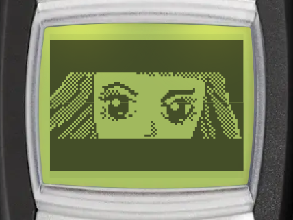
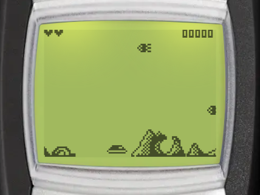

# Space Impact +

| Splash screen | Gameplay |
| --- | --- |
|  |  |

Space Impact + is a side-scrolling space shooter. Pilot your spaceship through the mission to defeat the alien forces, and explore planets with a ground vehicle. You can find it in _Menu > Games > Space Impact +_.

:::tip Goal
Pilot your spaceship through the mission to defeat the alien forces. Destroy enemy ships and avoid their attacks to progress through the 10 levels and beat every boss.
:::

## Controls

There are 2 control schemes. To switch, select _Controls_ in the game menu, then choose _Default_ or _Alternate_ <Notation icon="premium" />. Your choice is saved, and the in-game _Instructions_ show the keys of the scheme you chose.

:::warning Controls (Default)

- <KeyIcon s="8" /> - move up / jump
- <KeyIcon s="0" /> - move down
- <KeyIcon s="aste" /> - move backward
- <KeyIcon s="hash" /> - move forward
- <KeyIcon s="3" /> - fire main weapon
- <KeyIcon s="6" /> - fire bonus weapon
- <KeyIcon s="navi" /> / <KeyIcon s="clear" /> - pause game
:::

:::warning Controls (Alternate)

- <KeyIcon s="2" /> - move up / jump
- <KeyIcon s="8" /> - move down
- <KeyIcon s="4" /> - move backward
- <KeyIcon s="6" /> - move forward
- <KeyIcon s="5" /> - fire main weapon
- <KeyIcon s="3" /> - fire bonus weapon
- <KeyIcon s="navi" /> / <KeyIcon s="clear" /> - pause game
:::

## How to play

### Levels

The mission has 10 levels. In space levels, you fly a spaceship that moves freely. In planet levels, you drive a ground vehicle: it cannot fly, but it can jump over obstacles. Each level ends with a boss fight, and some levels also have a mini-boss.

### Lives and retries

- You start with 3 hearts, up to a maximum of 5. Each hit from an enemy shot or a crash costs a heart. After a hit, your ship is safe from damage for 3 seconds.
- When you lose all your hearts, a countdown shows your remaining tries. Press any key before it ends to replay the level from the start, with your score kept. You have 3 tries.

### Weapons and pickups

- The main weapon has unlimited shots.
- The bonus weapon does more damage, and needs a short wait between shots. On planet levels it fires a rocket upwards. In space levels it is a laser or a homing missile, with limited ammo.
- Collect bonus pickups to get an extra heart or more bonus weapon ammo. Hearts and ammo carry over to the next level.
- Some obstacles cannot be destroyed. Your shots pass through them.

### Scoring

| Action | Points |
| --- | --- |
| Hit an enemy | 20 |
| Hit a boss | 5 |
| Destroy a boss | 100 |
| Collect a bonus pickup | 5 |

## Game modes

The game menu has these entries: _Continue_, _New game_, _Boss rush_, _Controls_, _High scores_ and _Instructions_. _Continue_ only shows when you have a paused game.

### New game

Play the full mission, from level 1 to level 10.

### Boss rush <Notation icon="premium" /> {#boss-rush}

Go straight to the boss fight of each of the 10 levels. Boss rush keeps its own best score on your device, which is not sent to the leaderboard.

## Continue after game over

When the game is over, you can replay the current level from the start with your score kept, once per game. It is free for subscribers, other players watch a video ad. Continue is only available on Android and iOS.

## High scores and achievements

The Space Impact + leaderboard ranks players by their best mission score. Select _High scores_ in the game menu to open it (Android and iOS only).

You can also unlock achievements in the mission (not in Boss rush):

- Defeat the main boss of each level, from level 1 to level 10.
- Clear all 10 levels without taking any damage.
