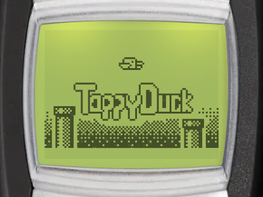
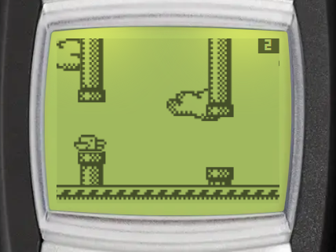

# Tappy Duck

| Splash screen | Gameplay |
| --- | --- |
|  |  |

Tappy Duck is a tap-to-fly arcade game. Flap the duck's wings to fly it through the gaps between the pipes. You can find it in _Menu > Games > Tappy Duck_.

:::tip Goal
Fly the duck through the gaps between the pipes. Each pipe you pass is a point.
:::

## Controls

:::warning Controls

- __Any key__ - flap wings / fly up (the first key starts the game)
- <KeyIcon s="clear" /> - pause game
:::

## How to play

- Each pipe you pass scores 1 point.
- The duck crashes when it hits a pipe or the ground. The top of the screen only stops the duck.
- As your score grows, the pipes come faster and the gaps get smaller.
- From 100 points, pipes can come in groups. From 200 points, some pipes move up and down.

## Medals

Pass enough pipes in one game to win a medal:

| Medal | Pipes |
| --- | --- |
| Bronze | 10 |
| Silver | 25 |
| Gold | 50 |
| Platinum | 100 |

The medal shows when the duck crashes, and on the result screen. Select _Medals_ in the game menu to see how many of each medal you have won, and the score needed for the ones you do not have yet. Each game counts only its best medal.

## Game menu

The game menu has these entries: _Continue_, _New game_, _Medals_, _High scores_ and _Instructions_. _Continue_ only shows when you have a paused game.

## Continue after game over

When the duck crashes, you can keep flying with your score kept, once per game. It is free for subscribers, other players watch a video ad. Continue is only available on Android and iOS.

## High scores

The Tappy Duck leaderboard ranks players by their best score. Select _High scores_ in the game menu to open it (Android and iOS only).
