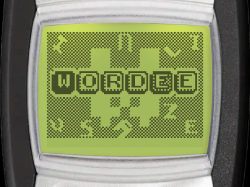
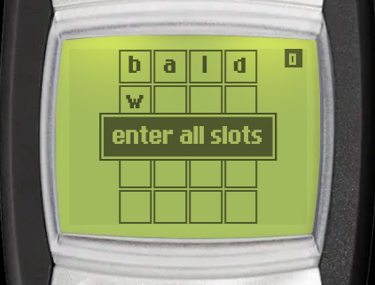

# Wordee

| Splash screen | Gameplay |
| --- | --- |
|  |  |

Wordee is a word guessing game. Find a hidden 4-letter English word in 5 tries, using the clues from each guess. You can find it in _Menu > Games > Wordee_.

:::tip Goal
Guess the hidden 4-letter word within 5 tries. Filled letters are correct, checkered letters are in the word but in another place.
:::

## Controls

:::warning Controls

- <KeyIcon s="2" /> - <KeyIcon s="9" /> - type a letter, the same way you write a text message
- <KeyIcon s="up" /> / <KeyIcon s="down" /> - move to the previous or next letter
- <KeyIcon s="clear" /> - delete a letter, or pause the game when the row is empty
- <KeyIcon s="navi" /> - submit the guess
:::

On the [web version](https://brick1100.visnalize.com), you can also type letters with your computer keyboard, press Backspace to delete and Enter to submit.

## How to play

### Typing a word

Letters are typed as in the message editor. Each key has its letters: <KeyIcon s="2" /> ABC, <KeyIcon s="3" /> DEF, <KeyIcon s="4" /> GHI, <KeyIcon s="5" /> JKL, <KeyIcon s="6" /> MNO, <KeyIcon s="7" /> PQRS, <KeyIcon s="8" /> TUV and <KeyIcon s="9" /> WXYZ.

Press a key again within 1 second to get its next letter. After 1 second, or when you press another key, the cursor moves to the next slot. For example, to type **C**, press <KeyIcon s="2" /> three times.

### Reading the clues

After you submit a guess, each letter shows a clue:

- **Filled** letter - the letter is in the word, in the right place.
- **Checkered** letter - the letter is in the word, but in another place.
- **Plain** letter - the letter is not in the word.

A letter that appears once in the word is only marked once, even if your guess has it twice.

### Word check

Your guess must be a real English word. If it is not in the word list, the game shows _Not in the word list_ and the guess does not use a try. The same applies when the row is not full (_Enter all letters_).

## Game modes

The game menu has these entries: _Continue_, _Daily word_, _New game_, _High scores_ and _Instructions_. _Continue_ only shows when you have a paused game.

### Daily word

One word each day, the same for every player. You have one try each day, and the result shows how many tries you used. See [Daily challenges](../games.md#daily-challenges) for streaks and statistics.

### New game

Play one word after another. When you find a word, press any key to start the next one, and your score is kept. The game ends at the first word you miss.

Each word you find scores points, based on the number of tries you used:

| Tries | 1 | 2 | 3 | 4 | 5 |
| --- | --- | --- | --- | --- | --- |
| Points | 100 | 70 | 50 | 30 | 10 |

## Continue after game over

In _New game_, when you miss a word, you can keep playing with your score kept, once per game. It is free for subscribers, other players watch a video ad. Continue is only available on Android and iOS. The daily word cannot be continued.

## High scores

The Wordee leaderboard ranks players by their best _New game_ score. Select _High scores_ in the game menu to open it (Android and iOS only). Playing the daily word also counts towards the shared [streak achievements](../games.md#daily-challenges).
