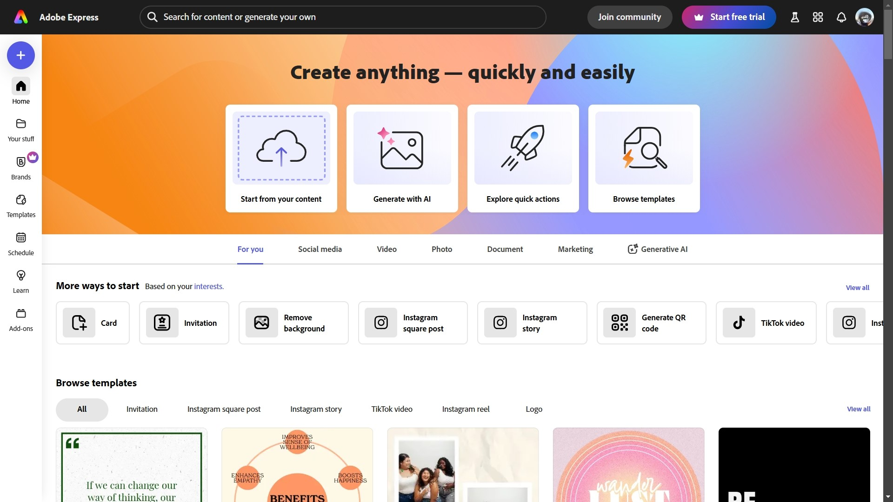
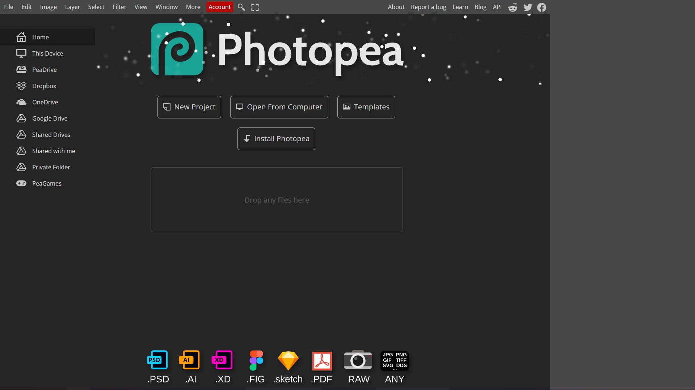
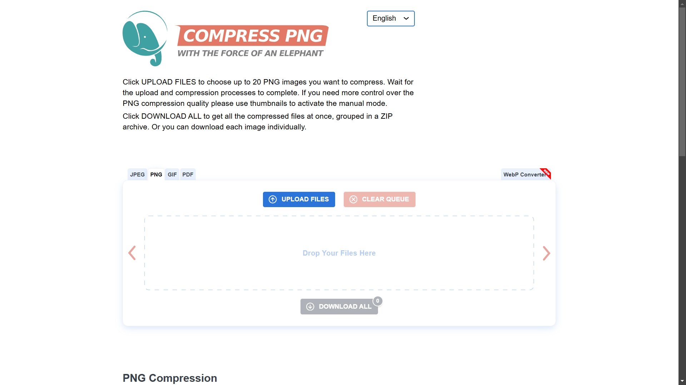
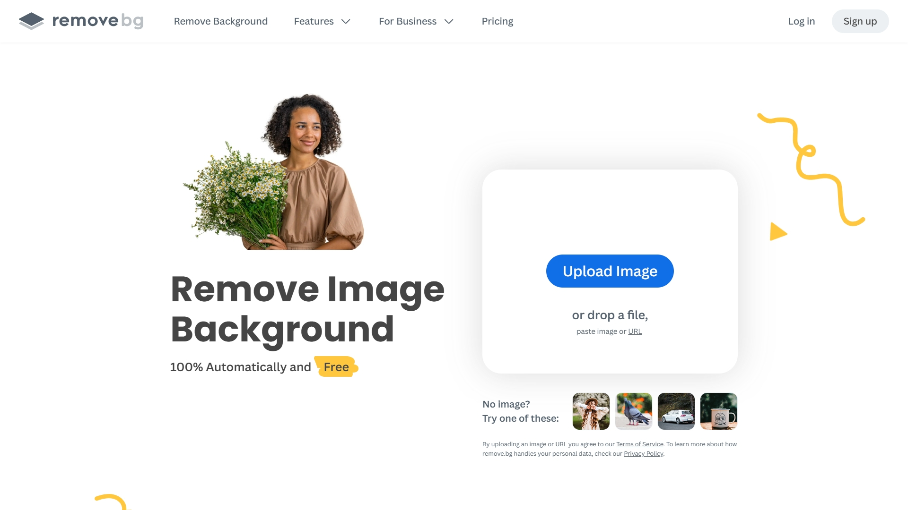
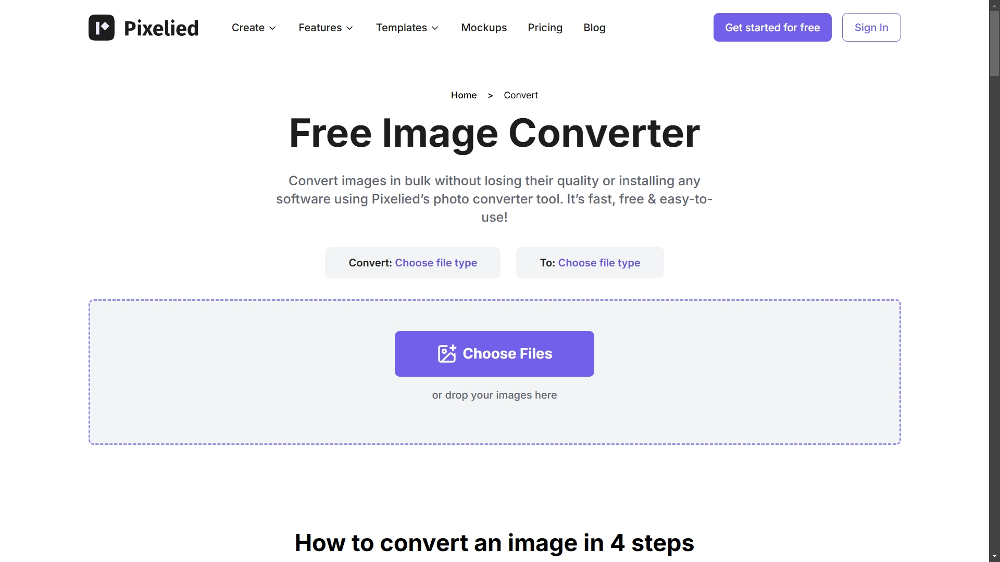
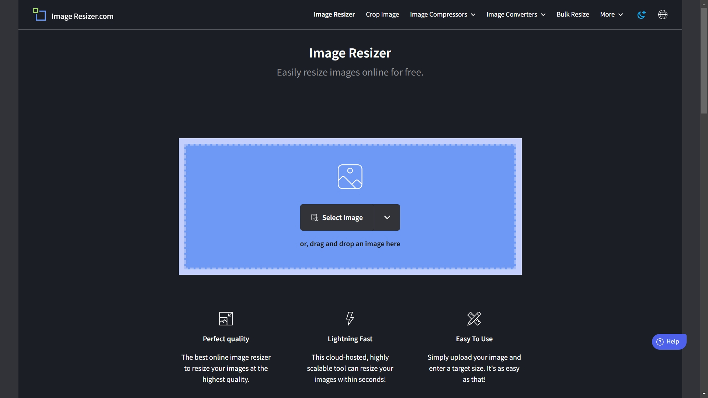
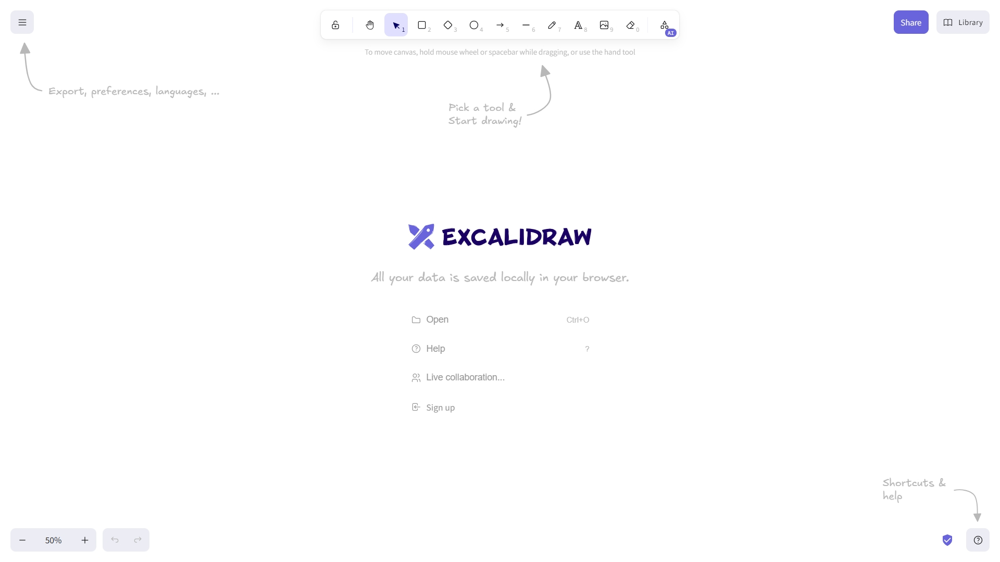
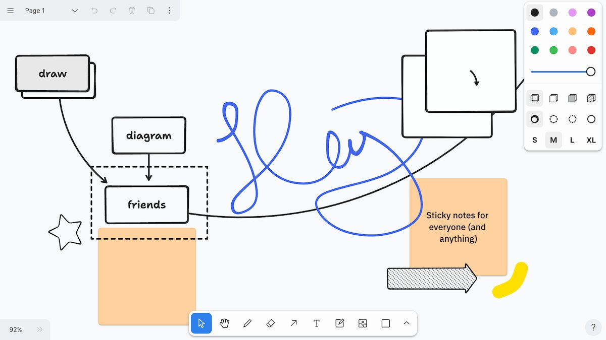
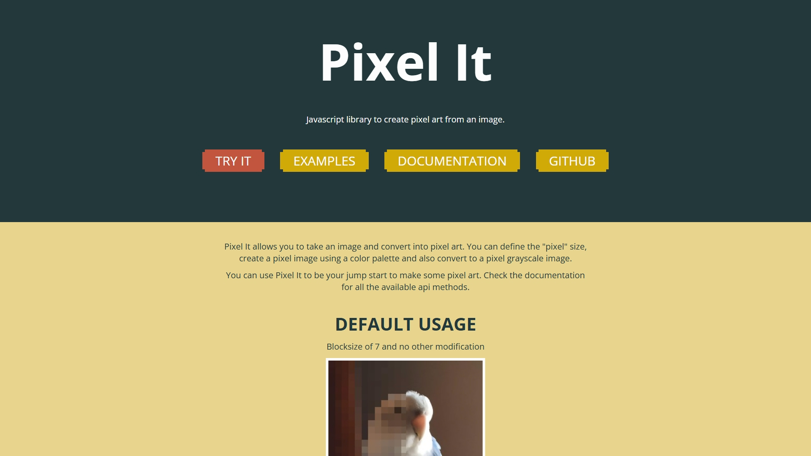
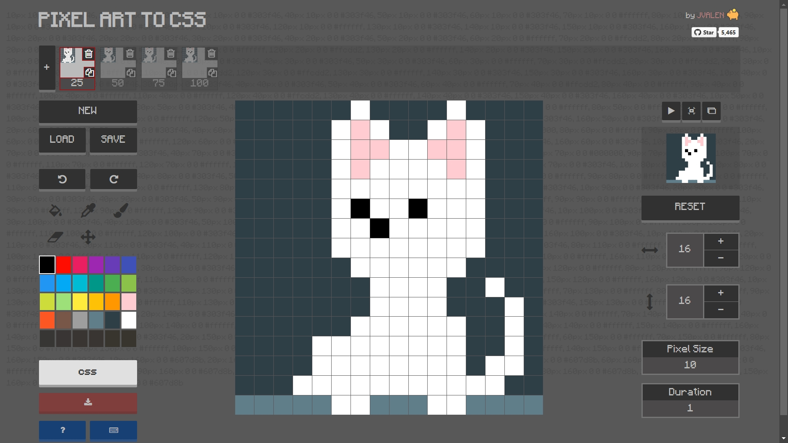

# 10 Free Online Image Tools

While working on Visnalize and its projects, I frequently use various online image tools to create, edit, and optimize visual graphics. These tools help me design engaging content, enhance images, and improve website performance. Here are 10 free online image tools that I recommend for creating and managing images effectively.

## Adobe Express

Adobe Express is a versatile tool for creating and editing images with ease. It offers templates and customization options for designing social media posts, banners, and more. Its user-friendly interface makes it suitable for both beginners and experienced designers. Adobe Express also includes features like image resizing, background removal, and access to a library of stock images and icons to enhance your projects.

__Website:__ [new.express.adobe.com](https://new.express.adobe.com/)

## Photopea

Photopea is a powerful browser-based image editor similar to Photoshop. It supports various file formats, including PSD, Sketch, and XD, making it a great alternative for users without access to Adobe tools. With advanced editing features like layers, masks, and blending modes, Photopea is ideal for retouching, graphic design, and digital art creation. Its versatility makes it a favorite among professionals and hobbyists alike.

__Website:__ [photopea.com](https://photopea.com/)

## Compress PNG

Compress PNG specializes in reducing the file size of PNG images without compromising quality. It's a handy tool for optimizing images for web use, which helps improve website loading times and overall performance. You can also compress multiple images at once, making it efficient for handling large batches of files.

__Website:__ [compresspng.com](https://compresspng.com/)

## remove.bg

remove.bg allows you to quickly and automatically remove backgrounds from images. Perfect for creating transparent PNGs for presentations or designs, this tool uses AI to detect subjects and remove backgrounds with precision. It’s especially useful for e-commerce, marketing, and personal projects where clean, professional images are required.

__Website:__ [remove.bg](https://remove.bg/)

## Free Image Converter by Pixelied

Pixelied’s Free Image Converter is a straightforward tool to convert images between formats like JPEG, PNG, and WebP. It’s fast and simple to use, making it ideal for users who frequently need to adjust image formats for compatibility. The tool also supports maintaining high image quality during conversion, ensuring your visuals look great no matter the format.

__Website:__ [pixelied.com/convert](https://pixelied.com/convert/)

## Image Resizer

Image Resizer lets you resize images in bulk or individually. It’s perfect for adjusting image dimensions for websites, emails, or social media. This tool offers customization options like aspect ratio maintenance and preset dimensions for various platforms, making it convenient for tailoring images to specific needs.

__Website:__ [imageresizer.com](https://imageresizer.com/)

## Excalidraw

Excalidraw is an excellent tool for creating quick, hand-drawn-style visuals. While primarily used for diagrams, it’s also great for sketching custom images or illustrations to enhance your content. Its collaborative features allow multiple users to work on a visual simultaneously, making it ideal for teams. Excalidraw's simplicity and charm make it a favorite for creating fun, engaging visuals.

__Website:__ [excalidraw.com](https://excalidraw.com/)

## tldraw

tldraw offers a simple yet effective way to create image-based drawings and illustrations. It’s lightweight and perfect for generating custom visuals or image mockups with minimal effort. With its clean interface and essential drawing tools, tldraw is an excellent choice for quickly visualizing ideas or creating placeholder images for designs.

__Website:__ [tldraw.com](https://tldraw.com/)

## Pixel It

Pixel It transforms images into pixel art. This tool is perfect for retro-style projects or experimenting with 8-bit designs. You can customize settings like pixel size and color palettes to create unique visuals that stand out. Pixel It is a fun and creative way to add a nostalgic touch to your projects.

__Website:__ [giventofly.github.io/pixelit](https://giventofly.github.io/pixelit/)

## Pixel Art to CSS

Pixel Art to CSS converts pixel art into CSS code. It’s an innovative way to create unique visual effects directly in web development projects. This tool bridges the gap between art and code, enabling developers to embed creative pixel designs into websites seamlessly.

__Website:__ [pixelartcss.com](https://pixelartcss.com/)
