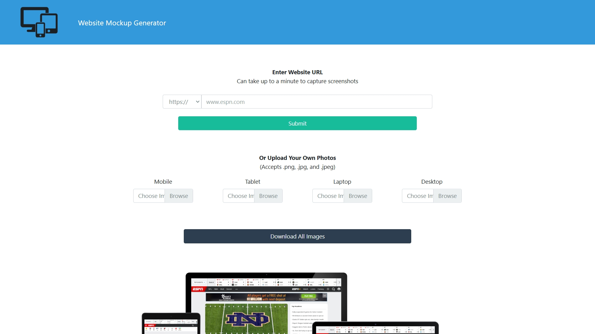
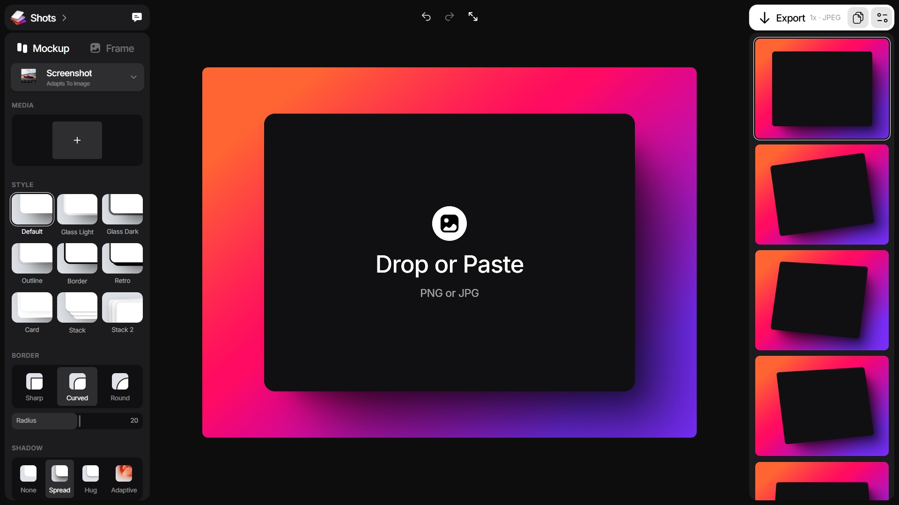
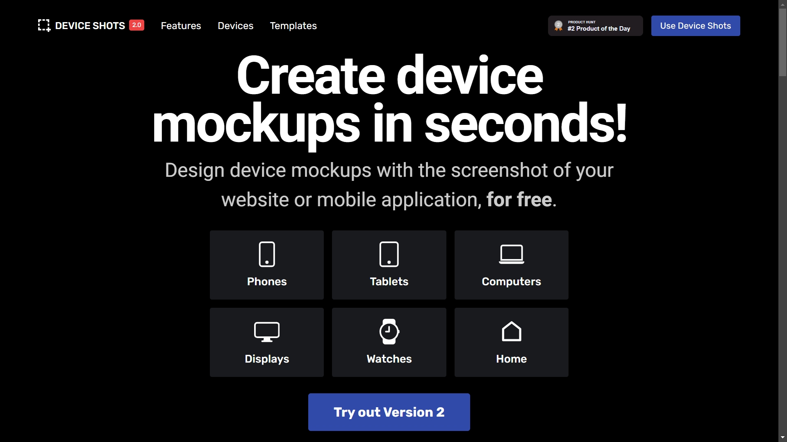
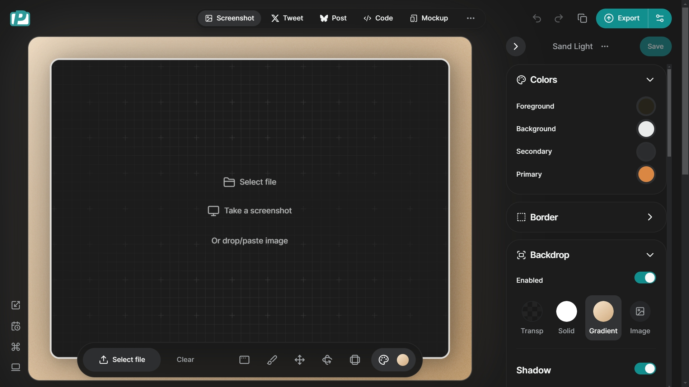
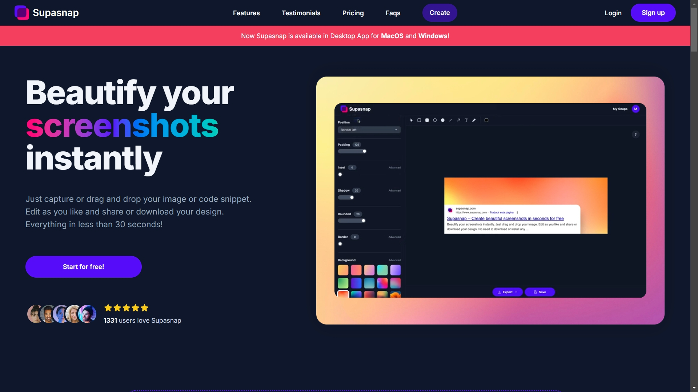

# 5 Free Screenshot & Mockup Tools

Screenshot and mockup tools are essential for creating visual presentations of websites, apps, and digital products. They help designers, marketers, and creatives showcase their work effectively and communicate ideas visually. Here are some free screenshot and mockup tools that I recommend for creating stunning visuals and engaging presentations.

## Website Mockup Generator

Website Mockup Generator makes it easy to create website mockups with realistic device frames, from smartphones, tablets, to desktops. All you need is a URL, and the tool generates high-quality mockups for your website instantly.

__Website:__ [websitemockupgenerator.com](https://websitemockupgenerator.com)

---

## Shots

Shots is a versatile mockup tool that lets you create beautiful mockups for websites, apps, and digital products. With a wide range of device frames and customization options, you can showcase your designs in a professional and engaging way.

__Website:__ [shots.so](https://shots.so)

---

## Device Shots

Device Shots offers a clean and straightforward way to frame your screenshots in realistic device mockups. Choose from a variety of devices, customize the background color, and download your mockups in high resolution.

__Website:__ [deviceshots.com](https://deviceshots.com)

---

## PostSpark

PostSpark specializes in creating social media mockups to elevate your marketing visuals, with a wide range of templates for Instagram, Facebook, Twitter, and more. Customize your designs with text, images, and colors to create eye-catching social media posts.

__Website:__ [postspark.app](https://postspark.app)

---

## Supasnap

Supasnap is designed for generating polished screenshots with minimal effort. Simply upload or capture your screenshot, code snippet and start customizing it with various options, from shadows, backgrounds, to overlay elements.

__Website:__ [supasnap.com](https://supasnap.com)
