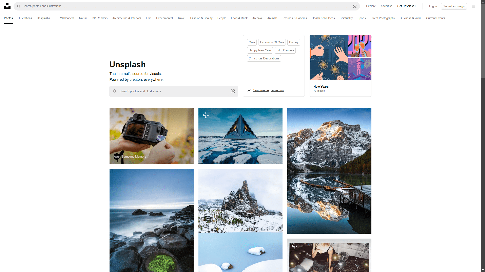
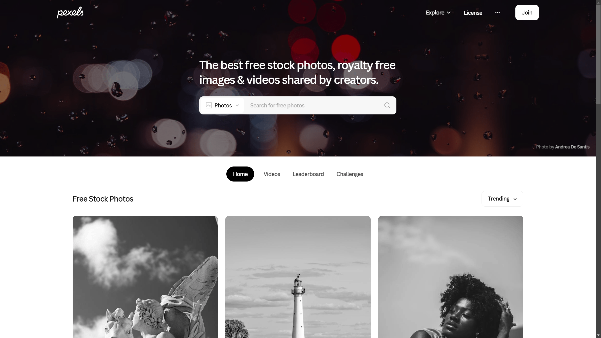
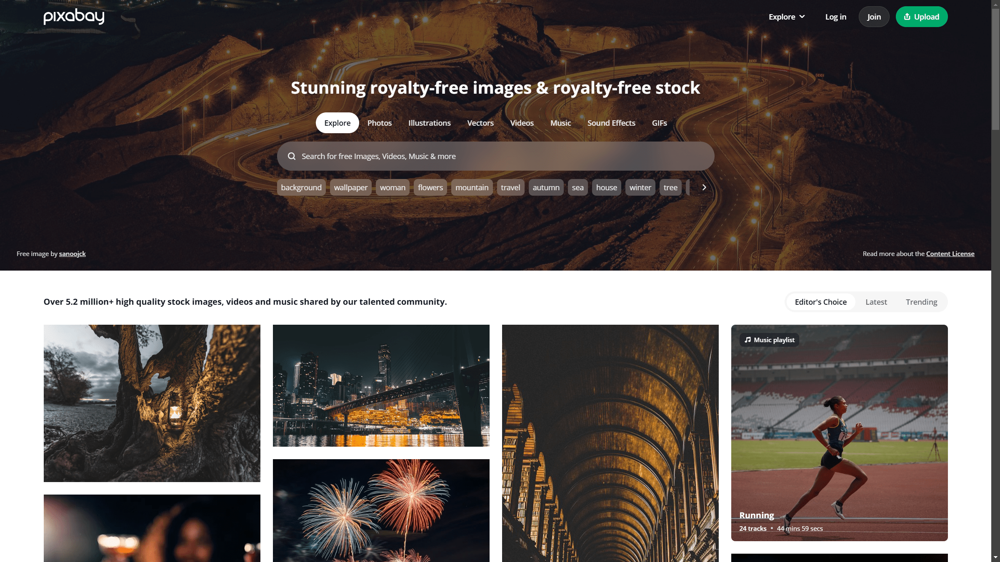
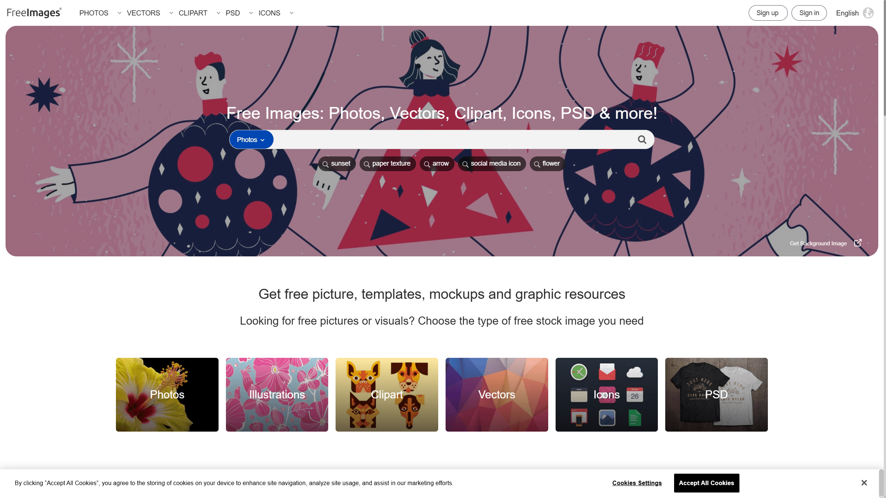
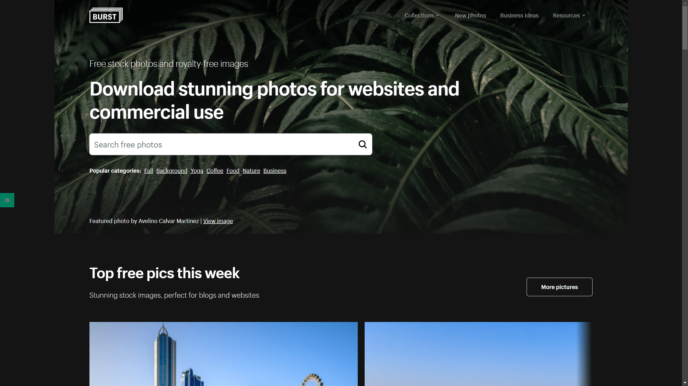
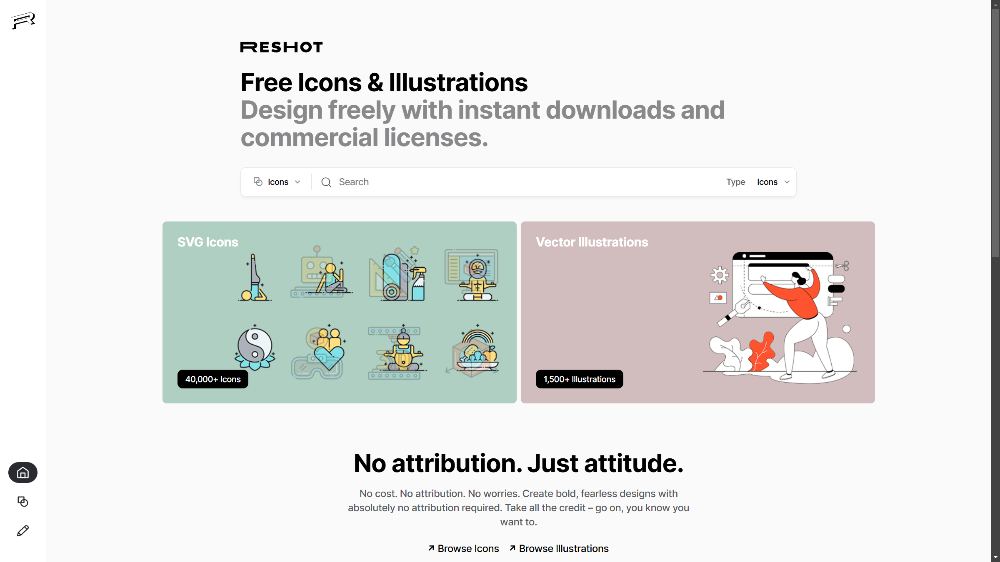
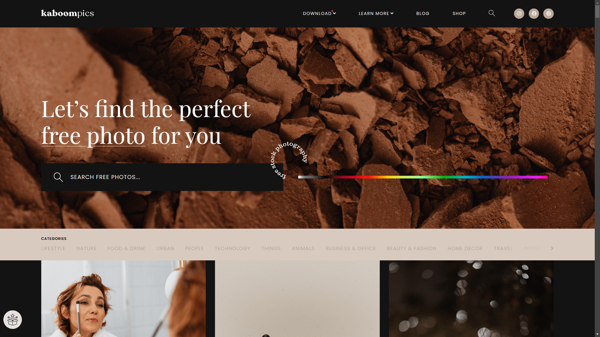
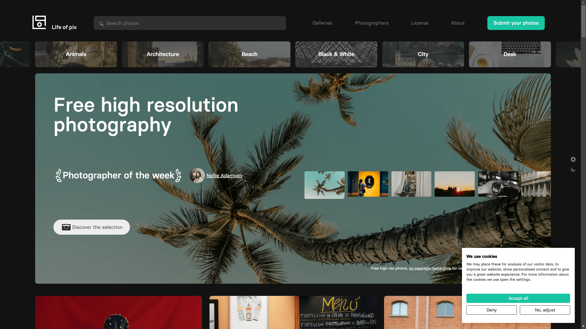
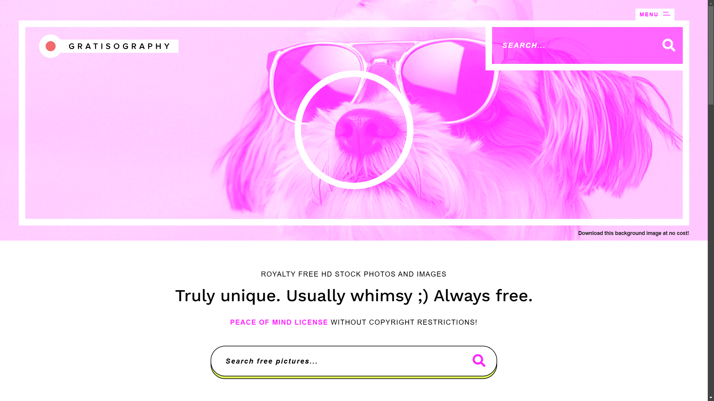
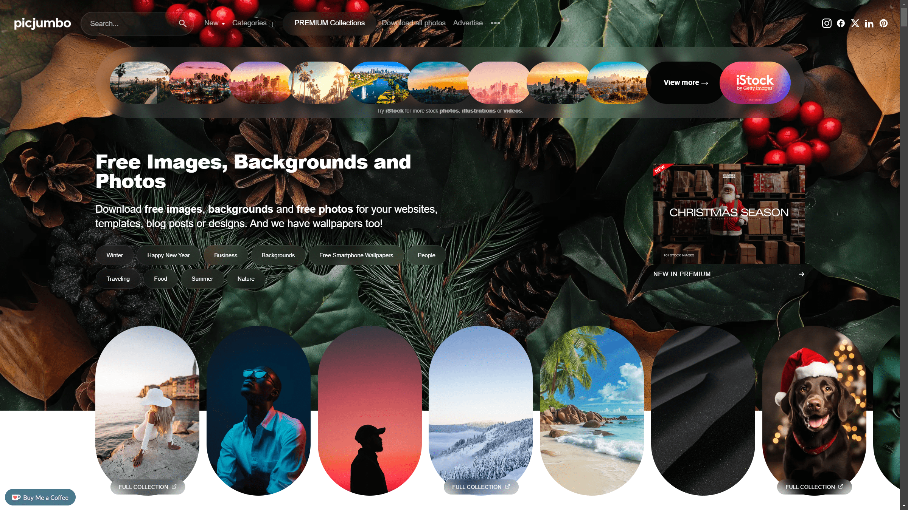

# 10 Free Stock Image Sites

From time to time, here on Visnalize, I need to find free but high-quality images for my blog posts, sharings, or as an inspiration to create something new. Visual content is powerful, it can help communicate messages and ideas more effectively, making the content more engaging and memorable.

In this post, I've compiled a list of 10 stock image sites that you can freely use for personal and commercial purposes without worrying about copyright issues. These sites offer a wide range of images, from nature and landscapes to people and technology, so you can find the perfect image for your use case.

## 1. __Unsplash__

Unsplash is a well-known platform offering a large library of high-resolution images contributed by a global community of photographers. Their images are free to use without attribution, though giving credit is appreciated.

__Website:__ [unsplash.com](https://unsplash.com)

## 2. __Pexels__

Pexels provides a vast collection of stock images and videos. The platform categorizes its content well, making it easy to find what you’re looking for. Like Unsplash, all images are free to use without attribution.

__Website:__ [pexels.com](https://pexels.com)

## 3. __Pixabay__

Pixabay is another excellent resource for stock photos, videos, illustrations, and even vector graphics. The site offers a robust search feature, and all content is royalty-free for personal and commercial use.

__Website:__ [pixabay.com](https://pixabay.com)

## 4. __FreeImages__

FreeImages has a wide variety of categories, making it easy to find unique stock photos. While registration is optional, it’s free and grants access to additional features.

__Website:__ [freeimages.com](https://freeimages.com)

## 5. __Burst by Shopify__

Burst by Shopify offers free stock photos tailored to entrepreneurs. It’s a go-to for business-related imagery, including e-commerce, marketing, and technology themes.

__Website:__ [burst.shopify.com](https://burst.shopify.com)

## 6. __Reshot__

Reshot focuses on authentic and unique images, perfect for startups, freelancers, and creatives. Their collection is less "stocky," making it ideal for projects that need a personal touch.

__Website:__ [reshot.com](https://reshot.com)

## 7. __Kaboompics__

Kaboompics offers a wide range of high-quality images and includes a complementary color palette for each photo, which is helpful for design projects. Their license allows free use with no attribution required.

__Website:__ [kaboompics.com](https://kaboompics.com)

## 8. __Life of Pix__

Life of Pix features stunning high-resolution photos contributed by a network of photographers. The site’s content is updated regularly, ensuring fresh options for your projects.

__Website:__ [lifeofpix.com](https://lifeofpix.com)

## 9. __Gratisography__

Gratisography is known for its quirky and creative images, perfect for projects requiring something out-of-the-ordinary. All photos are free to use without attribution.

__Website:__ [gratisography.com](https://gratisography.com)

## 10. __Picjumbo__

Picjumbo is a great resource for free stock images, especially for bloggers, marketers, and designers. The site offers premium memberships for access to exclusive content.

__Website:__ [picjumbo.com](https://picjumbo.com)
