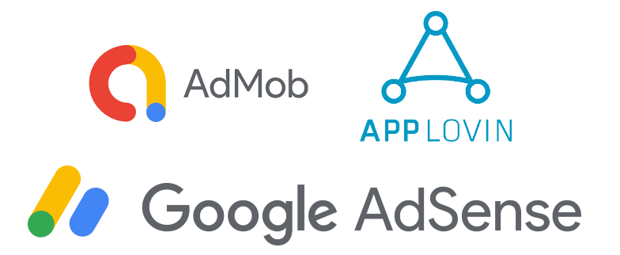
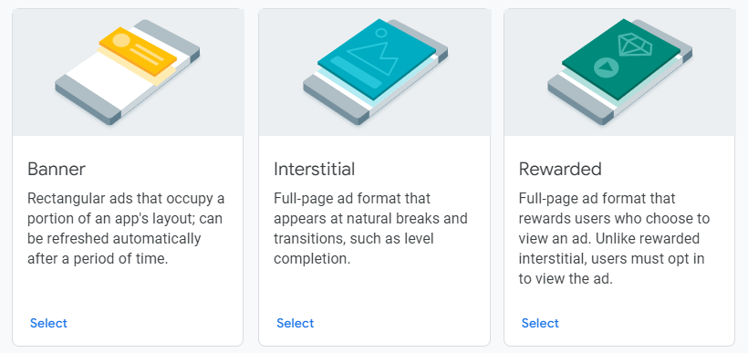
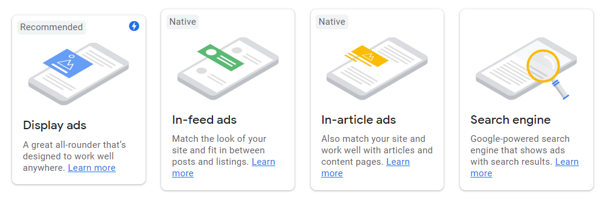
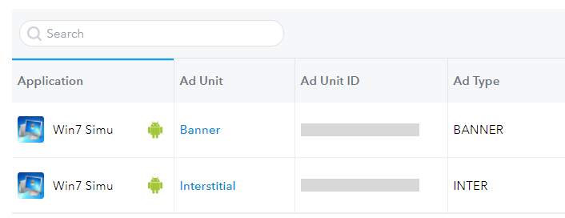

# About the ads and how I implement them

<m-blog-meta />

_Cover image by Fredrick Suwandi via [Unsplash](https://unsplash.com/photos/csXTAyTiESo)_

Ads, the thing we all hate as when we are trying to enjoy something, they appear and kill the whole experience. Yes, I said "we" because I myself also hate it, but let's be honest and admit the fact that they generate incomes and one can hardly fight against this temptation, or even go too far as abusing it to earn as much as possible when this power is given and may be used at one's will. Admittedly, I'm that type of guy. Or if you are one of the nice people in my audience, you may consider me having some morals left for not flooding your screen with ads.

Sounds more like a confession than a blog so far, eh? Let's put that aside because, in this blog, I would like to share my experience with the Ads implementation in the different versions of my [Win7 Simu](/win7simu/about.html).

## Choosing the Ad Network

Probably the least thing that bothered me when I came up with the idea to implement ads in my simulator. Despite a vast range of ad networks available, I just went straight for [AdMob](https://admob.google.com/home/) due to its dominating presence all around the world. Indeed it's dominating for various reasons. From the registration to implementation, it was incredibly easy that I hardly found any time struggling with it. The documentation is well structured and provides all the instructions I would ever need. It even offered the mediation feature which combines the AdMob network with other third-party ad networks I registered, and picks the highest paid ad among these networks and display to the users, my revenue is then further boosted (well, not so much as you're imagining).

So yea, AdMob had been my partner for more than a year, until a couple of months ago... an **ad serving limit** was put down on my account. This would not be surprising as I had faced this issue twice before, each time only lasted for around 2 weeks to 1 month, but this time, it has been 4 months, without any notifications or simply a freaking reason. I mean, literally, every time an ad serving limit was placed and lifted, I do not have any idea what was the reason. And this time it was over my patience limit and I decided to switch to a new partner for real. After several searches and comparisons, I decided to pick [AppLovin](https://www.applovin.com/) due to its ease of registration and a similar implementation method to AdMob. I'll just wait and see how it performs from here on.

For this website, I again went straight for [Adsense](https://www.google.com/adsense/start/), which is more or less a blood-related brother of AdMob. It has the same pros and is much simpler to register compared to other available vendors on the market due to the fact that page views/number of visitors per month are not considered but only your content that matters, as registration criteria. But hopefully, it won't end up the same way as AdMob.

Aside from these choices of mine, there are many more if you search them up, but of course, each one requires a different method for registration and the complexity depends on your region/location, and obviously your content as well. It's also important to note the revenue yielded from each is also varied.

## Picking the Ad Format

### Mobile App

Each ad network offers a different set of ad formats that you can implement. But in general, the most basic ones are **Banner**, **Interstitial** and **Rewarded**. Other formats just get their behaviors altered out of these base formats. Just understanding these 3 is already sufficient to pick the ones suitable for your app.

To pick the ad format for your own, it's obviously also important to know which one provides more revenue, hence for your reference, it is: **Rewarded > Interstitial > Banner**. Rewarded ads bring the most revenue out of these, as when a user opt-in to watch an ad in exchange for something in-app, it is usually a 30-second or longer video ad. While Interstitial ads are a bit less in terms of revenue, they are still much more compared to Banners, but they also come with the paid price of user experience and are much of a means for abusing or suffocating the user with ads.

For my **Win7 Simu**, I picked Banner and Interstitial as these two are more suitable with my app's tech and easier to implement.

### Website

For this website and the web version of **Win7 Simu**, so far I have only considered and implemented **Adsense**, therefore I'm only aware of the below ad formats from Adsense.

However, out of these 4, I only needed to use **Display Ad**, which is also the format recommended by Google. The Display ad offers a responsive size that works anywhere you might cram it to, but of course the space should not be too small, otherwise there will be no ad available for serving. It's also possible to let Adsense setup the ads for you without any manual work by enabling the **Auto Ads**, but personally, I prefer doing things by my own for which I will have full controls.

<a-google-ad />

## Implementing ads

In this section, I'm not going into so much detail as to how to implement the ads in coding or something like how to write a framework component for placing Ads (there are already plenty of such tutorials and guides which are far more helpful than I can explain), but rather how the ads are being implemented in my products, the **Win7 Simu** app and **this website**, and potentially any [future product](/brick1100/about.html) I may release.

### Win7 Simu

So as mentioned above, due to the nature of my app, I picked Banner and Interstitial as my ad formats to implement.

The banner ad was placed at the top of the screen, with a refresh rate set to auto - typically a new ad is served after around 25 to 30 seconds. This one earned me a few cents everyday and I would say that's a fairly good amount to be happy about. However, considered that it occupied quite some space at the top which can prevent the user from enjoying an OS in fullscreen and poorly affect the experience, I decided to make a sacrifice by removing it from the app. Therefore, from [v2.16.0](/win7simu/changelog.html#2-16-0) onwards, the banner ads are gone and you may enjoy the app to your fullest.

The interstitial ad is still kept as a motivation for me to constantly maintain and work on the project, and also bring you more cool updates. And I didn't forget to carefully consider the frequency and placement for this type of ad so that you won't be interrupted so much and get annoyed. But of course, no matter what I try, I fully understand that there are always people who prefer criticism and will never be happy with such effort. I sure hope if you are not one of these people, please understand and keep supporting me.

### This website

You're probably seeing a few ads already in this blog post, and you can trust me when I say this is as many as I wanted to implement, not more. I used the responsive display ads by Adsense and tried to place the ads in the least intrusive way that hopefully blend with your reading experience. One last useful hint for those who also want to implement Adsense in their Vuepress blogs just like mine, you can refer to my site's source code which I made public [on Github](https://github.com/Visnalize/visnalize.github.io/tree/dev).

And this would be all I wanted to share in this blog, hope you had a good time reading it and somehow got some useful pieces of info with you as well.

<m-blog-tag-list :tags="$page.frontmatter.tag" showIcon />
