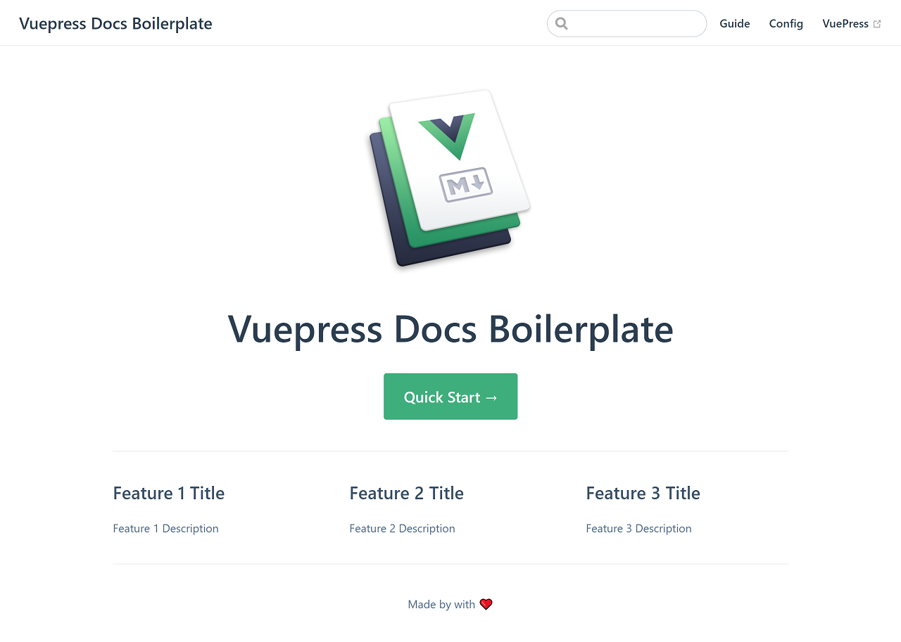

# How I built visnalize.com

<m-blog-meta />


_Cover image by Ilya Pavlov via [Unsplash](https://unsplash.com/photos/OqtafYT5kTw)_

So, after a year or so (since I released the [Win7 Simu](/win7simu/about.md) app), I decided to build a website for my own brand. The goal is to have a home for all of the information, my work, and probably, more of the useless stuff that I want to share. And in this post, I'm documenting some of the progress of how I made this website.

:::warning Warning
This is gonna be a technical blog post. Skip now, before getting dragged into the boredom. You have been warned.
:::

## The focus

- A simple and minimal website
- Only little effort and time shall be spent
- More time to write and share

In other words, I wanted to build a simple, fast but writing-focused website. With these criteria, I discovered [VuePress](https://vuepress.vuejs.org/) as the most suitable option (for someone who was also familiar with [Vue](https://vuejs.org/)).

**VuePress** is a static site generator (a tool that generates HTML websites from raw data and a set of predefined templates) powered by **Vue**, meaning with only a few setup and configuration steps, we would have a full-fledged website available in just a little time. Sounds convenient right? Let's see if it really is in the next sections.

## The making

### Setup

Before everything else, I needed an editor to code, and my favorite option was the [Visual Studio Code](https://code.visualstudio.com/) for its intuitive interface, powerful features, and a huge number of plugins backed by the community.


It also comes with a built-in terminal to conveniently run commands directly in the tool itself. So from there, all I needed was to run the following command to initiate a VuePress project:

```sh
npx create-vuepress-site [projectName]
```

Following the execution, I was prompted to input some metadata for my site such as the project name, description, maintainer info... all of which I skipped for later by hitting Enter. Upon completing, a new folder `docs` appeared under the current location which contains a bare minimum structure of the site.

Next, I installed the dependencies from the `package.json` and started a local server by running these commands:

```sh
cd docs
npm install
npm run dev
```

After a while, I realized that the terminal was still executing the commands (my poor old laptop...), so I decided to go and get myself a drink (just water, gotta stay hydrated)...

After another while, the installation was completed and the terminal prompted that a local server is up and running at `http://localhost:8080/`, opening it in the browser:



What an eye candy! That looked neat and flawless. Without so much effort and time, I got a site ready with some expensive features available already:

- A standout homepage
- A basic site routing
- A functional search bar
- A meticulous navigation mechanism
- And fully responsive on mobile

All of which could take me months, if not years to implement, but still wouldn't look half-decent. Not to mention some other super useful utilities that enhanced the writing and reading experience on both ends.

<google-ads />

### Customizing

Having the site ready, the next step was to make it my own. The site's control panel and utilities are conveniently wrapped inside the `.vuepress` folder, with custom components and styles in their respective folders and a `config.js` file as the central configuration for the entire site.

The `config.js` contains some basic configuration options and those of the default theme (all available options are thoroughly documented in the [official VuePress docs](https://vuepress.vuejs.org/theme/default-theme-config.html#homepage)). I started to play around with the options, starting with the site's title and description, then the navigation (menu) links and the sidebar. I tried modifying them to see how they work. For every change in the `config.js` to take effect, I needed to stop the server (press `Ctrl + C` in the terminal) and run the command `npm run dev` to rebuild the project. And magically, the changes are reflected in the structure of the site and pages just as defined in the configuration.

I started to streamline the site here and there, by uploading some images and icons for it, creating some custom components for reusable purposes, and adding some extra styles to make the site look a bit more unique but without overdoing it. And finally, for the main reason why this site should exist in the first place, I didn't forget to write some pages for the information I wanted to share, additionally with a blogging space to share my journey as you are reading.

## The deployment

Once happy with everything, the last step was build the complete project into a static HTML site. For this, I ran the command:

```sh
npm run build
```

VuePress then tried to transform everything into HTML files and output them in the `dist` folder under `.vuepress`. The `dist` folder could then be deployed to a host and ready to serve the readers.

For the hosting, I used [Github Pages](https://pages.github.com/), an excellent and extremely fast hosting service for static sites such as mine. The first thing I needed is a repository to store all the files in my `dist` folder, so I created one at [this location](https://github.com/Visnalize/visnalize.github.io). I uploaded the files to this repository and enabled Github Pages for it (all the steps are documented carefully in [Github's official site](https://guides.github.com/features/pages/)).

## Epilogue

To sum up, all the steps I did to get this site up and running:

- Download and install [Visual Studio Code](https://code.visualstudio.com/)
- Install [VuePress](https://vuepress.vuejs.org) and initiate a project with the following commands:

  ```sh
  npx create-vuepress-site [projectName]
  cd docs
  npm install
  npm run dev
  ```
  
- Customize the project with available configuration options as documented in [VuePress docs](https://vuepress.vuejs.org/theme/default-theme-config.html#homepage).
- Build the source code into static HTML with the command:

  ```sh
  npm run build
  ```

- Finally, deploy the site to a host using [Github Pages](https://pages.github.com)

The source code I made public in [this branch](https://github.com/Visnalize/visnalize.github.io/tree/dev) of the repository, you can explore or dissect however you like.

<m-blog-tag-list :tags="$page.frontmatter.tag" showIcon />

<google-ads />
