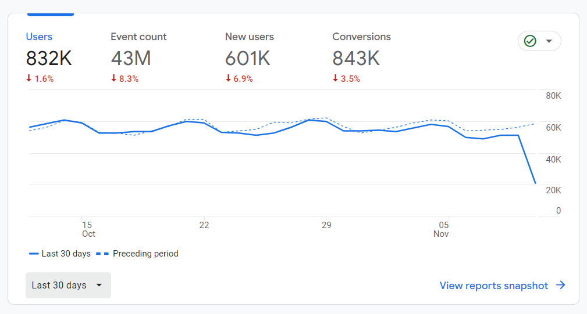
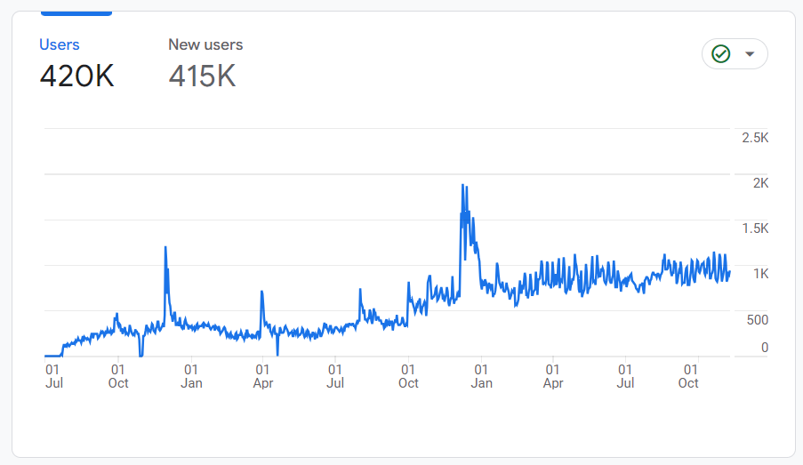

# Turning my side project into a side hustle

<m-blog-meta />

Today is November 11, 2023, it has been a year since I wrote my previous blog post [sharing how I built Win7 Simu](./building-win7-simu.md) to celebrate a milestone of 5M Google Play downloads. We are now at __10M downloads__ and again, to celebrate this milestone, I decided to sit down and write another blog post to share about how this <s>silly</s> side project has turned into a side hustle and has been generating a decent amount of recurring revenue for me since. Yes, we are talking about _money_ here, a sensitive topic, but somehow I feel that it may be interesting, with some of the learnings that I have had along the way may be useful to you. However, bear in mind that what you are about to read is __subjective__ and based on my own experience, so you are welcome to read with a grain of salt.

## The beginning

### The idea that started it all

I highly recommend reading [my previous post](./building-win7-simu.md) first if you haven't to get to know more about this silly project and how it started, but if you don't want to, here is a brief summary:

I had an idea of cloning Windows 7 UI to the web way back in mid-2019, to learn about front-end development. It was merely a code playground for me to learn and experiment and was rewritten a couple of times. The last rewrite attempt was in early 2020 using certain [popular web techs](./building-win7-simu.md#the-tech-stack) at that time, and I decided to publish it to Google Play as an Android app. It somehow got popular and has received a lot of downloads and positive feedbacks. Since then, I have been pushing it further by rolling out new features and updates regularly.

Till now, the app has had a total of __10M downloads__ and approximately __50K daily active users__, which can be easily considered a success for a side project. But do you know what makes it appear even more successful to me? It's the fact that it also generates some recurring revenue, monthly, stably, and kind of passively.

<google-ads />

### Building the surroundings

After recognizing its potential, I decided to invest more time and effort into the project. With Win7 Simu at the center, I started to build the surroundings, things that I believe would help me grow this project into a brand and eventually turn it into a side hustle. Below are a couple of things that I have done so far.

__Homepage + Blog__ (___visnalize.com___) - this idea came to me as Google Play required me to provide a privacy policy URL for the app when I tried publishing it to their store. I decided to build a simple homepage for it with little to no content at the beginning, but it has been growing since then, from an average of barely 300 to more than 1000 daily active users. The homepage is now the place where I share more about my projects, the stories behind and some of the learnings I have had along the way.

_Homepage daily active users growth over time_

[__YouTube channel__](https://www.youtube.com/@visnalize) - this idea, again, came to me only as Google Play required me to provide a YouTube trailer video for the app. Although I have had this channel for a while, I didn't really use it until then. After the trailer video for Win7 Simu, I started to upload more videos, still mostly revolving the app, but also some other kinds of content that I think would be interesting to the viewers, but none of them has been seen as sucessful as the Win7 Simu-related ones. Since the beginning, the channel has been growing steadily, currently with more than 7200 subscribers and 100K+ monthly views. If you are interested, here is a video sharing more in-depth about the channel's growth:

@[youtube](https://youtu.be/s6LfrKvq8n4)

__Social networks__ ([Github](https://github.com/visnalize), [Twitter](https://twitter.com/visnalize), [Facebook](https://www.facebook.com/visnalize)) - at some point after growing the homepage and the YouTube channel to a certain extent, I decided to expand to other social networks to gain more exposure and reach more people. Although the growth has been slow and the results are gloomy-looking, I believe it is still worth the effort as it is not too time-consuming and the potential is still there.

## A diverse revenue model

Let's get to the main topic of this post, the revenue model. I have been trying out different ways to monetize the project, and here are some of them.

### Ads

> _Recommended read: [About the ads and how I implement them](./about-the-ads.md)_

Due to the nature of the project, I thought that ads would be the most suitable way to monetize it. For the app version of Win7 Simu, I started out with __Google Admob__, which appears to be the most popular ad network for mobile apps, however, due to certain issues with the network, I switched to __Applovin__, which has been working well so far. For its web version, I have been using __Google Adsense__ and it has been working well so far. Although at the beginning, I also had some problems setting it up due to the fact that Adsense is not designed and supported for web apps, but I managed to find a way around it by getting this homepage approved first, then I can serve ads on the web app as well, thanks to it being hosted on a subdomain of this homepage.

Some time later, I tried out the mediation feature of Applovin, which allows me to serve ads from whichever ad network that offers the highest eCPM (effective cost per mille) rate. Since using mediation, I have been seeing a significant boost in revenue by partnering with several external ad networks such as __VDO.AI__, __Appbroda__, and even __Admob__, which I was unable to use their service as the primary platform. And until now, ads have been the main source of revenue for this project.

Aside from the mobile and web version of Win7 Simu, I have also been serving ads on the homepage and turning on monetization for the YouTube channel. Although the revenue from these sources is not much, it is still a great addition to the overall revenue.

### Subscriptions

After seeing the positive revenue outputs from ads, and having received many feedback from users, I added a subscription feature to Win7 Simu's app version using __Google Play Billing__ to allow users to experience the app without interruption by removing ads. The subscription is simple and straightforward, with only 2 options available: monthly and yearly, with affordable prices. I honestly never expected it to be well-received, but it turned out to be working well, with a decent amount of subscribers and recurring revenue so far.

Likewise, I also added a subscription feature to the web version of Win7 Simu via __Patreon__, which is a popular platform for creators to get paid by their fans/users. Despite the outlook not looking as positive as the app version, I still learned something there, and the experience can be useful for future projects.

### Partnerships

The last revenue source that I have had my hands on is new and unique in its own way (or rather unpopular in my opinion). It is a partnership with __Gamezop__, a gaming platform that any websites/web apps can integrate to bring casual games for their users. The so-called "integration" is rather simple in my case, all I needed to do was just to add a banner/icon in my app that leads to the Gamezop platform where my users can play a wide range of casual games there. Half of the ad revenue generated from the platform would then be shared with me. The shared revenue is nowhere near the amount that I get from the main revenue source, but it still has been decently and consistently contributing to the overall revenue.

<google-ads />

## Disclosing the numbers

"I don't give a sh*t about your story, just show me the numbers" - if that is what you are thinking, then I will cut to the chase and show you the numbers. Below is a list of the MRR (monthly recurring revenue) breakdown for all of the revenue sources that I have mentioned above from the latest month (October 2023).

- Ads:
  - Applovin: __~400$__
  - Admob: __~300$__
  - VDO: __~60$__
  - Appbroda: __~40$__
  - Adsense: __~300$__
- Subscriptions:
  - In-app purchase: __~200$__
  - Patreon: __1.67$__
- Partnership (Gamezop): __~20$__

In total, after subtracting all the costs and expenses, the MRR is around __1000$__.

## Final thoughts

So how do you feel about that number? Is it a lot? Is it just a little? The answer likely depends on from which part of the world you are looking at it, but for me, it is a lot, especially for something that I started out as a side project for learning. With that said, it is still unlikely that I will receive this exact amount every month, there might be ups and downs, there might be happy days I receive more, there might be a time I lose it all after waking up, but I am still happy with what I have achieved so far.

A few key takeaways that you may find useful from my story:

- I was lucky to be able to turn my learning process into a side project, and eventually a side hustle.
- I diversified the revenue sources to minimize the risk of losing it all and to maximize the potential of earning more.
- I kept grinding and pushing it further, even when I didn't feel like it, and it paid off.
- I was, I am, and I will still learning, and applying what I learned to make good use of every opportunity.

And as I said at the beginning of this post, this is a very subjective story, what worked out for me may not work out for you, and even this little success might not repeat itself for my other projects. But I hope through this post, you have learned something new and useful, and I wish you all the best with your projects.

<m-blog-tag-list :tags="$page.frontmatter.tag" showIcon />
