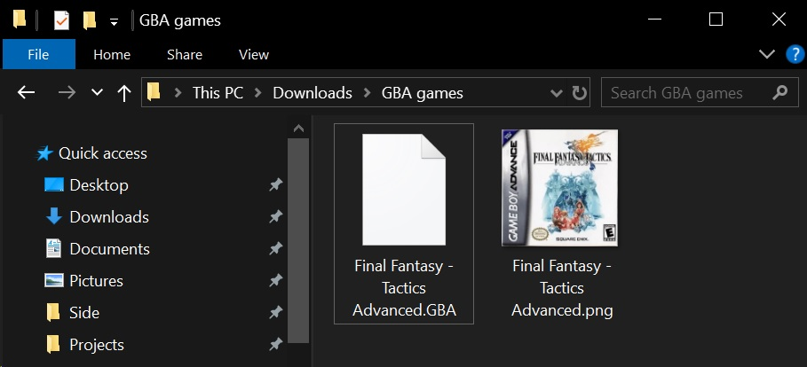
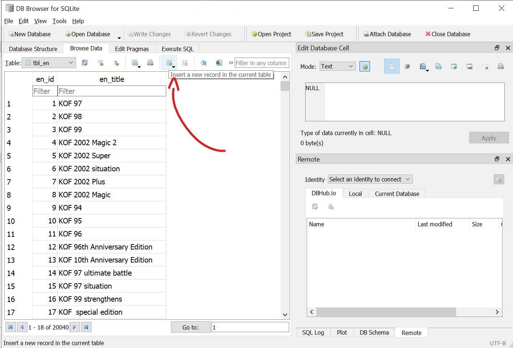
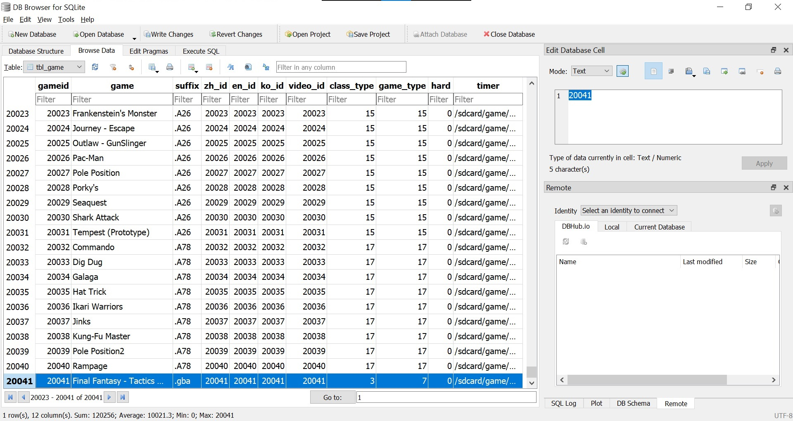

# How to add more games to Game Stick Lite 4K

<m-blog-meta />

Recently, I have had a chance to get my hands on a Game Stick Lite 4K, a USB stick-like device with two controllers and a bunch of pre-installed games that you can play on your TV. It is a fantastic option for those who want to play their childhood games on a big screen without owning a fancy console or a computer, as it is very affordable (typically around $20 - $40) and easy to set up. Though there are a lot of games pre-installed, some of your childhood favorites might be missing or are not available in your language. In this post, I will show you how to add more games to the Game Stick Lite 4K to enjoy more of your childhood games.

## Prerequisites

- A Game Stick Lite 4K (apparently)
- A computer or laptop with internet connection
- A MicroSD card reader (even your smartphone can be used as a card reader)

## Step-by-step guide

- Have the game ROMs you want to play ready (you can find these easily by searching on the internet). Optionally, download a cover image for each game. The cover image should be in the `.png` format and have the same name as the game ROM file. The cover image may then be displayed when you select the game to play.

  

- Remove the MicroSD card from the game stick and insert it into your computer or laptop using a MicroSD card reader.
- At the root of the SD card, you will see a `game` folder, this is where all the games are stored. Games are grouped by the console they belong to. For instance, all the NES games are stored in the `fc` folder, all the GameboyColor games are stored in the `gbc` folder, Atari games in the `atari` folder, and so on.
- Copy your game ROMs (and their cover images) to the respective folders. Note that the ROM format should match with what is already available in the folder.
- Install [DB4S](https://sqlitebrowser.org/) (SQLite Database Browser) on your computer or laptop.
- Back to the root of the SD card, open the `games.db` file with DB4S (you might need to copy the file to your computer first if you are using a smartphone as a card reader).
- Here, a list of tables in the game database will be displayed, you only need to care about the tables `tbl_en` and `tbl_game` where you will modify to add your games.

  

- Click on the "Browse Data" tab and select the `tbl_en` table from the dropdown. Choose "Insert a new record" and add your game titles. Make sure the game titles match the names of the ROM files you added earlier.

  

- Then select the `tbl_game` table from the dropdown. Start adding your game data here following the existing format and structure. Also make sure the game titles match the names of the ROM files you added earlier.

  

:::warning Warning
Be very careful when modifying the game database. Any mistake will cause the game stick to not work properly. Always make a backup of the `games.db` file before making any changes.
:::

- Save your changes (and replace the `games.db` file on the SD card if you copied it to your computer earlier).
- Safely remove the MicroSD card from your computer or laptop and insert it back into the game stick.
- Turn on the game stick and enjoy your games!

<m-blog-tag-list :tags="$page.frontmatter.tag" showIcon />
