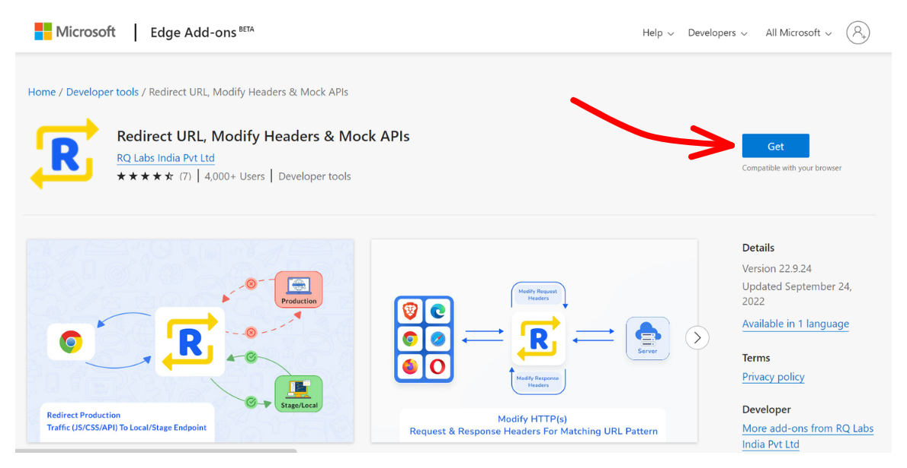
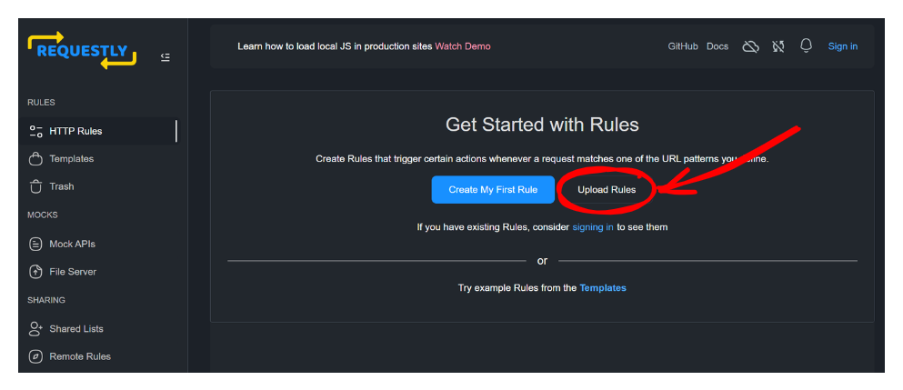

# How to get iframes to load any websites

<m-blog-meta />

<a-button href="#step-by-step-guide">Jump to the guide</a-button>

As mentioned in my previous post regarding [the issue](./building-win7-simu.md#iframe-issue) that the Win7 Simu's web browsers (using `iframes`) have been suffering from, I have been trying hard to come up with a way to solve it, from all the "google-ing", digging the source code of potential solutions, to a lot of trials and failures, I have finally come to the solutions that work. These solutions do not dismiss the issue completely, but they just seem to work better, in one way or another, than the earlier approach using a proxy server.

In this post, I'm gonna share the solution I have come to for the __Web__ version of Win7 Simu. The solution for the __Android__ platform is different and may be shared in another post.

## The scenario

As I have shared in the previous [blog post](./building-win7-simu.md), Win7 Simu is made up of web techs, and [iframe](https://developer.mozilla.org/en-US/docs/Web/HTML/Element/iframe) has been the technique of choice to simulate a web browser's functionalities due to its similar capabilities. To put it simply, iframe is capable of embedding one website into another, allowing controlling the embedded website to some extent. However, due to security risks, the website owners may restrict this capability or not allow the embedding to happen at all, by setting the `X-Frame-Options` header to `sameorigin` and/or specifying the `Content-Security-Policy` header constraint on the response received by requests to load their website.

For example, if an iframe wants to load a Google search page at `https://google.com`, it will make a request to that URL, Google will respond to the request with the necessary data to present itself as a web page, including the `X-Frame-Options` and/or `Content-Security-Policy` headers in the response. If the iframe receives the `X-Frame-Options` with the `sameorigin` value, or with some cross-origin restriction rules in the `Content-Security-Policy`, the web page cannot be shown in the iframe.

_(Illustration poorly crafted using [Excalidraw](https://excalidraw.com/))_

And this is a common practice for the majority of websites, they don't owe you anything to let you run loose and potentially cause damage to their business.

So I'm out of luck then? There is no way to simulate a web browser's functionalities in a web environment? Well, more or less. With the problem identified, there is still a chance to come up with a solution, and the solution I have come to is __intercepting the response__ to remove these two headers so that the iframe can load any website normally. For this, a browser extension is required as it is the only possible way to intercept requests/responses coming through the user's web browser without much security concern. Follow the below steps to implement this solution on your device.

<google-ads />

## Step-by-step guide

::: warning Note
This guide is not applicable for Android. If you are using the Android version, skip it to save some minutes of your life 😇
:::

### 1. Install Requestly browser extension

* Visit [Requestly home page](https://requestly.io/)
* Download the extension for your browser of choice, eg. pick the Chrome version of the extension if you are using Chrome, Firefox extension for Firefox, Edge add-on for Edge etc.

### 2. Import the predefined rules

* Download <a href="/assets/win7-simu-requestly.json" download>this JSON file</a> which contains the Requestly rules to make Win7 Simu's web browers capable of loading any websites.
* Go to [Requestly app page](https://app.requestly.io/rules/my-rules)
* Upload the JSON file to import the rules.

### 3. Enjoy

There is no step 3. From now on, you should be able to view any websites in Win7 Simu's web browsers without problems.

<m-blog-tag-list :tags="$page.frontmatter.tag" showIcon />
