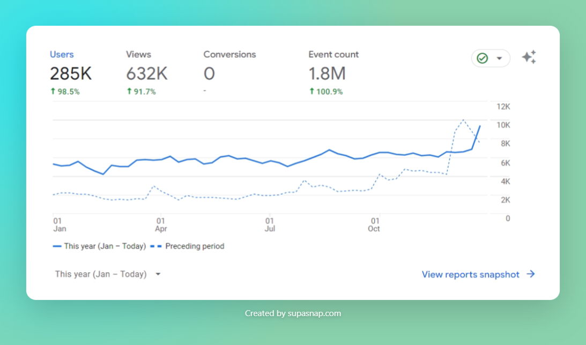
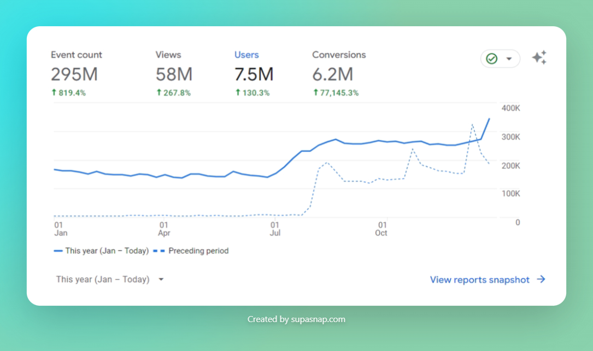
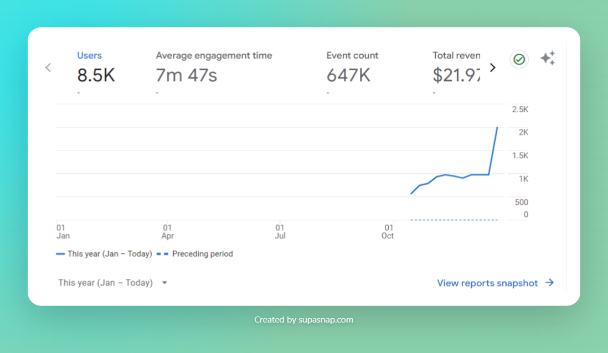

# Visnalize year in review - 2023

<m-blog-meta />

_Cover image by Streetwindy via [Unsplash](https://unsplash.com/photos/fireworks-display-over-city-buildings-during-night-time-rYIrNpFFilI)_

Last year, I initiated a habit of writing a "year in review" post for [Win7 Simu](./win7-simu-year-in-review-2022.md). It was a great way to reflect on the year and see what I have accomplished. I decided to do it again this year, however, this time I will write about Visnalize as a whole, since we now have more than one product, it will probably be more interesting to have a look at a bigger picture.

Let's not waste any more time and get right into it.

## The amazing numbers

### Visnalize(.com)

- __6__ new blog posts published
- An average of __800__ daily active users
- An average of __1700__ daily page views
- A total of __$950__ in revenue (all from AdSense)

### [Win7 Simu](../win7simu/about.md)

__Android only__

- __10.8M__ users downloaded the app from [Google Play](https://play.google.com/store/apps/details?id=com.visnalize.win7simu)
- __670K__ active devices that still have the app installed
- __42.4K__ users gave an average rating of __4.18/5__
- __20K__ users left a review

__Both versions__

- An average of __50K__ daily active users
- A user spent an average of __14 mins__ with the app
- __2.3M__ accounts created in the app
- __18__ version updates were released
- __$9.8K__ gross revenue from ads
- __$3.1K__ gross revenue from in-app purchases
- __$303__ gross revenue from partnerships

### [Brick 1100](../brick1100/about.md) (Beta)

- __9.2K__ users downloaded the app from [Google Play](https://play.google.com/store/apps/details?id=com.visnalize.brick1100)
- __1.8K__ active devices that still have the app installed
- An average of __200__ daily active users
- A user spent an average of __7 mins__ with the app
- __300__ accounts created in the app
- __8__ version updates were released
- __$22__ gross revenue from ads

<a-google-ad />

## Other accomplishments

### A new collaborator for Win7 Simu

Since November of this year, you must have noticed Win7 Simu has been receiving several major UI enhancements and new themes. This is all thanks to [Thuan](https://github.com/hohaicongthuan), a new collaborator that I had the pleasure to welcome and onboard to the Win7 Simu project. Thuan is a computer enthusiast, freelance developer and has a special interest in game development. Although he has little experience with the tech stack behind Win7 Simu, he has been able to quickly pick up the pace and contribute to the project without much guidance required. I am more than happy to have him onboard and look forward to continuing our collaboration in the future.

### New feedback channels for Brick 1100

With the new beta release of Brick 1100, I have set up a new [Discord server](https://discord.gg/6AQDnZa4Xm) for the community to hang out, discuss all things Brick 1100-related, and provide feedback to make Brick 1100 a better app. Additionally, there is also this [feedback forum](https://visnalize.com/brick1100/feedback) for those who don't want to use or are not familiar with Discord can provide feedback and suggestions, easily and anonymously without much hassle.

### A new chapter in life

I don't share my personal identity online much, but this is a big one so I make it an exception. In the early of 2023, I got married to my beautiful wife and later in the year, we welcomed our first child into the world, a healthy and handsome baby boy. It was a life-changing experience and a feeling that I can't describe in words. I am thankful to life for everything that I was given.

## Looking out to 2024

The coming year will be different in many ways, there will be new challenges, busy schedules, trying to balance out the time for family and work, and everything in between. I am unsure how much time I will be able to dedicate to Visnalize, bringing out more cool features and updates for Win7 Simu and launching the first production release of Brick 1100, but I will try my best to keep the projects going and make them better.

As always, I thank you for all your love and support so far, and I hope you will continue your support for me in the future. Happy new year and see you in 2024! 🎉

<m-blog-tag-list :tags="$page.frontmatter.tag" showIcon />
