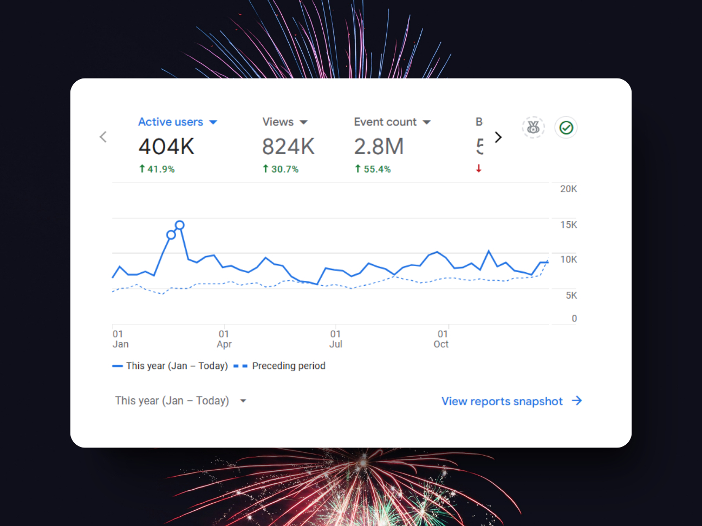
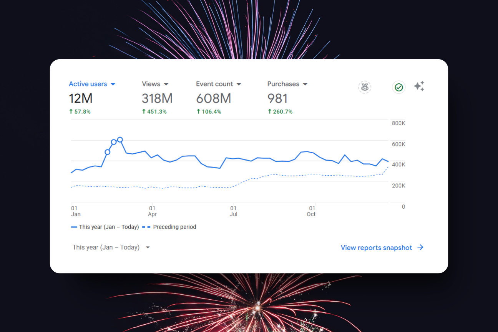
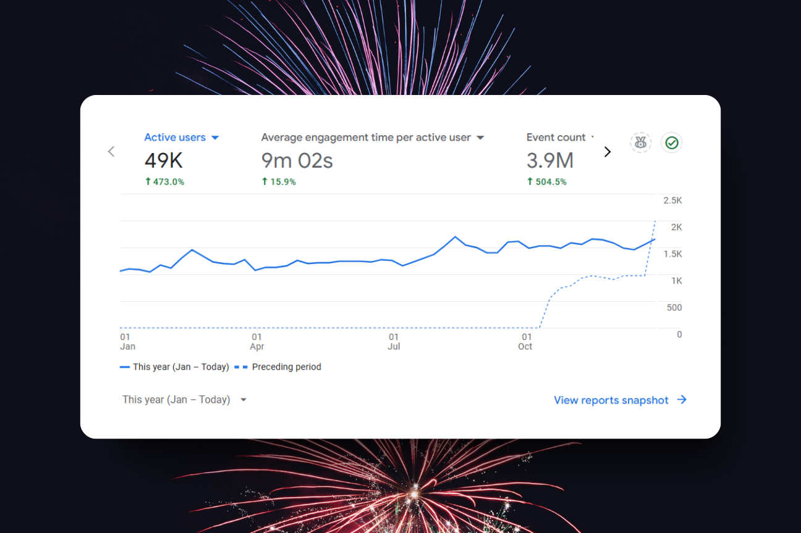
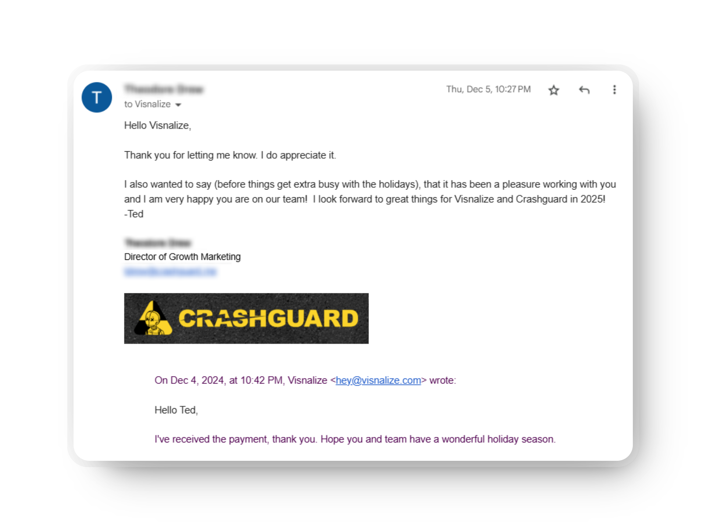
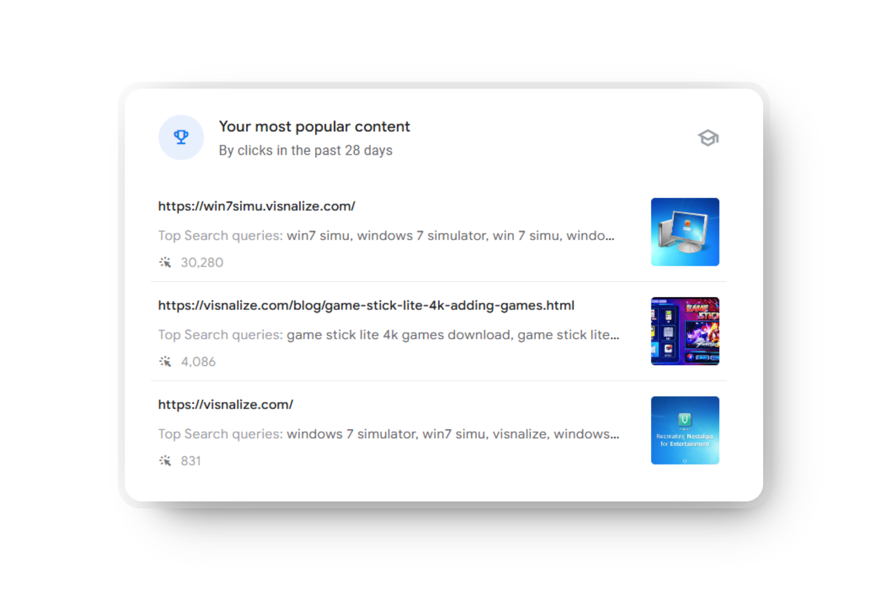
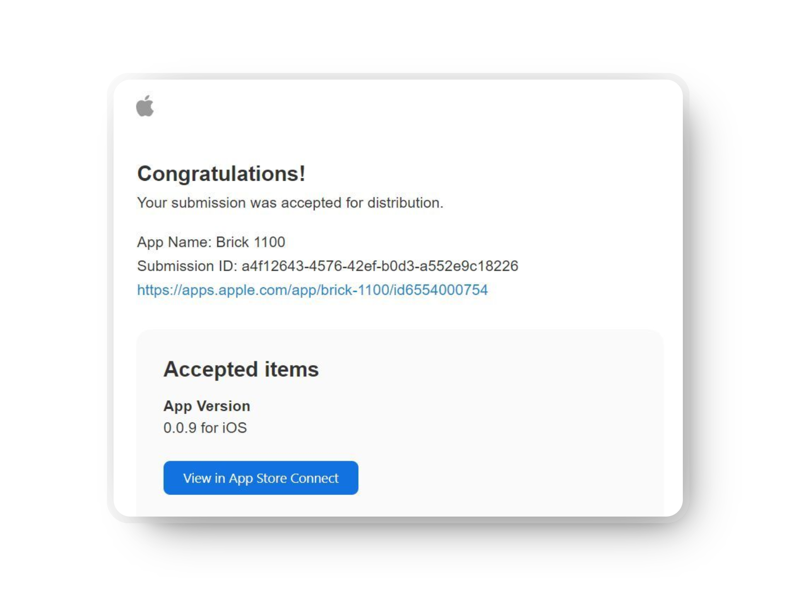

# Visnalize year in review - 2024

<m-blog-meta />

_Cover image by Thuan Vo via [Pixabay](https://pixabay.com/photos/ho-chi-minh-city-river-evening-5954147/)_

2024 has been a year [full of challenges](./updates-life-inactivity-projects.md#son-hospitalized-on-his-first-birthday) for me personally, but for Visnalize, there have been some amazing accomplishments. I am excited to share with you some of the highlights from the past year, including the growth of this website, Visnalize.com, and the projects: [Win7 Simu](../win7simu/about.md) and [Brick 1100](../brick1100/about.md). There will be a new indicator badge that shows the comparison between this year and last year's numbers, so you can easily see how much we have grown. Let's dive in!

## The amazing numbers

### Visnalize(.com)

- __8__ new blog posts published <Badge type="tip" text="+2 vs last year" />
- A total of __79__ sitemap entries (content pages, blog posts, etc.) <Badge type="tip" text="+40 vs last year" />
- A total of __404K__ visitors <Badge type="tip" text="+41.9% vs last year" />
- A total of __824K__ page views <Badge type="tip" text="+30.7% vs last year" />
- A total of __$1,945__ in revenue (all from Adsense) <Badge type="tip" text="+104% vs last year" />

### Win7 Simu

__Android only__

- __18.9M__ users downloaded the app from Google Play <Badge type="tip" text="+75% vs last year" />
- __1.12M__ active devices that still have the app installed <Badge type="tip" text="+67.2% vs last year" />
- __62.5K__ users gave an average rating of __4.126/5__ <Badge type="error" text="-1.29% vs last year" />
- __27.6K__ users left a review <Badge type="tip" text="+38% vs last year" />

__Both Android and Web__

- An average of __76K__ daily active users <Badge type="tip" text="+52% vs last year" />
- A user spent an average of __26.5 mins__ with the app <Badge type="tip" text="+89% vs last year" />
- __6.4M__ accounts created in the app <Badge type="tip" text="+178% vs last year" />
- __15__ version updates were released <Badge type="error" text="-3 vs last year" />
- __$19.7K__ gross revenue from ads <Badge type="tip" text="+101% vs last year" />
- __$5.5K__ gross revenue from in-app purchases <Badge type="tip" text="+77% vs last year" />
- __$4.7K__ gross revenue from partnerships <Badge type="tip" text="+1,450% vs last year" />

<a-google-ad />

### Brick 1100 (Beta)

__Both Android and iOS__

- __50.4K__ users downloaded the app from both App Store and Google Play <Badge type="tip" text="+444% vs last year" />
- __3.8K__ active devices that still have the app installed <Badge type="tip" text="+111% vs last year" />
- An average of __250__ daily active users <Badge type="tip" text="+25% vs last year" />
- A user spent an average of __9 mins__ with the app <Badge type="tip" text="+28.6% vs last year" />
- __1837__ accounts created in the app <Badge type="tip" text="+512% vs last year" />
- __5__ version updates were released <Badge type="error" text="-3 vs last year" />
- __$225__ gross revenue from both ads and in-app purchases <Badge type="tip" text="+922% vs last year" />

## Reflecting on the year

In general, 2024 has been a year of growth for Visnalize. The numbers show that we have made significant progress in terms of user acquisition, engagement, and revenue. I am particularly proud of Visnalize.com, which I didn't expect it to achieve such growth in a year. And the retro projects have also seen good results, especially Win7 Simu, which has been a consistent performer over the years. On a related note, here is a quick recap of the highlights and lowlights in the year.

### 👍 Things went well

#### Thuan, Win7 Simu collaborator is still with us

If you have been following my blog for a while, you might remember that I mentioned [Thuan](https://github.com/hohaicongthuan) a few times in my previous posts, he even published [one of the posts](./win7-simu-windows-media-center.md) on this site.

He [first joined](./visnalize-year-in-review-2023.md#a-new-collaborator-for-win7-simu) the Win7 Simu project as a collaborator in November 2023 and has been contributing great work to the project ever since. I expected him to leave the project after the first few months, like several others in the past, but he is still with us and has been a great help in maintaining and improving the app. I am grateful for his dedication and look forward to our continued collaboration in the future.

#### Crashguard partnership

On August 13, I received an email from a product manager of [Crashguard](http://crashguard.me/), asking if I would be interested in integrating their product into Win7 Simu. The crash and feedback data from Win7 Simu would help them improve their product, in exchange, they would offer a monthly stipend for the partnership. I was skeptical at first, but after some research and a few more emails back and forth, I decided to give it a try. In the end, it turned out to be a great partnership that I never expected, and I have been receiving a monthly stipend from them since then, explaining the __1,450%__ increase in revenue from partnerships above.

<a-google-ad />

#### A trending blog post brings traffic

I'm not a content writer, and I'm not a content marketer either, I only share what I find interested, authentic experiences, and knowledge that I think might be useful to others, not targeting any specific audience or having a content strategy in place. One day, I wrote [a blog post](../blog/game-stick-lite-4k-adding-games.md) about a random topic of personal interest, but somehow it went viral on search engines. It has been bringing in quite a lot of traffic to the website, and is consistently claiming the top spot in the most popular content list on my site.

#### Brick 1100 release on App Store

Despite little expectation that the app would pass Apple's review process and get approved, it was finally released on the App Store on September 18. This, to me, is a big achievement that's worth celebrating, after nearly 2 months with a lot of back and forth communication with the review team, and a lot of changes to be made to comply with their guidelines.

The release on the App Store has granted me access to a new market, even with no marketing effort as of now, the app has been downloaded by a few hundred users, and I have received one positive review from a user, which is a good sign that the app is on the right track to a potential success.

### 👎 What didn't go well

#### Win7 Simu's issue dragging on

There is an existing issue with the app that has been reported by users since months ago last year, but I still haven't been able to fix it due to no resources available to reproduce the issue. The issue is causing the app to crash on several devices and Android versions, leading the app to be uninstalled, and the ratings to drop. This has been giving me anxiety and the feeling of wanting to give up on the project, but I do have a responsibility to the users who have been supporting the app for years, so I will keep trying to find a solution to the issue.

#### Slow progress on the projects

I promised to bring Brick 1100 to production in mid-2024, but it is still in beta as of now. The progress has been slow due to the lack of time, technical skills, and real-life issues that I have been dealing with. Similarly, I have been planning to bring out more updates, fixes, and new cool features to Win7 Simu, but the progress has been rather slow, and the app has been left behind in terms of updates compared to the previous year.

## Looking out to 2025

2024 was pretty much a roller coaster ride for me, with a lot of ups but also a fair share of downs. I am grateful for all the achievements and lessons learned in the past year, and I am looking forward to a better year in 2025. I cannot promise that I will be able to do better in the coming year, but I will keep trying my best to keep the projects going and make them better.

As always, I thank you for all your love and support so far, and I hope you will continue your support for me in the future. Happy new year and see you in 2025! 🎉

<m-blog-tag-list :tags="$page.frontmatter.tag" showIcon />
