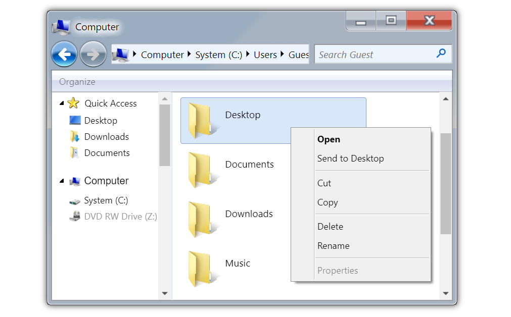
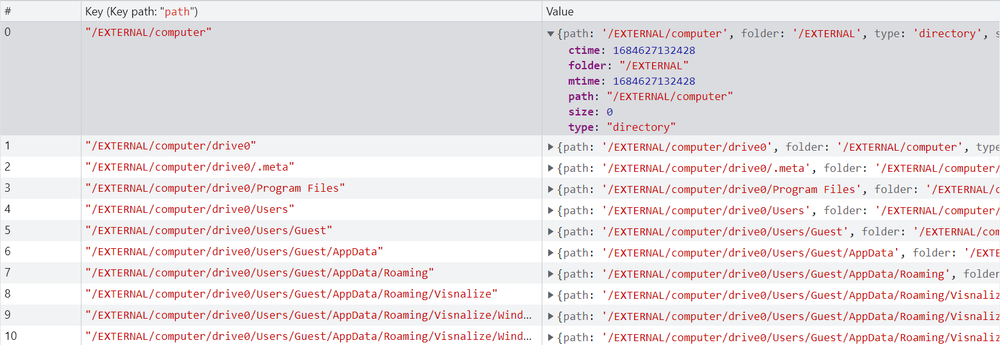

# Implementing File Explorer in Win7 Simu

<m-blog-meta />


_Cover image by Viktor Talashuk via [Unsplash](https://unsplash.com/photos/05HLFQu8bFw)_

__File Explorer__ has always been one of the vital features in any operating system, as a Windows simulator, to no surprise that it's also among the most demanded features to be added in Win7 Simu. However, I have been procrastinating its implementation as, besides my skillset limitations, there are quite a lot of complexities and technical constraints involved. Now that I have finally been able to implement it properly, let's read through some technical decisions I made and how it deviates from the actual File Explorer of Windows.

## Some difficulties

- _Self-skillset limitation_ - as this simulator has been a work of a one-man development team, sometimes it is tough when you get stuck and there is nobody to support, or at least just to talk it out
- _Work-life balance disruption_ - as I have a family and a 9-to-5 job, trying to find a time slot in between for hobbyist projects is tough
- _Disheartening moments_ - having to spend a long long time working on something out of your capability, and stay committed to it is also tough
- _Too many unknowns_ - libraries, frameworks, techs, platforms, devices, or even just the languages you are not in control may slow you down, kill your time and still you couldn't figure out how to resolve the issue.

Yes, those are, but not all the difficulties I have been dealing with when developing the File Explorer functionalities, or in general, this simulator. Just a little bit of a sharing before we get into the technical stuff, so you may know that there is no shortcut to achievements.

Despite only a few capabilities being rolled out for the File Explorer in [v3.0.0](../win7simu/changelog.md#_3-0-0), it actually took me months to come up, put the stuff together, and do thorough testing before releasing to you. It was not easy, at all, with several late nights and weekends burned onto it, having to face constant challenges and struggling to break through my own limits. However, the hard work finally paid off, it has come to fruition 😌

## Implementing the File Explorer functionalities



In v3.0.0, the minimum viable version of File Explorer supports basic operations on files and folders such as creating, opening, editing, renaming, moving, copying, and pasting. And an integral part of this is the trash/delete mechanism which is also supported. As the simulator has to support both Web and Android platforms, there are some challenges to solve for each, and the implementation approach also differs. I will break down some key notes for each.

<setupad-ads />

### Implementation for Android

With Android already having its own file management system to help organize and manage data from memory cards, I only needed to leverage this capability and hook up to Win7 Simu. However, as easy as it may sound, for someone who has very little knowledge of any programming languages other than JavaScript, it was time-consuming to be able to write a simple piece of code that just works without many issues.

Anyway, the key thing I'm trying to get across here is that, as an operating system, Android has its own way of organizing files and folders, where there is no concept of disk drives or the like as in Windows. And to make it worse, even the different Android versions have a slight difference to handle this among themselves 🤦‍♂️ Therefore, to mimic the disk-drive-driven structure, I needed to build a tree hierarchy from the app directory (a user-friendly path is something like: `Android/data/win7simu.visnalize.com/files`), which does not require any permission to perform read/write operations on, in case you are doubtful to grant this app access to your data. To put it simply, the app directory acts as the File Explorer system root, with the path hierarchy as follows:

```
Android/data/win7simu.visnalize.com/files
└── computer/
    └── drive0/
        ├── Program Files/
        ├── Users/
        │   ├── Guest
        │   │   ├── AppData
        │   │   │   └── Roaming
        │   │   │       └── Visnalize
        │   │   │           └── Windows
        │   │   │               └── RecycleBin
        │   │   ├── Downloads
        │   │   ├── Music
        │   │   └── Videos
        │   └── <user_id>
        │       ├── AppData
        │       ├── Desktop
        │       └── ...
        └── Windows/
```

Moreover, there is a separate Android drive where you can access all the data available from the root of the memory card. However, due to the strict permission policies, an app is only allowed a certain level of access to the data outside of that app's directory, especially on later Android versions, so please do not expect the Win7 Simu's File Explorer to be as robust as the system default one. Ultimately, its sole purpose is not to be a complete functional emulator, but just to experience, to explore certain limited simulated features of Windows 7.

### Implementation for Web

For the Web, the approach was literally built from the ground up, with the IndexedDB API utilized as the source for storing the item paths and organizing them into a hierarchical tree. [IndexedDB](https://developer.mozilla.org/en-US/docs/Web/API/IndexedDB_API) is a powerful solution that allows storing large amounts of data with high-performance search capability based on indexed keys. If you're a curious person with some coding experience, you may check out the web version of Win7 Simu from the dev tools and you may see something like this:



That is how the File Explorer is structured under the hood from the IndexedDB view. Each file/folder's path corresponds to an index key, with the value containing the metadata and content of that item. For every operation performed against this structure, such as creating, modifying or deleting an item... a corresponding path or key reacts to it. The whole structure is then processed and displayed accordingly on the File Explorer interface.

And of course, be cautious not to mess with it, otherwise, you will lose all your data (hopefully not so important, but I guess who would put important stuff in a simulator, right?).

## So, what's next

As the released version of the File Explorer is roughly just a minimum viable version, there are still plenty of rooms for improvements and addon features, namely:

- Support multiple item selection
- Support quick navigation from the address bar
- Support files/folders search
- Support sorting items, various view modes (thumbnail, list, details)
- Support storage allocation, add volumes, modify drive labels

And many more that, depending on the number of demands and requests, I might get my hands onto them, some may get implemented very soon, late or will never get implemented at all.

If you enjoy my work and it has somehow helped you in any way, get in touch with me via my email, or simply leave a comment to let me know, that will definitely lift my spirit and encourage me, or even better, become a financial supporter (via [Patreon](https://www.patreon.com/visnalize) or Play Store IAP) so I can constantly invest more time in it and roll out more cool features. Again, thank you for your support and stay tuned for more updates. ✌

<m-blog-tag-list :tags="$page.frontmatter.tag" showIcon />
