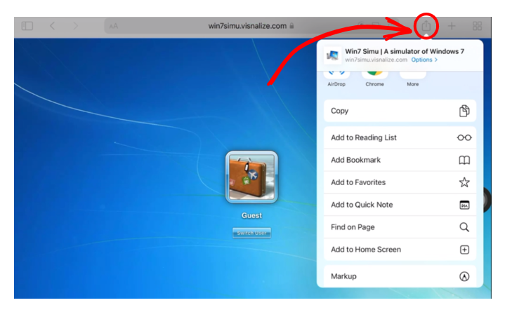
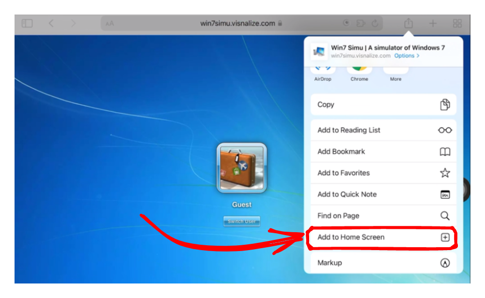

# Win7 Simu versus mobile devices

<m-blog-meta />

_Cover image by Brandon Romanchuk via [Unsplash](https://unsplash.com/photos/VXcJYnVjev8)_

Recently, I have received some feedback about making Win7 Simu easily accessible on mobile devices for those who do not own an Android device and cannot grab the installer from the Google Play Store (primarily iOS users). Therefore, in this post, I'm gonna show you how you can install the web version of Win7 Simu on your mobile device and access it just like a native mobile app!

:::tip Note
This guide primarily aims at iOS users, however, Android and other mobile OSes in general might be able to achieve the same result with a similar method.
:::

## Step-by-step guide

### 1. Open Win7 Simu with Safari

Safari is the default browser on iOS devices and the only browser that enables what we're trying to achieve. So, open up your Safari and navigate to the [Win7 Simu website](https://win7simu.visnalize.com/).

Click on the Share icon as shown in the screenshot below.

### 2. Add to Home Screen

From the popup, scroll down until you see the "Add to Home Screen" option as shown in the screenshot below and tap it. Optionally, customize the name of the app by editing the text in the field provided.

### 3. Enjoy

Once that's done, you will see the Win7 Simu icon show up on your home screen. And that's it! You've successfully installed Win7 Simu from Safari. Now you can enjoy the app-like experience without the need to download it from the App Store.

## Some notes

Despite the app-like experience, please keep in mind that it is just a website by nature, and therefore still has certain limitations as listed [here](../win7simu/about.md#web-version). However, the situation might change in the near future as the technology that empowers this capability receives more robust support from mobile vendors. So stay tuned and keep supporting me, either in spirit or [financial](https://www.patreon.com/visnalize) 🤩

<m-blog-tag-list :tags="$page.frontmatter.tag" showIcon />
