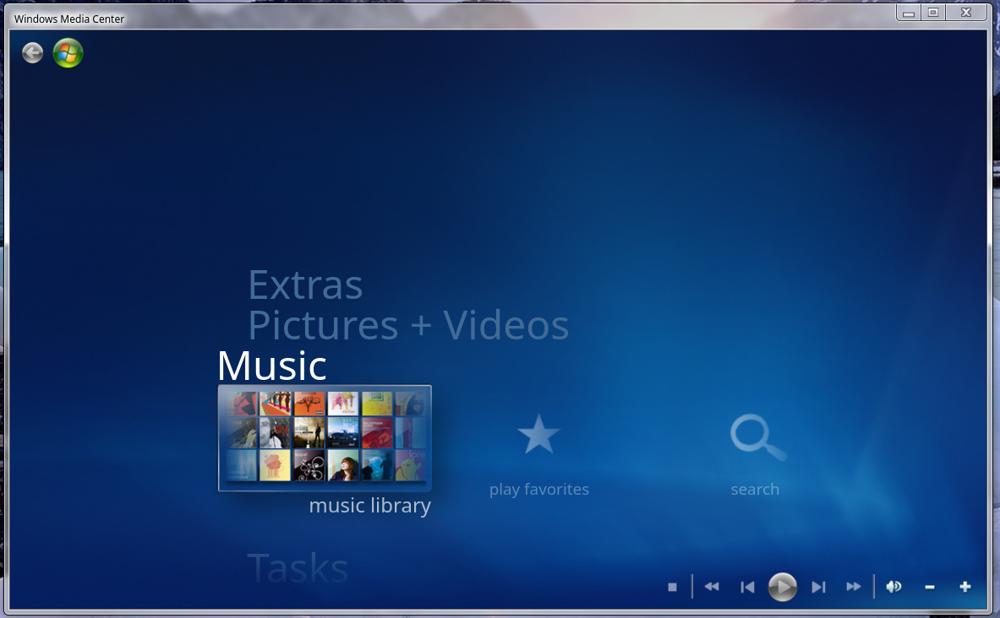
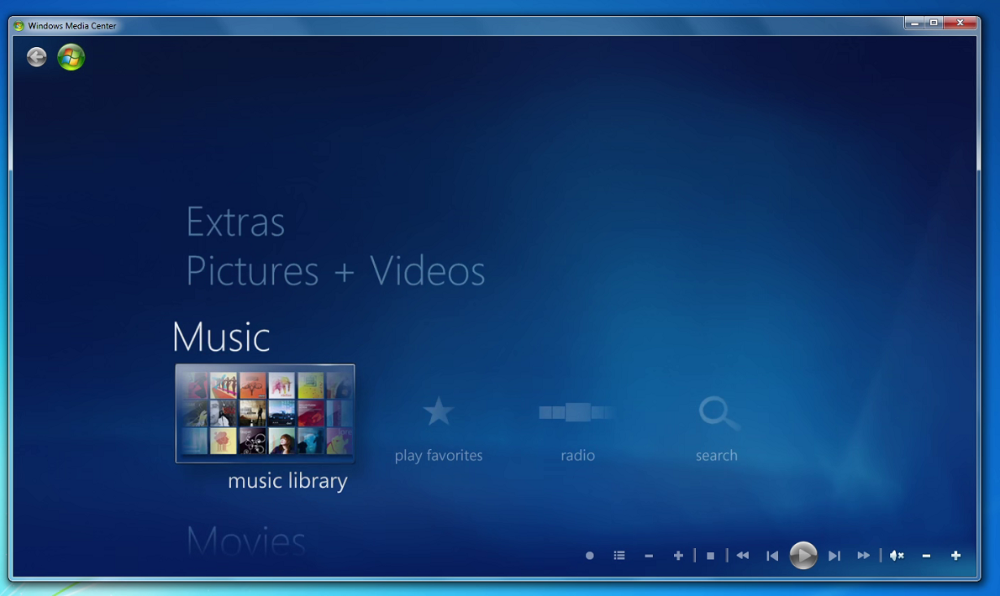

# Implementing Windows Media Center in Win7 Simu

<m-blog-meta />


__Windows Media Center__ (WMC for short) is a media player program created and first introduced to Windows XP Media Center Edition in 2002 by Microsoft. It can play slide shows, music, videos, CDs, and DVDs, you can even watch live TV and record it. For many of us, it was part of childhood bringing back a lot of memories from the good old days.

Unfortunately, shortly after the release of WMC in Windows 7 in 2009, Microsoft no longer worked on it and eventually it was announced discontinued on Windows 10. It was devastating to see a such good program with a stunning user interface go.

Of course, with the joy of bringing back the nostalgia, we would love to bring WMC back in Win7 Simu.

## The Scope

The original WMC in Windows 7 can do many things like playing live TV, slide shows, music, video, CD, DVD and more. Because Win7 Simu is a simulator built on the [web technologies](./building-win7-simu.md#the-tech-stack), we're not going to replicate the whole program and this project is obviously not intended to replace the original.

For that reason, the scope of the project will be implementing a basic version of WMC that lets you browse your favorite photos, and play music and videos. Basically, it will be a stripped-down version of the original.

## The Implementation

### Resource Files

Most of the resource files are extracted from the `.DLL` files in the original WMC. It contains everything we need to faithfully recreate WMC so we don't have to make everything from scratch (hope we will not get in trouble for using those resource files 👀).

We didn't use the font files in the original because those files are huge, it'll bloat the app install size up which we don't want.

### The Intro Screen

The intro screen might be the most time-consuming part because of the sheer amount of animation keyframes it has, though it's not too difficult to implement it.

Inside the resource files, there are [`.MCML`](https://learn.microsoft.com/en-us/previous-versions/windows/desktop/windows-media-center-sdk/bb189388(v=msdn.10)) files that describe a lot of the animation keyframes so we just had to translate it to the equivalents in CSS, though it still needed a lot of adjustments.

Here is what an animation in the `.MCML` looks like. The animation has a name and a bunch of following keyframes and it's fairly straightforward to translate it to CSS.

```xml
<Animation Name="Launch.Text.MotionBlur">
    <Keyframes>
        <ScaleKeyframe Time="0.0" Value="3.0, 3.0, 1.0" Interpolation="EaseIn, 2.0, 0.80" />
        <ScaleKeyframe Time="1.0" Value="1.0,1.0, 1.0" />
        <ScaleKeyframe Time="2.2" Value="0.85,0.85, 1.0" RelativeTo="Absolute" />
        <ScaleKeyframe Time="2.7" Value="0.75, 0.75, 1.0" RelativeTo="Absolute" />
        <AlphaKeyframe Time="0.0" Value="0.0" RelativeTo="Absolute" />
        <AlphaKeyframe Time="0.133" Value="0.0" RelativeTo="Absolute" Interpolation="SCurve" />
        <AlphaKeyframe Time="0.833" Value="0.75" RelativeTo="Absolute" />
        <AlphaKeyframe Time="1.5" Value="1.0" RelativeTo="Absolute" Interpolation="SCurve" />
        <AlphaKeyframe Time="2.0" Value="1.0" RelativeTo="Absolute" />
        <AlphaKeyframe Time="2.7" Value="0.00" RelativeTo="Absolute" />
        <PositionKeyframe Time="0.0" Value="50,600,0" Interpolation="EaseIn, 2.0, 0.80" />
        <PositionKeyframe Time="1.0" Value="0,200,0" />
        <PositionKeyframe Time="2.2" Value="0,170,0" />
        <PositionKeyframe Time="2.7" Value="0,150,0" />
    </Keyframes>
</Animation>
```

Lucky for us, Microsoft still keeps the documentation of the [Windows Media Center SDK](https://learn.microsoft.com/en-us/previous-versions/windows/desktop/windows-media-center-sdk/ms818424(v=msdn.10)) so we, at least, have something to reference.

### The Home Screen

The home screen might be one of the challenging parts when making WMC. There are a lot of animations and masking, and magnifying effects (I don't know what it's called, alright). We couldn't understand most of the information in the `.MCML` files to recreate it so we decided to use the power of observation and use what we can use in CSS and go with our guts.

The result home screen is quite good and comparable to the original, in our opinion. Though it doesn't look like a 1-to-1 replication.

WMC Home Screen in Win7 Simu | Original WMC Home Screen
:-:|:-:
 | 

### The Photos + Videos Libraries

The WMC in Win7 Simu searches for photos in `C:\Users\<UserName>\Pictures` (for now) and displays all the photos and folders it found. Each thumbnail can be easily rendered by getting the blob URL of the image and using it in the `` tag. The downside of this approach is that it might be slow if the image is too large.

For the video library, it's a tad trickier. Each video thumbnail is an HTML5 `<video>` tag. First, we get the video's blob URL, feed it into the `<video>` tag and then seek 15% of the duration of the video and use that frame as the video thumbnail. The 15% choice is purely arbitrary. After the video thumbnail has been sought, we revoke the blob URL to avoid memory leaks.

At the time of this writing, WMC in Win7 Simu doesn't show video thumbnails in folders because that'll be a lot of `<video>` tags. However, we still need to test it out to see how many `<video>` tags will start affecting the performance.

The video is played by simply using the HTML5 `<video>` player. However, the downside of using this is you can only play videos with codecs that are supported by the browser, e.g. if you try to play a .WMV video file, it's not supported by the Chromium browsers (at least at the time of this writing).

### The Music Library

WMC in Win7 Simu searches for songs at startup because the album arts of songs are stored and we don't want to keep regenerating it every time we open the music library. It becomes laggy every time the songs' metadata and album arts are generated. For that reason, we decided to make WMC searches for songs and generates album art once at startup so you might see visible lag if you have a lot of songs when first opening the app.

And, of course, the downside of this approach is that the music library won't refresh if you decide to add new songs while WMC is opening. In this case, you have to close the app and open it again for the music library to be refreshed.

The music is played by simply using the HTML5 `<audio>` player which provides a lot of basic audio player controls.

## The Future?

So what's next for WMC in Win7 Simu?

As of the time of this blog post, WMC in Win7 Simu can do basic stuff, i.e. play slide shows, music and videos _(you can check it out right now via the [Android app](https://play.google.com/store/apps/details?id=com.visnalize.win7simu) or the [Web version](https://win7simu.visnalize.com))_. There are still a bunch of features that we're working on to complete it, e.g. rate media files, play favorite music, photos, individual songs, to name a few.

We might add more advanced features that the original doesn't have if there are demands for it so be sure to show us your interest by leaving comments, and emails, showing us love or words of encouragement, or considering becoming a financial supporter for the project via [_Lemon Squeezy_](https://store.visnalize.com/) or ___Play Store IAP___.

If you have any questions, feel free to reach out at the email address [hey@visnalize.com](mailto:hey@visnalize.com). Thank you for reading and stay tuned for more updates. ✌

_Published by [Thuan](https://hohaicongthuan.github.io/)_

<m-blog-tag-list :tags="$page.frontmatter.tag" showIcon />
