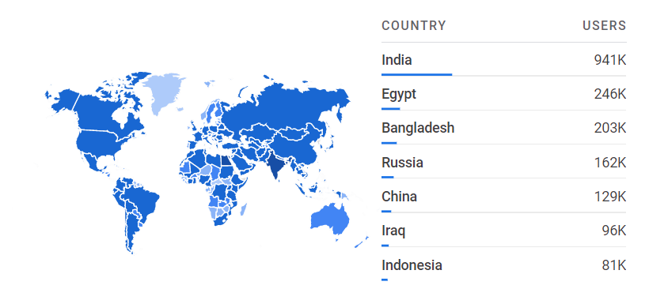
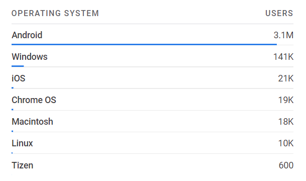
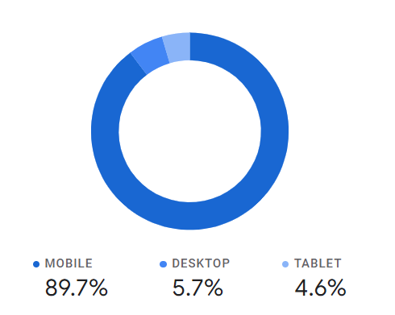

# Win7 Simu year in review - 2022

<m-blog-meta />

_Cover image by Tron Le via [Unsplash](https://unsplash.com/photos/sjlU-PBXFHg)_

Another year passed by, how was it for you? Hope you had a wonderful year. For Win7 Simu, 2022 was amazing. For a hobby project that was started out just [for fun and learning](./building-win7-simu.md), it definitely has been growing surprisingly thanks to <s>my effort</s> the love and support from you all. So in this post, let us have a look back at some amazing numbers that Win7 Simu achieved in 2022.

## The amazing numbers

* **4.3M** users downloaded the app from [Google Play](https://play.google.com/store/apps/details?id=com.visnalize.win7simu)
* **30K** users downloaded the app from [Huawei AppGallery](https://appgallery.huawei.com/app/C106588347)
* **29K** users gave an average rating of **4.1/5**
* **15K** users left a review
* **500K** accounts created in the app
* **13** version updates were released
* **50** contributors helped out with the translations on [Crowdin](https://crowdin.com/project/win7simu)

## Other interesting statistics

### Countries overview

### Devices overview

Operating systems | Device categories
--------|:-------:
||

## Looking out to 2023

I hope Win7 Simu has been doing a good job in contributing to a wonderful year for you. Please keep supporting it and continue to look forward to more updates rolling out, with more stunning features and stability. Wishing all the best to you and your family. Happy New year! 🎉

<m-blog-tag-list :tags="$page.frontmatter.tag" showIcon />
