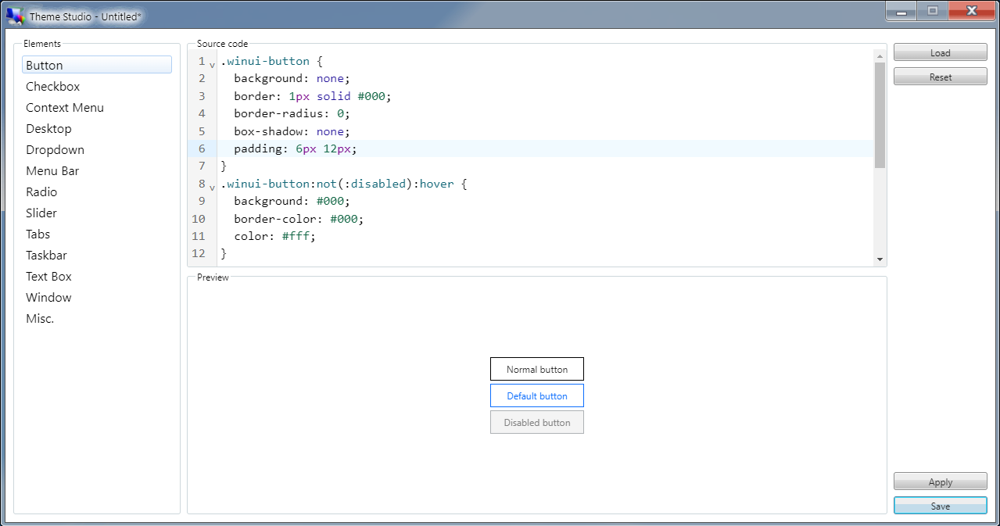
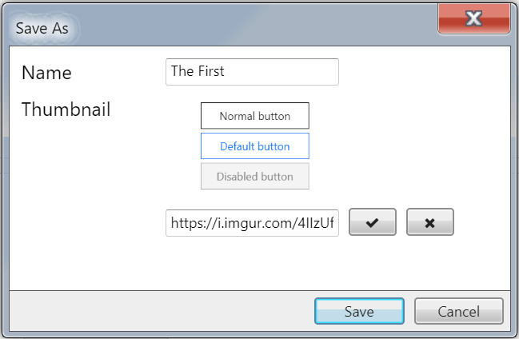
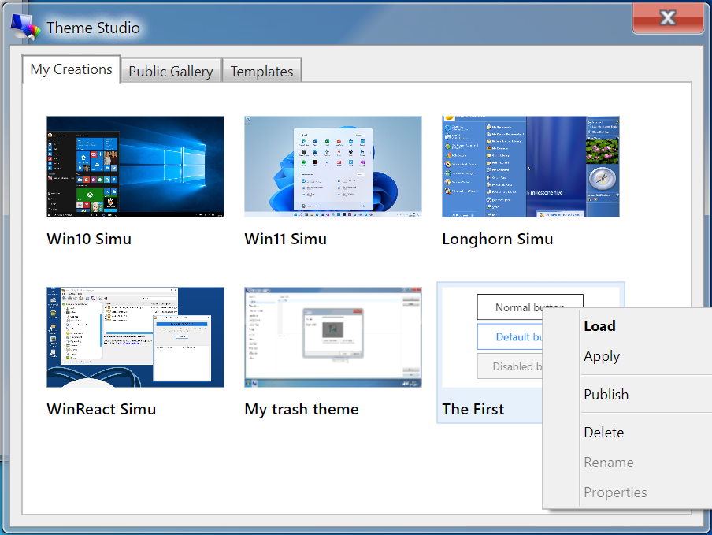
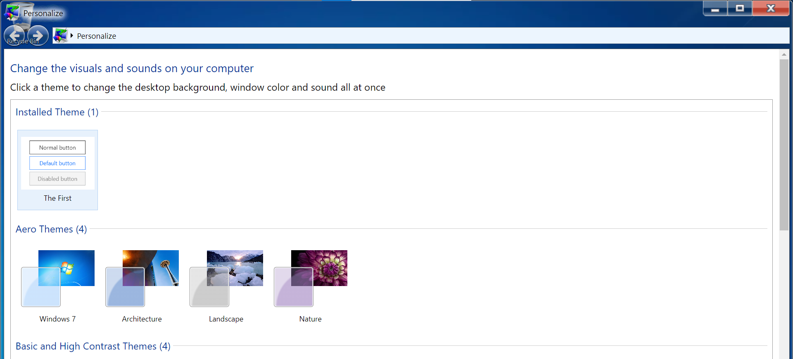

# In-depth guide

<m-social-links />

This page aims to walk you through __Theme Studio__ in an in-depth manner, everything you need to know to craft your own themes for Win7 Simu. As a prerequisite, it is required that you have some ground knowledge of __HTML__ and __CSS__ to be able to follow along easier, otherwise, here are some good free resources to learn:

* MDN ([HTML](https://developer.mozilla.org/en-US/docs/Learn/HTML) - [CSS](https://developer.mozilla.org/en-US/docs/Learn/CSS))
* w3schools ([HTML](https://www.w3schools.com/html/default.asp) - [CSS](https://www.w3schools.com/css/default.asp))
* Sololearn ([HTML](https://www.sololearn.com/learn/courses/html-introduction) - [CSS](https://www.sololearn.com/learn/courses/css-introduction))

## Step-by-step

### Writing your first theme

* From the main window, choose "Start a new project". A blank Theme Studio editor opens up.
* Let's say I want to make a theme that only changes the appearance of the buttons, I will select the "Button" element.
* In the Source code component, enter:

```css
.winui-button {
  background: none;
  border: 1px solid #000;
  border-radius: 0;
  box-shadow: none;
  padding: 6px 12px;
}
.winui-button:not(:disabled):hover {
  background: #000;
  border-color: #000;
  color: #fff;
}
.winui-button.default {
  background: none;
  border: 1px solid #0d6efd;
  box-shadow: none;
  color: #0d6efd;
}
.winui-button.default:hover {
  background: #0d6efd;
  border-color: #0d6efd;
}
```

* The button's CSS snippet above will take effect immediately in the Preview area and you should be able to see a new appearance of the buttons:



* To temporarily experience the theme in action, click the "Apply" button. You should see the new appearance of the buttons everywhere, but note that this will only last for the current login session, if you logout or restart the simulator, the changes will be gone.
* Once happy with it, you can save the theme by clicking the "Save" button. From the save popup, enter a desired Name, for the thumbnail (this is optional), there are 2 options available:
  * Take a screenshot - this will quickly capture a screenshot of your current screen.
  * Load from URL - this will load the image from the input URL.



* Clicking "Save" again will save the theme locally on your device.

After your theme is saved, you can find it under the "My Creations" tab of Theme Studio's explorer, from there, you may either "Load" it to resume editing, "Apply" to use it, or "Publish" it to the community.



### Using themes

* To use your created theme, right-click on it (hold your finger), and select "Apply" from the menu. You should now see the buttons' appearance changed to the selected theme.
* This change will last for as long as you decide to switch to another theme.
* If you open up "Personalize", you will also notice that there is a new section for the selected theme as "Installed Theme", allowing you to switch between this and the native themes.



* This also applies to any public themes and templates that you use from Theme Studio.

### Publishing your theme

:::warning Note
This feature is only available with user accounts. Therefore, make sure you are logged-in in order to see it.
:::

* If you want to share your theme with the community, you can publish it also by right-clicking on the theme (hold your finger), and selecting "Publish" from the menu. The theme will then be published under the "Public Gallery" tab.
* As your theme is now publicly available, everyone has access to it. They can either load its source code to view and modify, or use it to apply to their Win7 Simu.
* Likewise, you can also view, modify, or use any of the public themes.
* If you wish to remove your theme from the public, simply select "Delete" also from the right-click menu, your theme will be then removed from the Public Gallery. However, keep in mind that anyone who has already loaded your theme onto their device will still keep a copy of it.

<a-google-ad />

## Common selectors

The CSS snippet below includes some common selectors for certain elements that you may use to craft your theme:

```css
/********** Button **********/
.winui-button {
  /* A normal button */
}
.winui-button.default {
  /* A default button */
}
.winui-button:disabled {
  /* A disabled button */
}


/********** Checkbox **********/
input[type="checkbox"] + label {
  /* A normal checkbox */
}
input[type="checkbox"]:disabled + label {
  /* A disabled checkbox */
}


/********** Context Menu **********/
.winui-menu {
  /* The container of a context menu */
}
.winui-menu > [role="menuitem"] > a,
.winui-menu > [role="menuitem"] > button,
.winui-menu > [role="menuitem"] > label,
.winui-menu > [role="menuitem"][aria-haspopup="true"] {
  /* The various child elements of a menu */
}


/********** Desktop **********/
#windows {
  /* Change the background */
  --bg: url("") !important;
}
[data-icon="computer"] {
  /* Change the computer icon */
  --icon: url("") !important;
}


/********** Dropdown **********/
.winui-dropdown {
  /* A normal dropdown */
}
.winui-dropdown:focus {
  /* A focused dropdown */
}


/********** Menu Bar **********/
.winui-menubar {
  /* The container of a menu bar */
}
.winui-menubar > [role="menuitem"] {
  /* A child element of a menu bar */
}
.winui-menubar [role="menuitem"][aria-disabled] {
  /* A disabled child element */
}


/********** Radio **********/
input[type="radio"] + label {
  /* A normal radio button */
}
input[type="radio"]:disabled + label {
  /* A disabled radio button */
}


/********** Slider **********/
.winui-slider::-webkit-slider-runnable-track {
  /* The slider track */
}
.winui-slider::-webkit-slider-thumb {
  /* The slider thumb */
}


/********** Tabs **********/
.winui-tabs [role="tablist"] {
  /* The tab navigation menu */
}
.winui-tabs .winui-button {
  /* The tab navigation menu's button */
}
.winui-tabs [role="tabpanel"] {
  /* The tab panel */
}


/********** Taskbar **********/
#taskbar {
  /* The taskbar container */
}
#start-button {
  /* The start button */
}
#taskbar-items {
  /* The container of taskbar items  */
}
#taskbar-items > .taskbar-item {
  /* The individual taskbar items */
}
#taskbar-tray {
  /* The taskbar tray */
}


/********** Text Box **********/
.winui-textbox {
  /* A normal textbox */
}
textarea.winui-textbox {
  /* A multi-line textbox */
}


/********** Window **********/
.window {
  /* The main window container */
}
.titlebar {
  /* The window's title bar */
}
.window .control[aria-label="minimize"] {
  /* The window's minimize control */
}
.window .control[aria-label="maximize"] {
  /* The window's maximize control */
}
.window .control[aria-label="close"] {
  /* The window's close control */
}
.window .container {
  /* The window's content area */
}
.window .statusbar {
  /* The window's status bar */
}
```

## Background and icons

To change the background and the various icons using Theme Studio, you must comply with the following rules:

* Use `--bg` and `--icon` [variables](https://developer.mozilla.org/en-US/docs/Web/CSS/Using_CSS_custom_properties) for the background and icons respectively.
* Append `!important` after each rule for the change to take effect.
* Target the corresponding [program ID](#program-ids) with `[data-icon="<program_id>"]` to change its icon.

Example:

```css
#windows {
  /* Change the desktop background to Windows XP Azul */
  --bg: url("https://i.redd.it/0ohv3srxzb631.jpg") !important;
}

[data-icon="themestudio"] {
  /* Change the icon of Theme Studio */
  --icon: url("https://cdn-icons-png.flaticon.com/256/5447/5447297.png") !important;
}
```

### Program IDs

:::warning Note
This list is incomplete and subject to change (more to be added) in the future updates.
:::

* `computer`
* `bin`
* `about`
* `calc`
* `chrome`
* `cmd`
* `games`
* `ie`
* `notepad`
* `snipping`
* `paint`
* `player`
* `sticky`
* `camera`
* `recorder`
* `wordpad`
* `run`
* `magnifier`
* `themestudio`
* `installer`
* `bsod`
