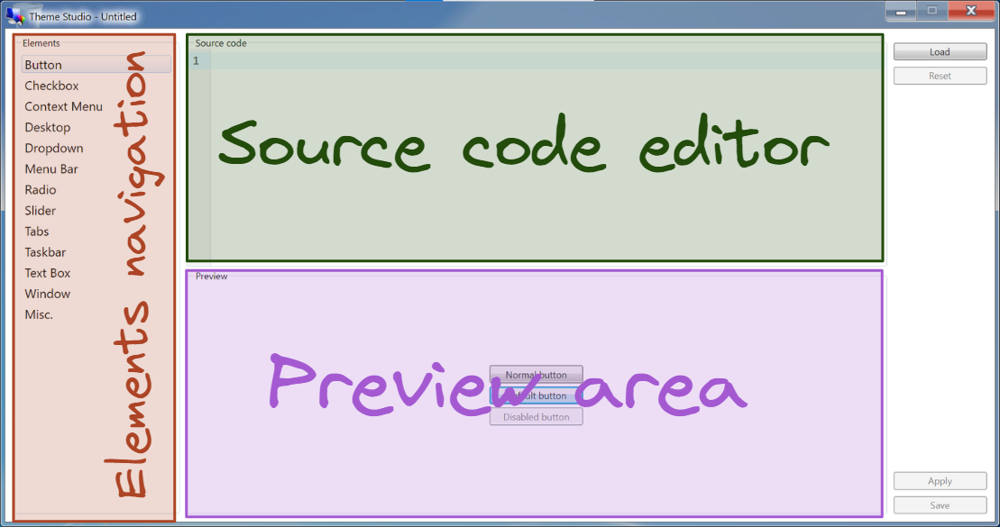
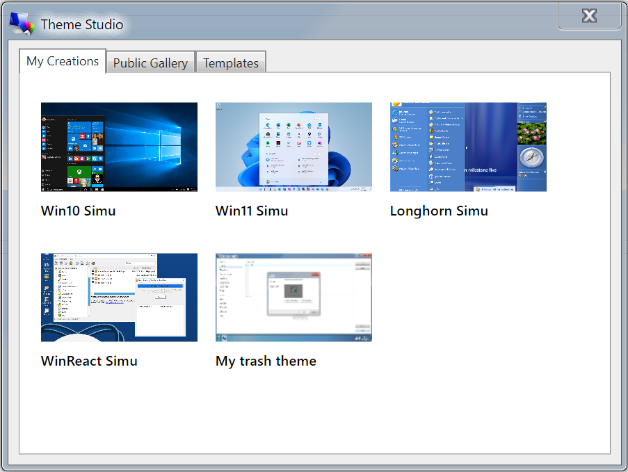
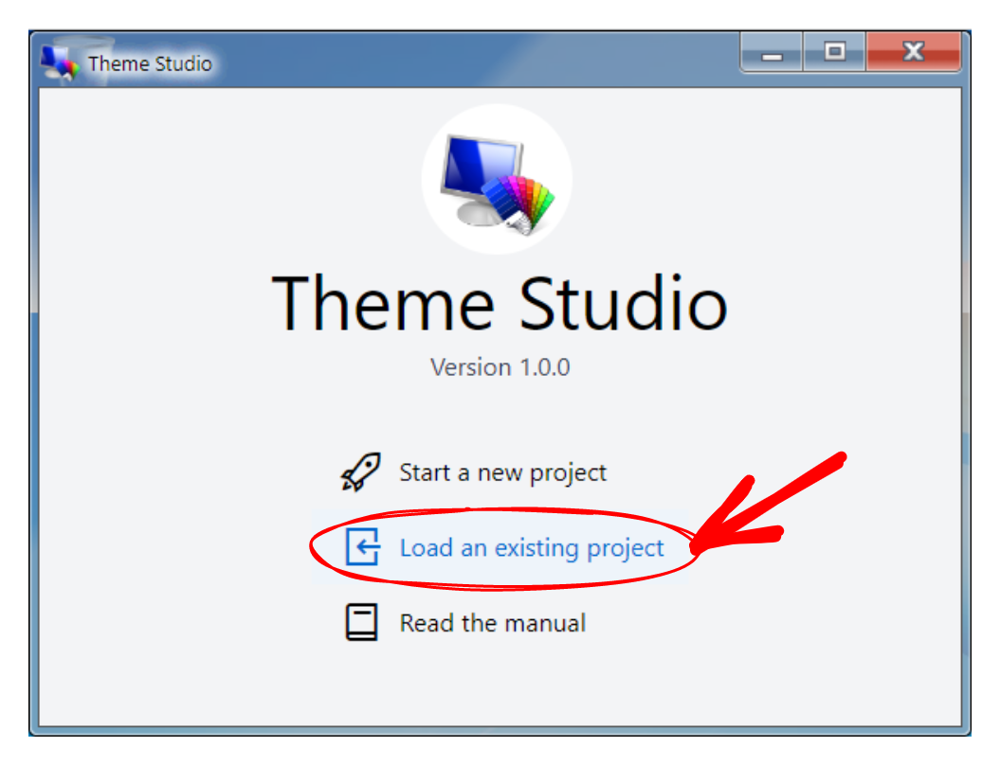
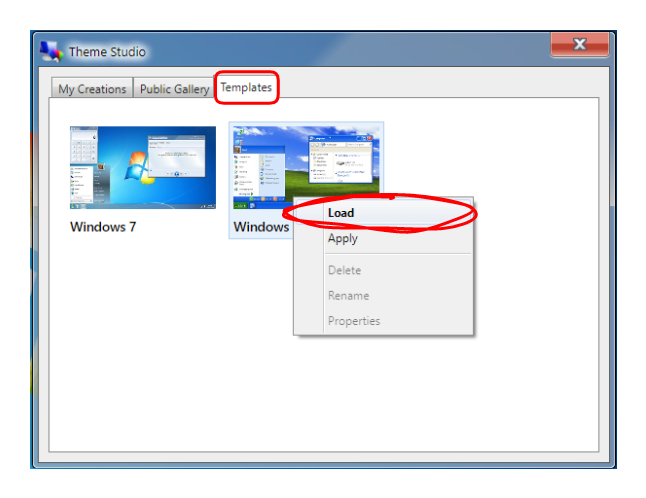
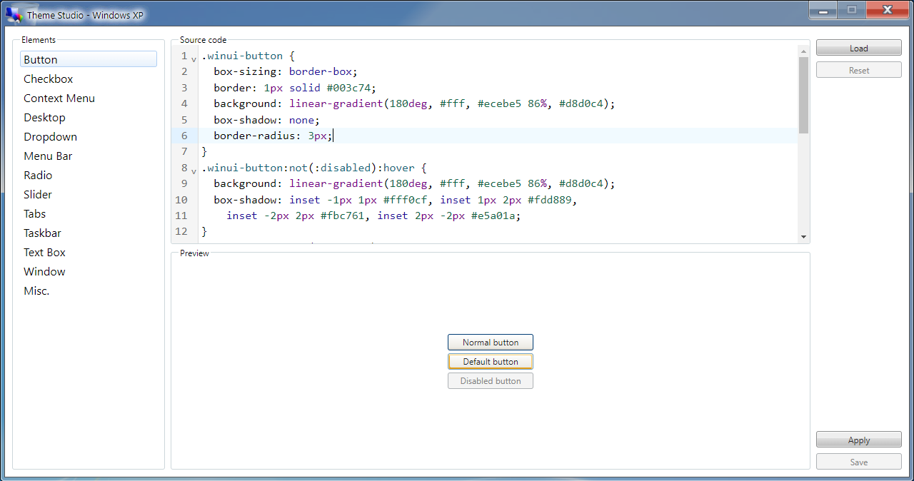
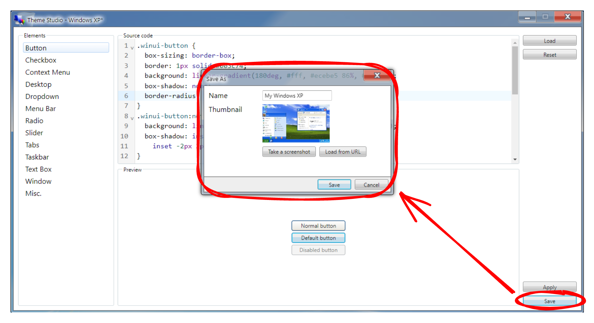

# Getting started

<a-social />

## User interface

### Theme Editor

The Theme Studio's editor interface is designed to be simple and easy to use, with only 3 components:

* Elements navigation - the navigation panel of elements with built-in previews for a quick glimpse of the styling changes.
* Source code editor - the main editor that allows you to style the elements using CSS.
* Preview area - how the elements look after applying your styling changes.

:::tip Miscellaneous element
The "Misc." element is a special element that doesn't have the Preview area. It is intended to support any other elements that are not shown on the Elements navigation, therefore you can use it to write any miscellaneous CSS here.
:::

### Themes Explorer

The Theme Studio's themes explorer consists of 3 tabs:

* My Creations - where you can find your saved projects/themes on your device.
* Public Gallery - where you can find all sorts of themes published by the community, you can also load their source code to your editor or apply to your Win7 Simu.
* Templates - some available templates as base themes that you may select and get started easily.

## Quick start

The quickest and easiest way to get started is to load the source code from an existing template:

1. From the main window, choose "Load an existing project"

2. Switch to the "Templates" tab, select a template by right-clicking (hold your finger) on it and choose "Load".

3. You should now be able to see the source code of your selected template, then you can start making changes using the editor to craft your own theme.

4. Finally, you can save your project as a theme by entering the required information in the save popup. You can then resume editing from the current progress, or apply the theme to your Win7 Simu.

<setupad-ads />
