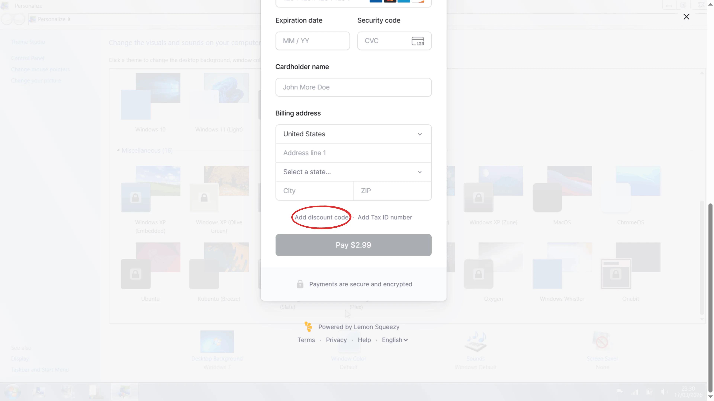
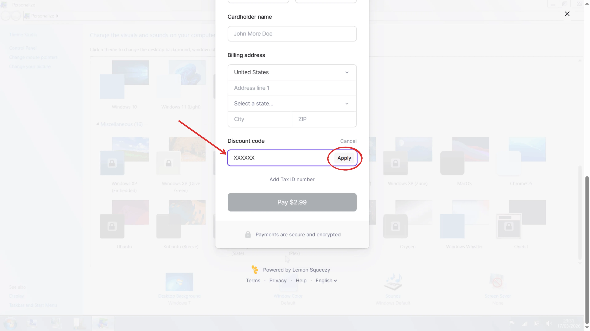
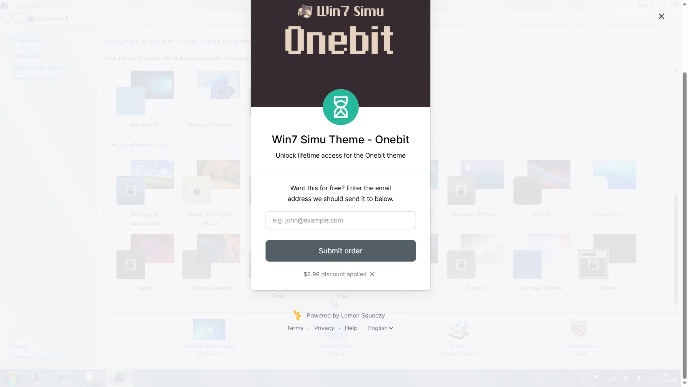
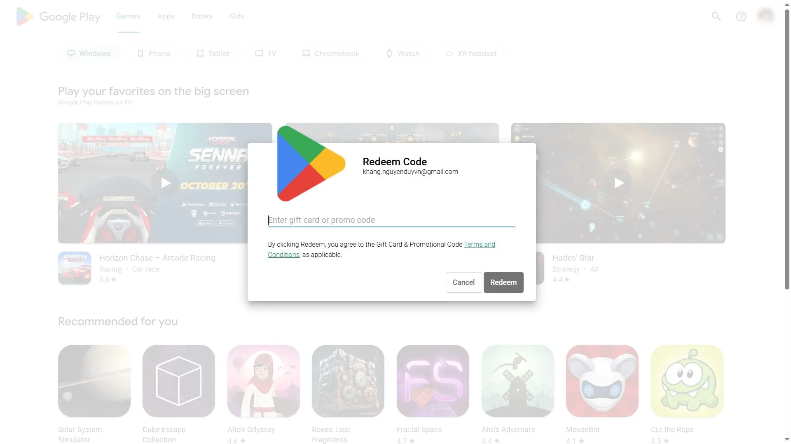
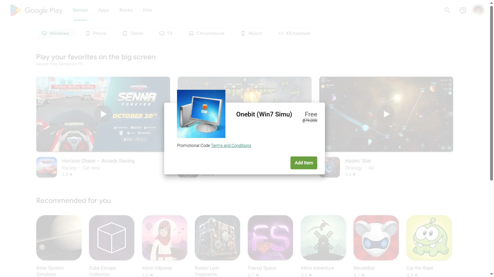
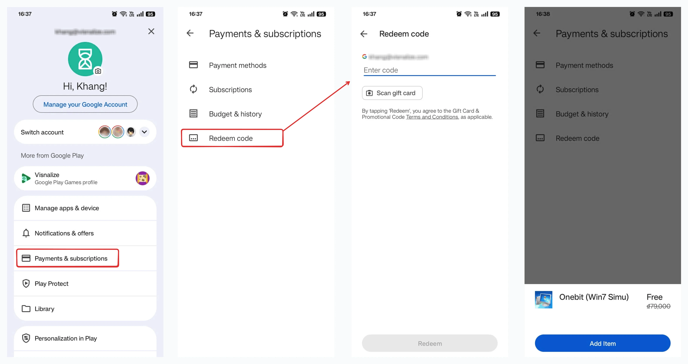

# Giveaways

Congratulations! You have found the secret page of Win7 Simu. We occasionally give away Win7 Simu's themes and in-app items. Check back to this page for the latest giveaways and how to redeem them.

Strikethrough codes are either expired or have been redeemed. If you have any questions or issues, please leave a [comment below](#comments) or [contact us](../about.md#contact).

<SponsorAd />

## List of giveaways

### [Onebit theme](./themes/onebit.md)

Web | Android
--- | ---
`0426ONEBIT` | ~~`FF5DA88KLA7R2WXXRMS1ZFQ`~~
`0426ONEBIT` | ~~`ADZD0HLWE4J7HLK01H963JZ`~~
`0426ONEBIT` | ~~`YM96GP2HV2WDT94MNHD9H5Y`~~
`0426ONEBIT` | ~~`RA2PT10Y786Q29S9AKF4F3U`~~
`0426ONEBIT` | ~~`SPL95KPN75V3JWNVXXYKGQK`~~
`0426ONEBIT` | ~~`M0JT4MZSRDYHCX7HA0S932N`~~
`0426ONEBIT` | ~~`QFWT0PA4CYFLBA21XLALLWV`~~
`0426ONEBIT` | ~~`LN3AA69X4P730L0LJX0DWF7`~~
`0426ONEBIT` | ~~`HBC05ACU3JGZ5DFRW5W5A12`~~
`0426ONEBIT` | ~~`Z1VKZGYWDU8LKZH3B7FD8P4`~~

## How to redeem

### Web

To redeem a giveaway code in the web version of Win7 Simu, follow these steps:

1. In the app, select the giveaway item you want to redeem.
2. On the checkout page, scroll to the bottom and click __Add a discount code__.
  
3. Enter the giveaway code and click __Apply__.
  
4. If the code is valid, you will see the discount applied. Enter your email address to receive the item.
  

### Android

To redeem a giveaway code in the Android version of Win7 Simu, there are 2 ways:

#### On computer

1. Go to [https://play.google.com/redeem](https://play.google.com/redeem).
2. Make sure you're redeeming with the same Google account that you use on your Android device.
3. Enter the giveaway code and click __Redeem__.
  
4. If the code is valid, you will see the confirmed item. Click __Add item__ to receive it.
  

#### On Android device

1. Open the Google Play app <Notation icon="android" />.
2. At the top right, tap your __Profile picture__.
3. Tap __Payments & subscriptions__, then __Redeem code__.
4. Enter the giveaway code and tap __Redeem__.
5. If the code is valid, you will see the confirmed item. Tap __Add item__ to receive it.

