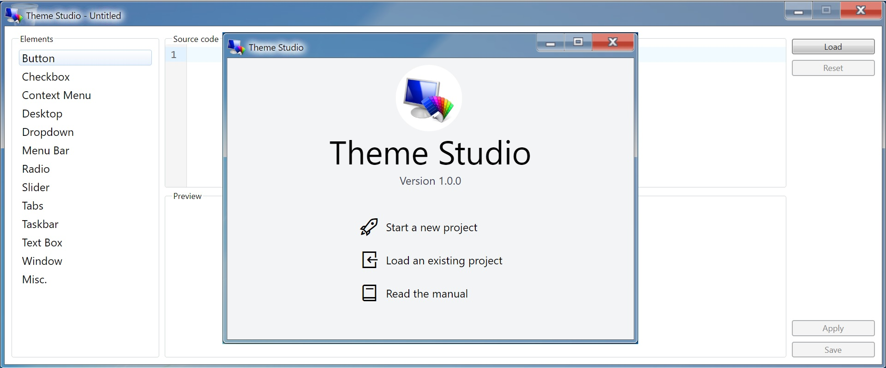

# Theme Studio

__Theme Studio__ is a unique extension application of [Win7 Simu](./about.md), offering you the capability to create your own custom themes and turn the Windows 7 simulator into whatever system that only bounds to your creativity.

::: info <iconify-icon icon="fluent:learning-app-24-regular" height="20" />Learn & Play {data-feature}
A simple code playground for you to learn CSS
:::

::: info <iconify-icon icon="fluent:communication-person-24-regular" height="20" />Publish & Share {data-feature}
Take pride in your creativity and share with others
:::

::: info <iconify-icon icon="fluent:emoji-sparkle-24-regular" height="20" />Admire & Enjoy {data-feature}
Enjoy the creative crafts made by others
:::

With Theme Studio, you are able to:

* Hand-craft your own themes using [CSS](https://developer.mozilla.org/en-US/docs/Web/CSS), a stylesheet language with a simple syntax that has been beautifying the internet since 1996). As you play with CSS while creating your themes, you get to learn and practice it in the progress.
* Apply your themes to turn a Windows 7 simulator into any system as far as your skills and creativity may reach. You can also publish them and share with your fellow Win7ers.
* Access those themes that are published and shared publicly from the community, pull them locally to view, edit, and save the source, and to enjoy the appearance, the uniqueness of the themes made by others.

Check out the video series below to see how it works, or learn and start crafting your own theme from the [Quick Start guide](./themestudio/quick-guide.md).

@[youtube](https://youtube.com/playlist?list=PLztkJSxlj5P6lUgP806gAnAvgnCaSumsC)

