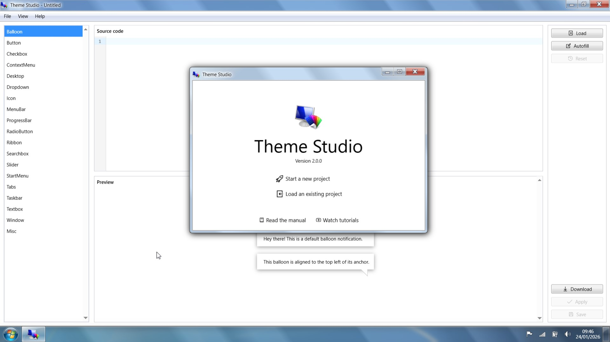

# Theme Studio

__Theme Studio__ is an exclusive application of [Win7 Simu](./about.md), offering you the capability to create your own custom themes and turn the Windows 7 simulator into whatever system that only bounds to your creativity.

## Features

Theme Studio provides you a simple yet powerful interface to:

* Hand-craft your own themes using [CSS](https://developer.mozilla.org/en-US/docs/Web/CSS), a stylesheet language with a simple syntax that has been beautifying the internet since 1996). As you play with CSS while creating your themes, you get to learn and practice it in the progress.
* Access a wide range of built-in UI elements and components of Win7 Simu, each having its own CSS class selectors to target and style, making it extremely easy to customize the appearance of the simulator.
* Preview your changes in real-time as you write the CSS code, or apply the themes temporarily to see how they look and feel in action.
* Manage your themes easily from the Theme Studio explorer, where you can:
  * Load your saved themes to resume editing.
  * Apply them to use right away.
  * Publish them to the community for others to access.
* And finally, access those themes that are published and shared publicly from the community, pull them locally to view, edit, and save the source, and to enjoy the appearance, the uniqueness of the themes made by others.

## Getting started

Check out the video series below to see how it works, or learn and start crafting your own theme from the [Quick Start guide](./themestudio/quick-guide.md).

@[youtube](https://youtube.com/playlist?list=PLztkJSxlj5P6lUgP806gAnAvgnCaSumsC)
